\mainmatter

# Introduction
<div style="text-align: center;">
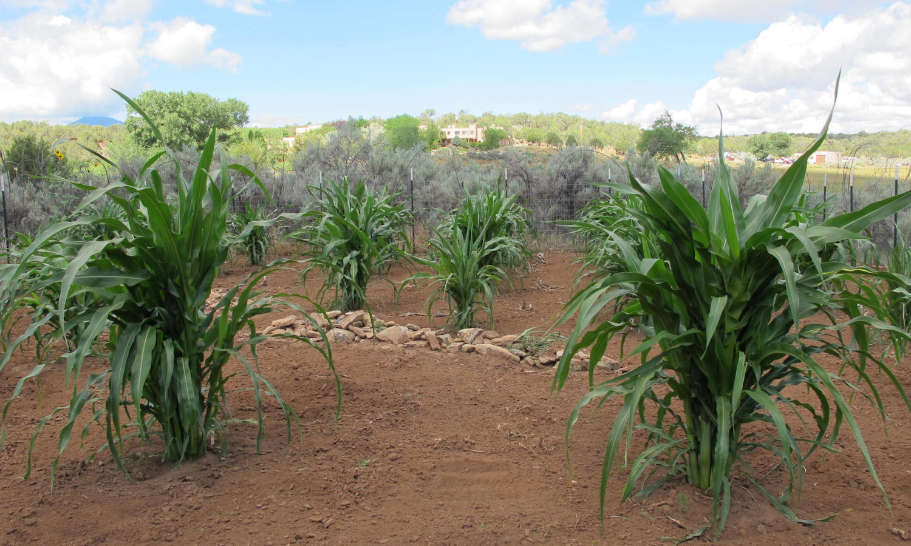
</div>

**Farming is a fundamental part of Pueblo identity**. It is is integrated into every aspect of traditional Pueblo culture.

Pueblo leaders are concerned with preserving knowledge about farming and ensuring that this knowledge is transmitted to younger generations. Crow Canyon researchers and educators are interested in learning about traditional agriculture in order to better understand ancient farming practices and to gain a deeper appreciation for the role of corn in Pueblo society, past and present. **The Pueblo Farming Project** is a collaborative effort that addresses the interests of both groups.

Since 2006, the Crow Canyon staff has worked with traditional Pueblo farmers from Hopi, Arizona, to document their farming practices and the cultural context in which they take place. Every year, Hopi farmers have visited Crow Canyon in the spring and fall to teach the Center's researchers and educators about Pueblo Indian farming, food storage, and food preparation. Together, farmers and staff have planted and harvested several experimental gardens on Crow Canyon's campus, testing farming techniques and varieties of seeds used by the Pueblo farmers in their own fields.

Documentation for the project includes still photography, video, and audio recordings of planting and harvesting, and a variety of written records that include detailed measurements of plants at different stages of growth, daily temperature and precipitation values, crop yields, and preliminary results of corn DNA analysis. Data generated as part of the Pueblo Farming Project have already proven useful in broader research. For example, Village Ecodynamics Project scientists have compared the results of their computer simulations with corn harvest yields from the Pueblo Farming Project to better understand ancient environmental conditions and agricultural productivity—and the effects of both on human settlement patterns.

## What was the PFP?

### History of the Pueblo Farming Project: 2004 – Today {-}

#### The Beginning {-}

The beginning of the Pueblo Farming Project can be traced to a September 2004 Native American Graves Protection and Repatriation Act (NAGPRA) consultation for Crow Canyon's Goodman Point Archaeological Project. National Park Service staff and Crow Canyon archaeologists met with Hopi Cultural Preservation Office staff at their office in Kykotsmovi, Arizona to discuss the research design for this project. When we concluded our discussion we asked the Hopi if there were research topics that interested them that were not covered in the research design, and they quickly responded that they wanted to know more about ancestral Pueblo farming and how it compared to the agricultural practices of Hopi and other Pueblo people today.

From these beginnings, the PFP has been developed through a partnership between Crow Canyon and Pueblo farmers, especially the farmers from Hopi whose participation in the project has been coordinated through the Hopi Cultural Preservation Office.

#### Designing the Project {-}
<div style="text-align: center;">
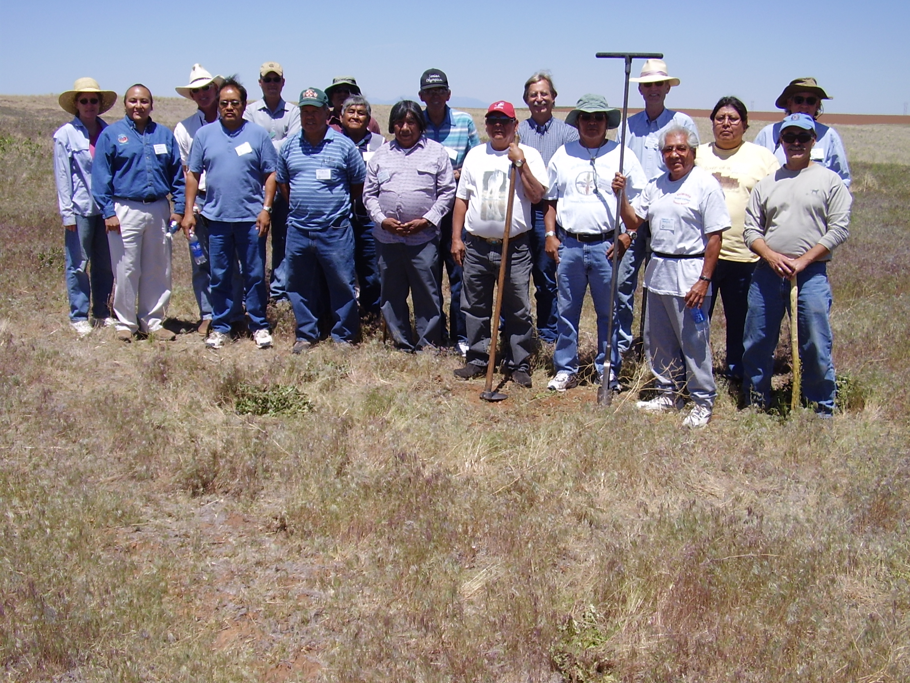
</div>

To follow through on this request, Crow Canyon developed the first of a series of grants to support a collaborative project on Pueblo farming (see section below on Who Funded the Pueblo Farming Project). The initial grant funded a planning meeting in May 2006 where we discussed the various types of research that could investigate ancestral Pueblo farming practices and link them to techniques used by modern Pueblo farmers. Participants at the meeting included traditional Pueblo farmers from Hopi, Jemez, Ohkay Owingeh, and Tesuque; Crow Canyon staff; and other anthropologists who specialize in the study of ancestral and modern Pueblo agriculture.

After two days of discussion, this group decided to implement an experimental gardening project that focused on direct-precipitation farming because this was the main type of farming practiced by the ancestral Pueblo in the Mesa Verde region. We use the term "direct-precipitation farming" to represent agricultural practices that use little to no large-scale landscape modification, but that readily take advantage of local landform and soil characteristics to enhance soil moisture (such as areas of higher runoff or greater snow accumulation) and often include small-scale anthropogenic modifications such as check dams. Direct-precipitation farming is sometimes referred to as "dry-land" or "rain-fed" farming. The group agreed that Hopi should take the lead as the traditional farming experts, since they still practice direct-precipitation farming whereas most other contemporary Pueblo tribes use more intensive flood-plain and canal irrigation techniques. Crow Canyon agreed to seek grant funding for the project that became known as the Pueblo Farming Project.


#### Selecting Garden Locations {-}
<div style="text-align: center;">
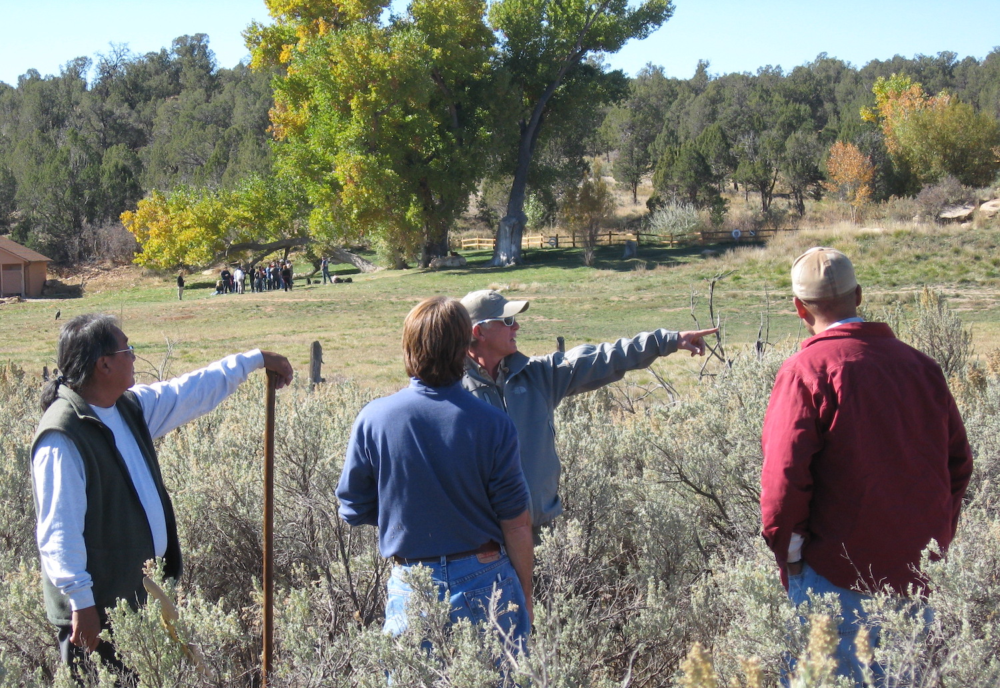
</div>

The next step occurred in 2007 when Hopi farmers met to select locations for the gardens. We originally hoped to place these gardens at the Goodman Point Unit of Hovenweep National Monument to complement our ongoing research there, but we did not get permission for this and decided instead to locate the gardens on Crow Canyon's campus to integrate the PFP into the Center's education programs.

Pueblo farmers used traditional ecological knowledge to select the garden locations, focusing on the native plants that indicate good areas for farming. Rabbitbrush and snakeweed are two plants they see as indicating prime areas, but dense stands of those plants were not present on Crow Canyon's campus. In the absence of such indicator species, they selected two areas in small washes on the east side of Crow Canyon that are dominated by sagebrush today. The sagebrush in these areas was taller because their location in small drainages provided more moisture than the areas outside the drainages. The farmers assessed soils for their texture and moisture-holding capacity and examined the details of specific settings including slope, aspect, and other factors. Although the Hopi farmers did not consider these two locations as ideal, they thought they would be adequate.

One location had sage that was unusually tall; this area was located near the mouth of a small wash coming from the east slope of the Crow Canyon drainage. When this area was cleared, an ancient check dam was found and subsequently recorded (5MT19690). This was named the Check Dam Garden (CDG). The other plot was located higher up in a small drainage to the north in an area where there was a thick patch of verdant grass. The Hopi farmers thought there might be a spring in this area but subsequent work showed this was not the case. We call this plot the Pueblo Learning Center (PLC) garden because it is on the way to one of Crow Canyon's outdoor classrooms.

In addition to these new plots, the Hopi farmers suggested we continue planting a garden that Paul Ermigiotti had earlier developed for Crow Canyon's educational programs. We call this Paul's Old Garden (POG), and it is located on the valley floor in the bottom of Crow Canyon.

In 2009, we added two additional garden areas. The first, the Pithouse garden (PHG), was placed on the west slope of Crow Canyon and adjacent to Crow Canyon's Pithouse Learning Center to incorporate the garden into the lessons that occur there. The PHG garden had anomalously low yields for several years and soil profiles showed that the area had been disturbed when the adjacent replica pithouse was constructed (the garden soils contained construction materials), so we abandoned this garden after the 2014 growing season.

<div style="text-align: center;">
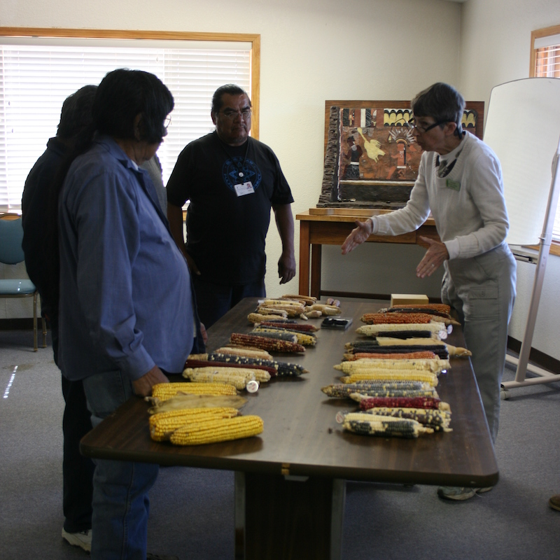
</div>

The second garden added in 2009 was Karen's Upper Garden (KUG), which was a plot farmed by Karen Adams in the 1990s and located on the mesa just west of Crow Canyon. Karen farmed this garden as part of Crow Canyon public education program and to quantify yields. Karen's Upper Garden has produced relatively low yields, which surprised us because evidence suggests that the mesa tops covered in Mesa Verde loess-derived soils were the area most intensively farmed by ancestral Pueblo people. This evidence includes the fact that most ancestral Pueblo habitation sites are near these loess soils on the mesa tops, and the fact that these loess-derived, mesa-top soils are the focus of contemporary direct-precipitation farming. To better evaluate the variation in these mesa-top settings, we added an additional garden in 2015 at Mike Coffey's farm near Dove Creek, Colorado (the Mike Coffey Garden or MCG).

The [PFP garden locations][Where did the PFP take place?] allow us to measure the effect of a variety of microenvironmental factors on agricultural potential. For example, the Crow Canyon gardens allow us to evaluate the effect of cold air that flows in drainages. The length of the frost-free period varies considerably despite relatively small differences in elevation and in the distance between the plots. The gardens are also located on soils with different characteristics and the effects of soil variability are the primary focus of this study.

#### Planting and Harvesting: 2008–today {-}
<div style="text-align: center;">
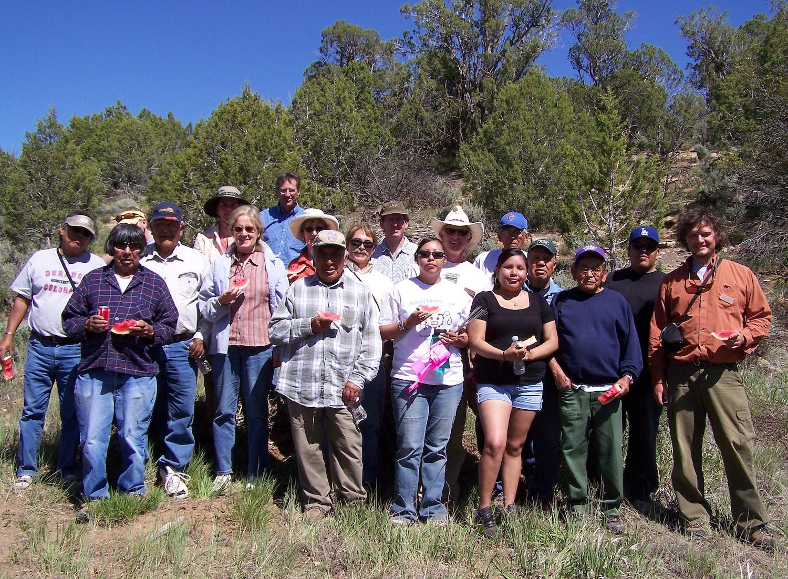
</div>

We planted and harvested gardens for the first time in 2008, with the work focused on the Check Dam Garden, Pueblo Learning Center garden, and Paul's Old Garden. From 2009–2014 we planted five gardens: the Check Dam Garden, Pueblo Learning Center garden, Paul's Old Garden, Pit House Garden, and Karen's Upper Garden. From 2015–2018 we planted the Check Dam Garden, Pueblo Learning Center garden, Paul's Old Garden, Karen's Upper Garden, and Mike Coffey Garden. During this time, Pueblo farmers served as the expert consultants for planting and harvesting. Most of the farmers are from Hopi, but farmers from other Pueblos have also participated. Crow Canyon staff members learn from the Pueblo farmers and assist in the planting and harvesting. Since 2019 we've routinely planted four gardens: the Check Dam Garden, Pueblo Learning Center garden, Paul's Old Garden, and Mike Coffey Garden.

#### Pueblo Farming Project Goals {-}
<div style="text-align: center;">
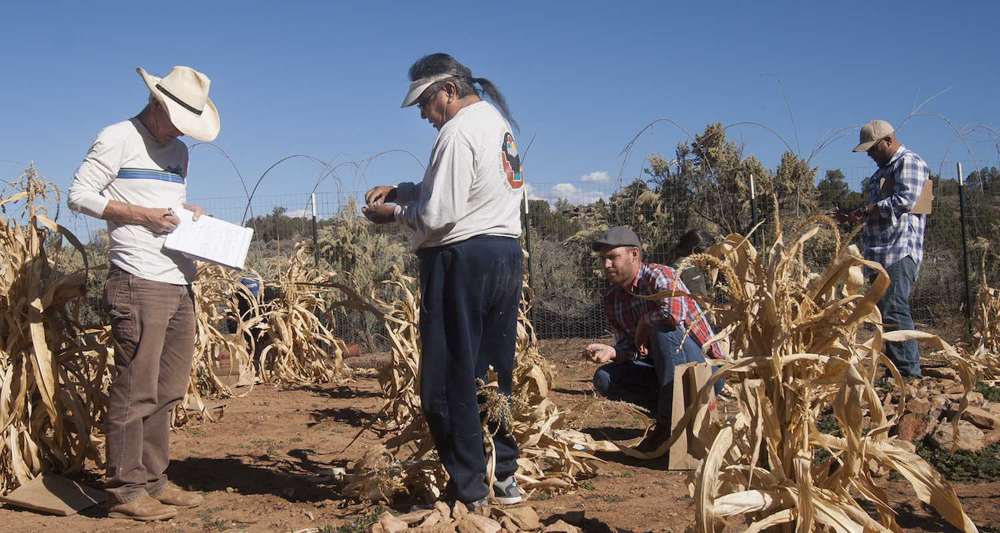
</div>

From the beginning, the Pueblo Farming Project has pursued educational and research goals that were developed by Hopi and Crow Canyon working together. Since 2008, Hopi farmers have traveled to Crow Canyon twice a year: once in the spring for a planting meeting and again in the fall for a harvest meeting. Each meeting includes discussions to review goals, evaluate the project's progress, and develop a plan for how to proceed with current and future initiatives. Of course, each meeting also includes work in the agricultural plots.

All Pueblo Farming Project activities have been recorded using numerous techniques: written notes from each meeting, audio and video recording, still photography, and written documentation that include detailed metrics on the plants and their growing environments. This has produced a rich dataset from which we produced several research and educational products.

<div style="text-align: center;">

</div>

One of the Pueblo Farming Project research goals was to evaluate how agricultural yields were affected by annual variation in temperature and precipitation. These data were integrated into another research project known as the Village Ecodynamics Project or VEP. The Village Ecodynamics Project was funded by two National Science Foundation grants awarded to Washington State University; Crow Canyon was a subcontractor on the project. A multidisciplinary collaboration, the Village Ecodynamics Project included archaeologists, geologists, hydrologists, geographers, computer scientists, and economists from institutions across the US and Canada. Village Ecodynamics Project researchers studied the interaction between Pueblo Indian people and their environment over more than a thousand years, beginning in AD 600. One aspect of the Village Ecodynamics Project was to use computer modeling to estimate ancestral Pueblo agricultural yields and how they varied through time and across the project study areas. Actual Pueblo Farming Project yields were compared to the Village Ecodynamics Project estimates to evaluate the accuracy of the computer model. Detailed information about the Village Ecodynamics Project can be found at this website: [http://www.veparchaeology.org/](http://www.veparchaeology.org/).

Hopi goals for the project were tied to the central role of corn and corn farming in Hopi culture. Fundamentally, they were interested in whether their seed and their traditional farming techniques would result in successful harvests in the Mesa Verde region, a place they consider as part of their ancestral homeland. For Hopi, the Pueblo Farming Project provided a substantive link between their past and the present. For Hopi, the Pueblo Farming Project helped demonstrate their cultural affiliation to the Mesa Verde region, and beyond planting and harvesting gardens they pursued this goal through another Pueblo Farming Project research initiative: the DNA analysis of modern Hopi corn.

#### Education Products {-}
<div style="text-align: center;">
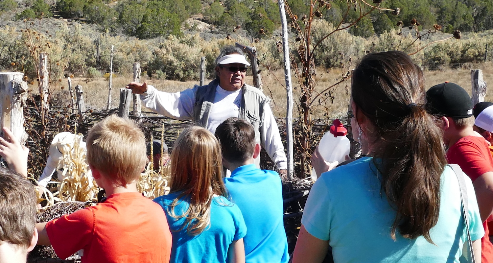
</div>

From the beginning, the Pueblo Farming Project was integrated into Crow Canyon's education programs. School groups who are at Canyon when planting and harvesting occurs observe and at times participate in these activities. Pueblo farmers speak to the students about the project and the role of farming in Pueblo culture, creating a unique and memorable learning experience for these students. The Pueblo Farming Project gardens are also integrated into Crow Canyon education programs during the growing season, providing the students with a powerful visual as the Center's educators teach about the importance of corn farming in ancestral and modern Pueblo communities.

<div style="text-align: center;">
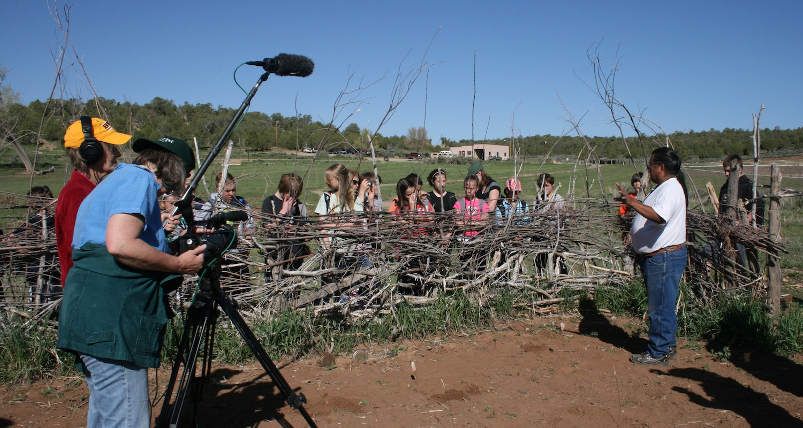
</div>

We also developed series of educational initiatives to reach a larger audience with what we have learned through the Pueblo Farming Project. We highlight three of these initiatives here. The first educational product we highlight is a documentary film, _More than Planting a Seed_:

<div class="embed-responsive embed-responsive-16by9">
<iframe src="https://www.youtube.com/embed/2x23FF_kUyo?modestbranding=1&rel=0&start=1" frameborder="0" gesture="media" showinfo="0" allow="encrypted-media" allowfullscreen></iframe>
</div>

<br>
A second educational product is an exhibit on display at the Crow Canyon Archaeological Center. This exhibit describes the project, presents our results, and tells the story of corn. Finally, we created and piloted five standards-aligned lessons for the classroom. Those lessons plans are included in this eBook.

Public education initiatives also include lectures for the public and presentations at professional meetings. Information about the Pueblo Farming Project was also disseminated through Crow Canyon's electronic and print newsletters and on Crow Canyon's website. The Pueblo Farming Project was also featured on local radio shows, including [an interview with Leigh Kuwanwisiwma on KSJD's Big Fat Farm Show](https://www.ksjd.org/post/pueblo-farming-project#stream/0).

## Who were the participants?
<div style="text-align: center;">
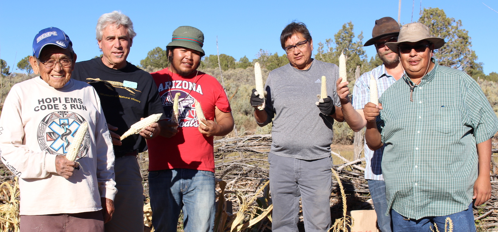
</div>

Over almost a decade, dozens of Hopi farmers, researchers, and volunteers participated in the Pueblo Farming Project, and hundreds of students visited the Pueblo Farming Project gardens during the growing season.

<div class="carousel">
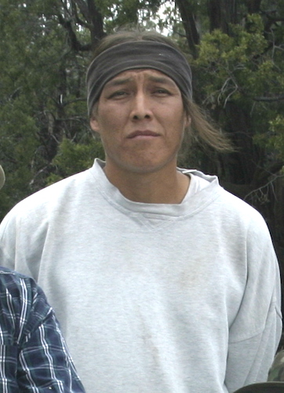
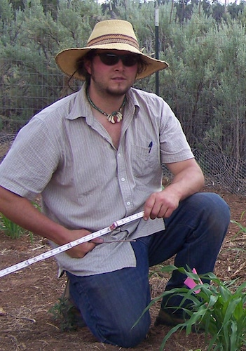
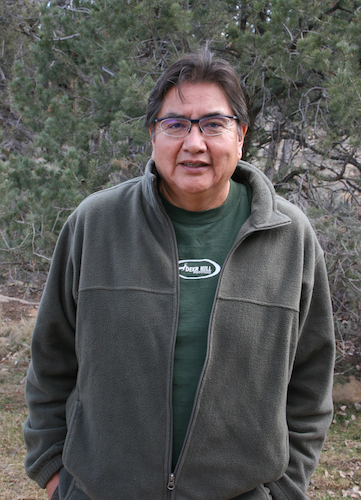
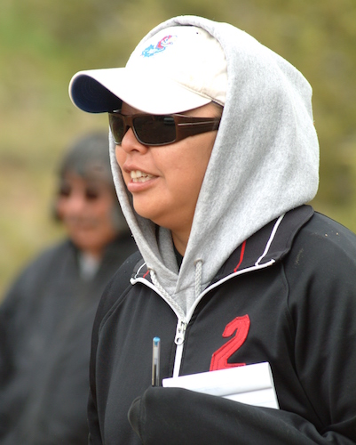
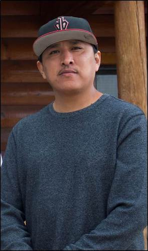
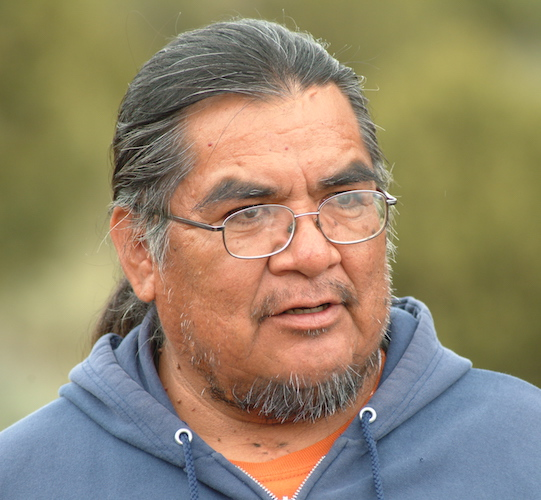
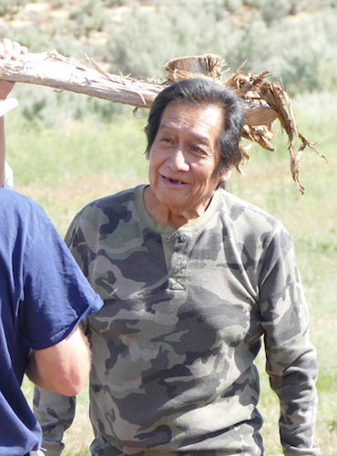
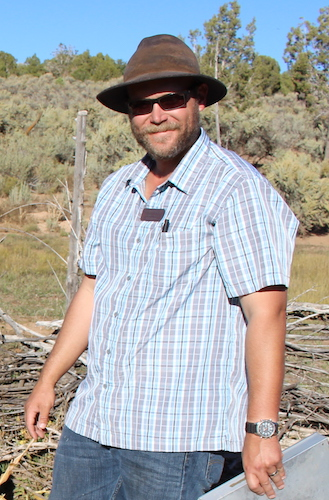
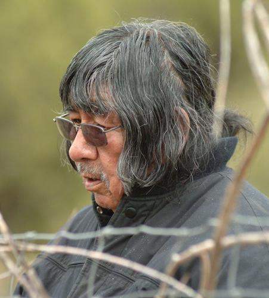
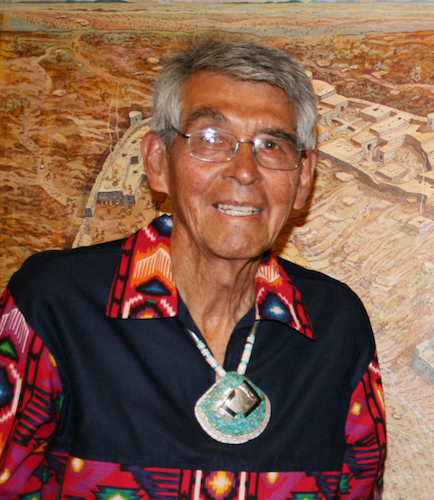
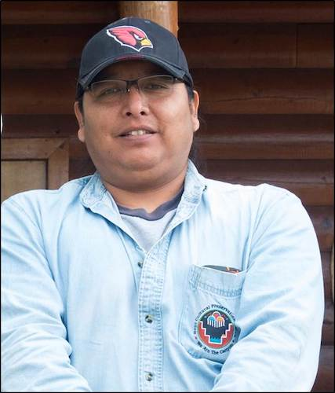
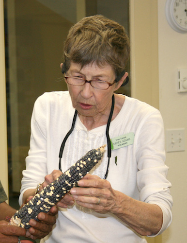
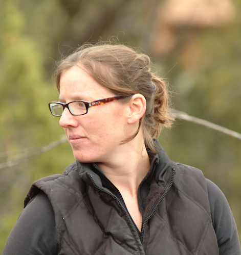
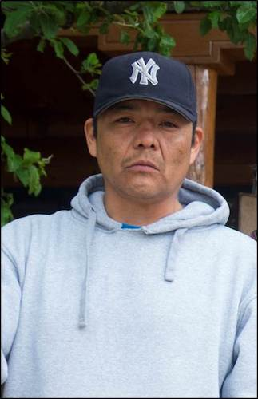
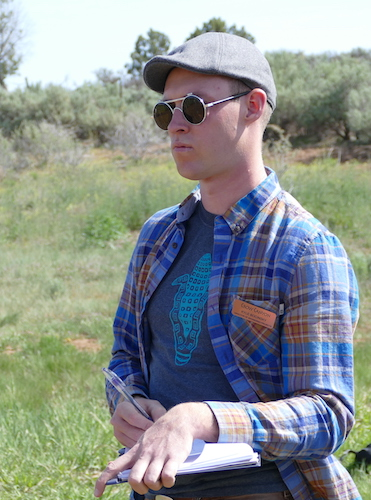
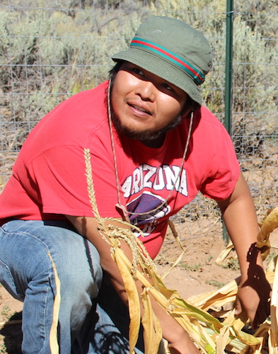
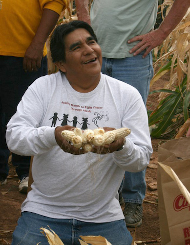
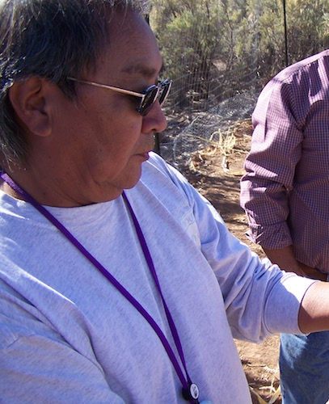
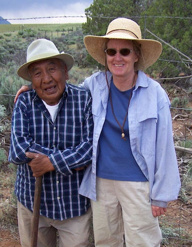
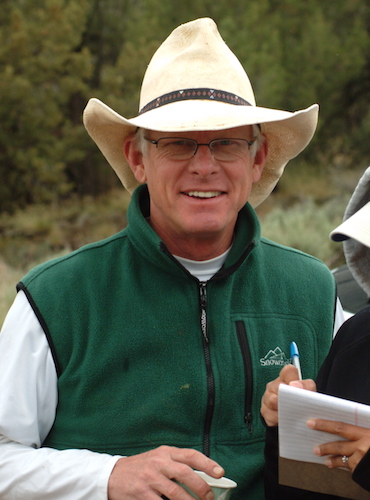
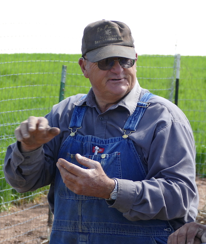
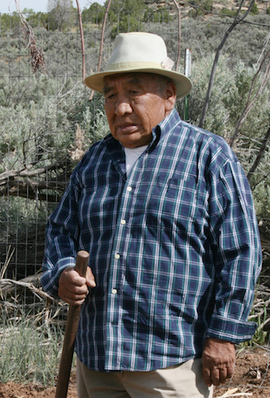
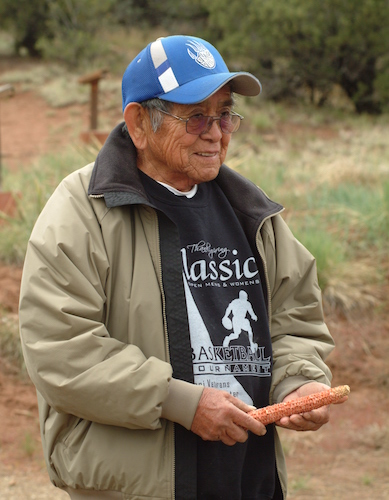
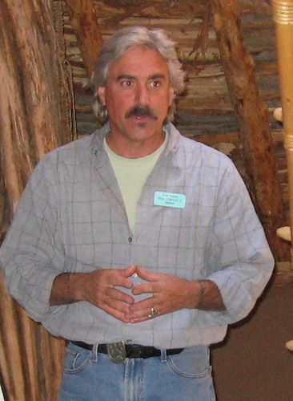
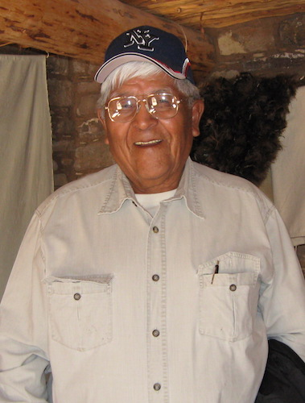
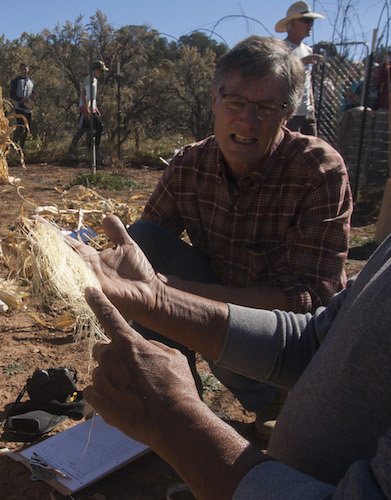
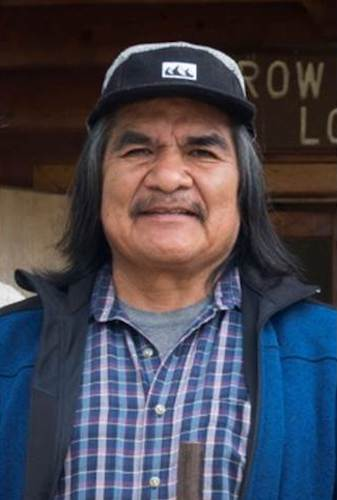
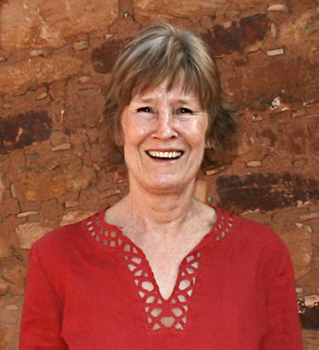
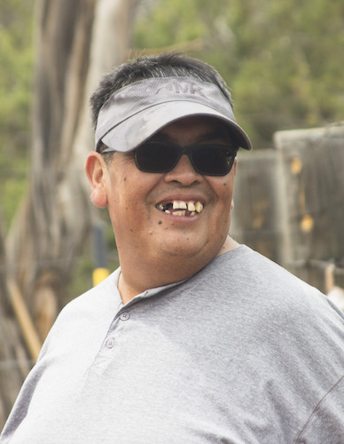
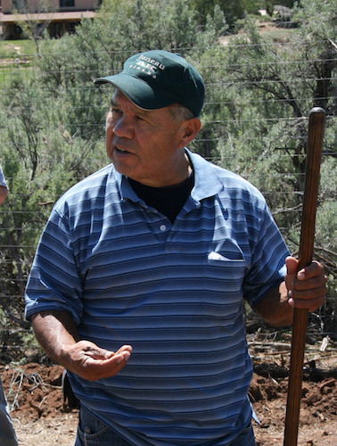
</div>

<div class="carcaption">
<p class="caption">&nbsp;</p>
</div>

## Where did the PFP take place?
<div style="text-align: center;">
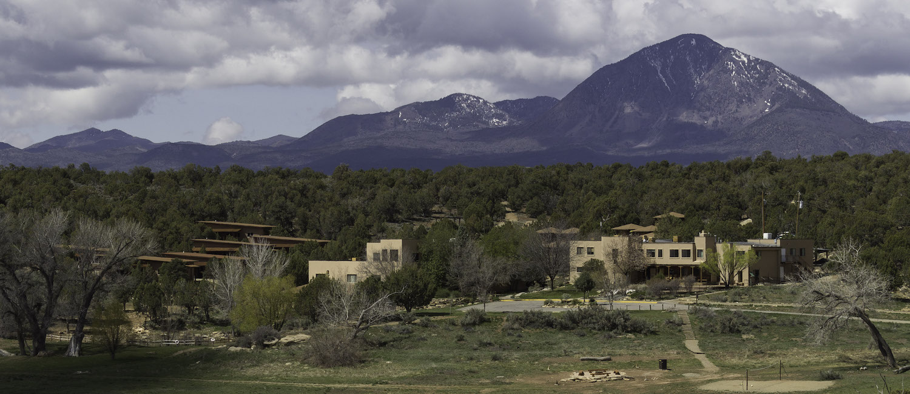
</div>

Five Pueblo Farming Project gardens are scattered around Crow Canyon Archaeological Center's rural campus in Cortez, Colorado. In 2015, we planted a new garden in the contemporary dry-farmed region north of Crow Canyon's campus. Use the map below to explore the PFP garden locations, and click on the gardens to get more information about when they were planted as part of Pueblo Farming Project research. You can zoom using the controls on the left, the scrollwheel on your mouse, or by pinching on a mobile device. The menu in the upper right allows for different map backgrounds. The mapped boundaries of each garden are at the garden fences; gardens may not have been completely planted in each year.

```{r, echo=FALSE, message=FALSE}

knitr::opts_chunk$set(echo = FALSE,
                      message = FALSE,
                      warning = TRUE,
                      error = TRUE,
                      # results = 'hide',
                      cache = FALSE)

library(magrittr)

garden_locations <- sf::st_read("./data/gardens.geojson",
                                quiet = TRUE)
garden_locations$color <- RColorBrewer::brewer.pal(length(garden_locations),"Dark2")

garden_centroids <- garden_locations %>%
  sf::st_transform(26912) %>%
  sf::st_centroid() %>%
  sf::st_transform(4326)

l <- leaflet::leaflet(garden_locations, width = "100%") %>%
  leaflet::addProviderTiles("Esri.WorldImagery", group = "Satellite") %>%
  leaflet::addProviderTiles("Esri.WorldTopoMap", group = "Topography") %>%
  leaflet::addMarkers(data = garden_centroids,
                      popup = ~Popup
  ) %>%
  leaflet::addPolygons(data = garden_locations,
                       fillColor = ~color,
                       popup = ~Popup
  ) %>%
  leaflet::addLayersControl(
    baseGroups = c("Satellite", "Topography"),
    options = leaflet::layersControlOptions(collapsed = T)
  )

widgetframe::frameWidget(l, width='100%')

```

## Who funded the PFP?

The Pueblo Farming Project started as part of the Village Ecodynamics Project and was initially funded under National Science Foundation grants DGE-1347973 and DEB-0816400. Subsequent years of the Pueblo Farming Project received funding from the History Colorado State Historical Fund (grant 2015-02-025), the National Geographic Society Genographic Project, and the Christensen Fund.

<div style="text-align: center;">


</div>

