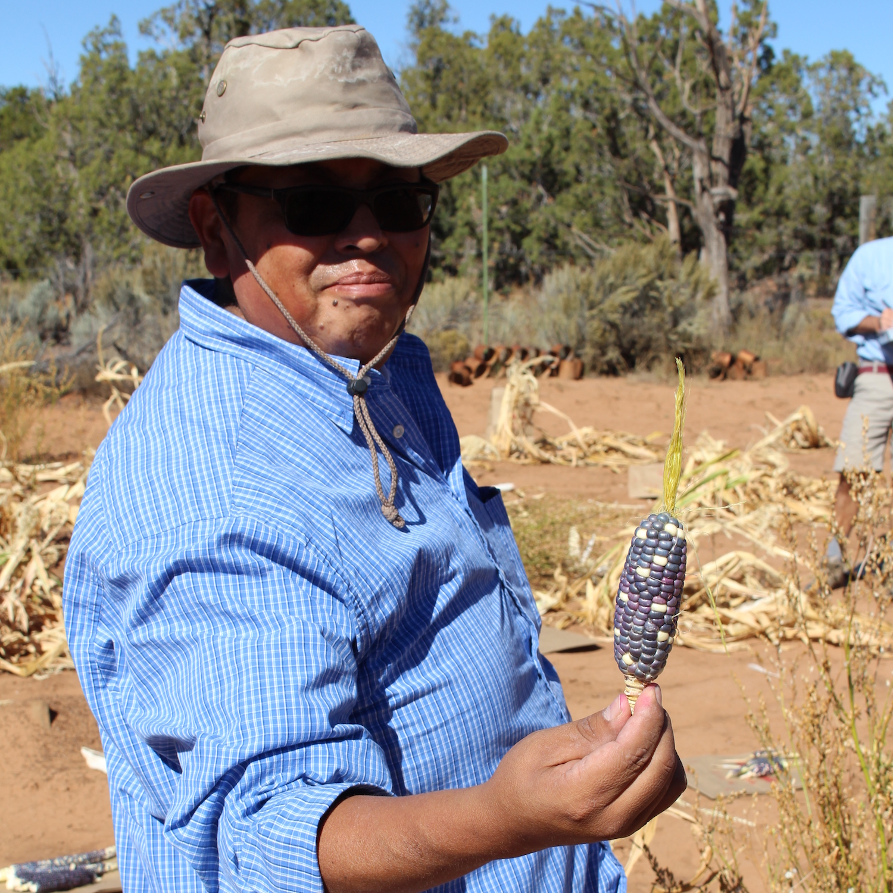
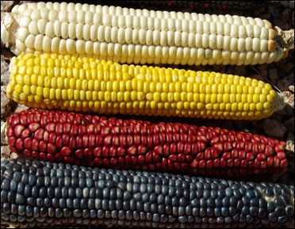
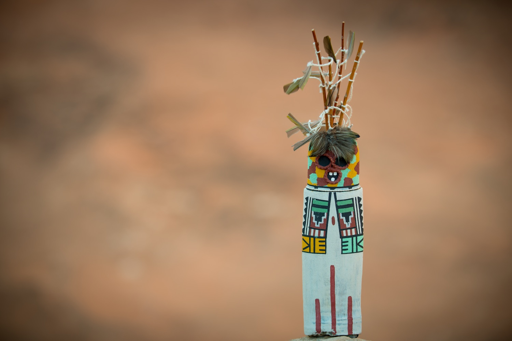
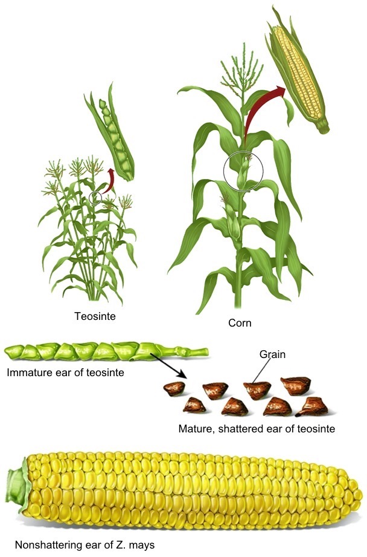
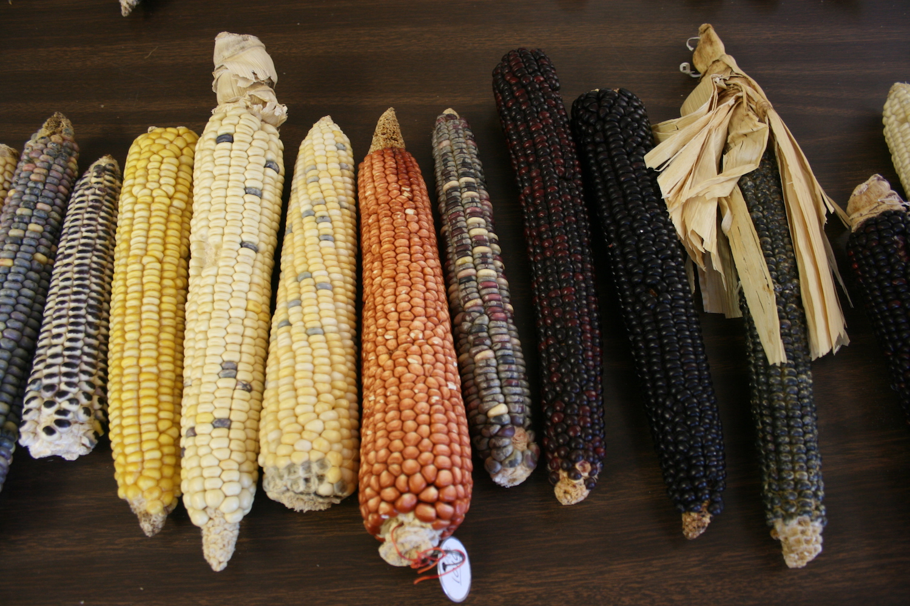
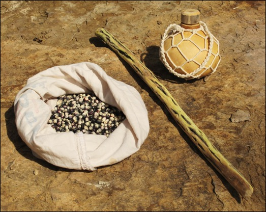
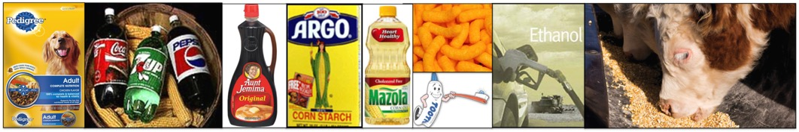

# The Story of Maize

The relationship between humans and corn (or maize, *Zea mays* ssp. mays) is a long and interesting story. The path to domestication began about 9,000 years ago in southwestern Mexico. The domestication process led to a unique codependency: as it exists today, corn is not able to reproduce without human intervention. But humans have also become dependent upon this plant.  

Today, corn is the most widely produced grain crop in the United States, though only a tiny fraction of the corn grown directly feeds people. Most of what we consume is in the form of high-fructose corn sweeteners. Most corn production goes toward animal feed, ethanol and exports. Corn has become less of an important food resource and more of a refined industrial product. In contrast, corn holds an important place in the origin myths and lifeways of many native cultures. In Pueblo cultures, maize plays a vital position physically, spiritually, and symbolically.

## Origins

The domestication of maize was unique. Typically, domesticated plants look similar to their wild ancestors; However, an ear of corn's closest wild relative, teosinte, is noticeably different from an ear of modern corn. An ear of maize is wrapped in a husk and the kernels are held tightly and not able to scatter or free themselves from the cob, whereas the kernels of teosinte are able to scatter freely. Because the husks of corn must be removed in order for corn to reproduce, corn is as dependent on humans as humans are dependent on corn.
<!-- 
 -->
<!--  -->
<!-- 
 -->

Teosinte, a wild grass native to Mexico and Central America, is so closely related to maize that it belongs to the same species, *Zea mays*, but is a different subspecies: parviglumis. Despite their shared ancestry, the plants differ in significant ways:

| **Maize** | **Teosinte** |
| --- | --- |
| grows as a single stalk with a few large ears | branched with many small ears |
| ears are encased in a husk with hundreds of kernels on the cob | ears have eight to 12 kernels, each surrounded by a hard fruit-case |
| ears typically have 8 to 16 rows of kernels | ears have two rows of kernels |
| kernels must be separated from the ear and planted by humans | ears shatter when dry and the seeds scatter, distributed by gravity, birds and other animals |

## The people of corn

Maize entered the southwestern United States about 4,000 years ago. On its long journey from Mexico, maize has adapted from its tropical environment, which has 12 hours of daylight, to the semiarid, long summer days and cool night conditions of the Colorado Plateau. Farming techniques also had to adapt. Direct-precipitation agriculture is dependent on moisture stored in the soil from precipitation and runoff water. Pueblo people have practiced direct-precipitation farming in the arid Southwest for millennia. They have accumulated detailed knowledge of their environment and have adopted specialized planting techniques. Direct-precipitation farming is an act of faith that binds the people to their land and their beliefs, requiring hard work, song and prayer.

Traditional direct-precipitation farming techniques include:

- **Knowing wild plants that indicate adequate soil moisture.** Several plant species are regarded as key indicators when it comes to agricultural field selection. Rabbitbrush (*Chrysothamnus*), snakeweed (*Gutierrezia*), grease wood (*Sarcobatus*), fourwing saltbush (*Atriplex*), and ricegrass (*Oryzopsis*) typically indicate good soil moisture. Corn is likely to do well where these indicator species grow vigorously.
- **Planting seeds deeply.** Seeds are planted deep, about eight to 12 inches, so they will come in contact with moist soil. This ensures the seeds receive all the benefits of winter moisture and a deep root system. 
- **Planting seeds in clumps.** By planting 10 to 15 seeds together, the farmers ensure the young plants protect each other from the harsh sun and winds. When many seeds are planted together, the chances of total loss from insects, birds, or rodents are reduced.
- **Planting with wide spacing between clumps.** Clumps are spaced about 1.5 to 2 meters apart to ensure adequate surface area to absorb precipitation and reduce competition from other plants for moisture stored in the soil.
- **Planting on north-facing slopes and/or planting in alluvial floodplains.** Less exposure to direct sunlight reduces evaporation and conserves soil moisture. Alluvial floodplains provide deep sediment deposits that have increased moisture-storage capacity. These settings also get recharged with organic materials that move down the drainage and settle in the fields.

> When the people emerged into this world Masau'u provided the people with three gifts---a planting stick (*so'ya*) a bag of seeds and a gourd of water. He handed them a small ear of blue corn and told the people: "Here is my life and my spirit. This is what I have to give you."
>
> --- A portion of a Hopi origin story

To contemporary Pueblo people, corn is considered a mother because it sustains the people both physically and spiritually. Corn is also a child --- it needs constant protection and encouragement to grow to maturity. After harvest, the plants die and are laid to rest just as people are. Nourishment provided by corn in turn allows the people to care for the growing plants. The symbolic cycle of corn and people repeats over and over.

## A world of corn

Maize was unknown outside the New World before the sixteenth century. Because of its ability to grow in diverse climates, maize spread rapidly to the rest of the world and became the staple it is today.

The success of maize worldwide can be attributed to the following:

**Adaptation** — Contemporary varieties of maize grow in many different environmental conditions: from sea level to 11,000 feet and from 5 to 170 inches of precipitation annually.

**Variability in appearance** — Ears and kernels display a diverse range of sizes, colors, and endosperm textures. There are thousands of varieties of corn to choose from in seed catalogs: open-pollenated, heirloom, hybrid, and even genetically modified. Variability in kernel shape, size, and color, as well as differences in ear size, demonstrates the incredible diversity in maize.

**Versatility** — Products range from cereal and sweeteners to fuel. Maize may be stored as dried grain, liquid sweeteners, or alcohol. Maize can be eaten boiled, roasted, popped, or ground.

Genetic diversity is important in adapting to a wide variety of environments and conditions. Hopi farmers have at least 17 locally adapted varieties of corn. This diversity allows plants to adjust to the arid environment of the region and reduce the risk of crop failure.
