# The life-cycles of maize

All farmers combine intimate knowledge about the crops they grow with in-field observations of how their crops are doing during the growing season. They use this information throughout the growing season when making decisions about how to care for their crops. Farmers from different cultures often have different "ways of knowing" about how their crops are doing.

Here, we present two ways of knowing that describe the life-cycle of maize. [The Hopi life-cycle of maize] emphasizes the relationship between Hopi farmers and their corn that has sustained the Hopi people for generations. [The phenology of maize] are the growth-stages that Western scientists record to understand 

## The Hopi life-cycle of maize

All farmers use descriptions of the life-cycle of their crops. The descriptions used by traditional farmers like the Hopi reflect their traditional ecological knowledge about how their particular varieties of maize grow. The words provided in the images below are the Hopi words for the growth-stages of maize.

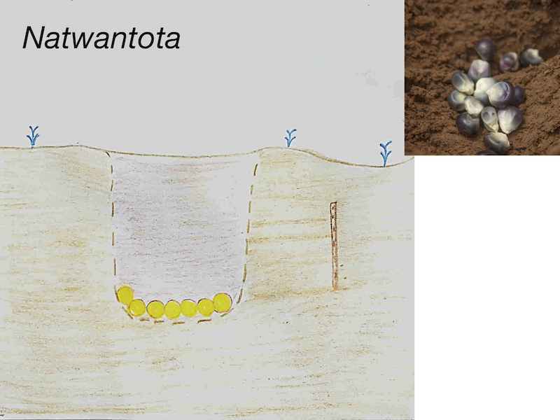
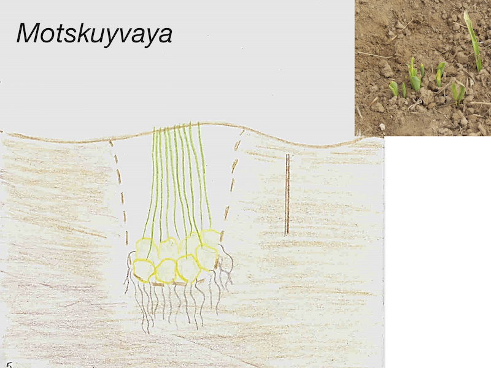
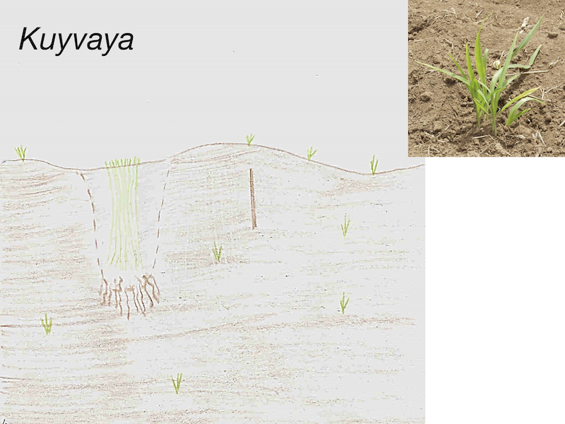
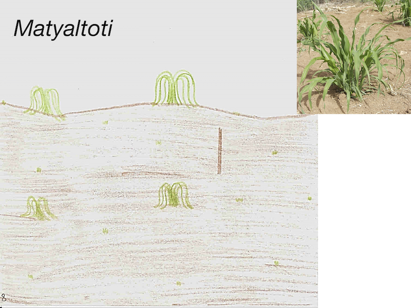

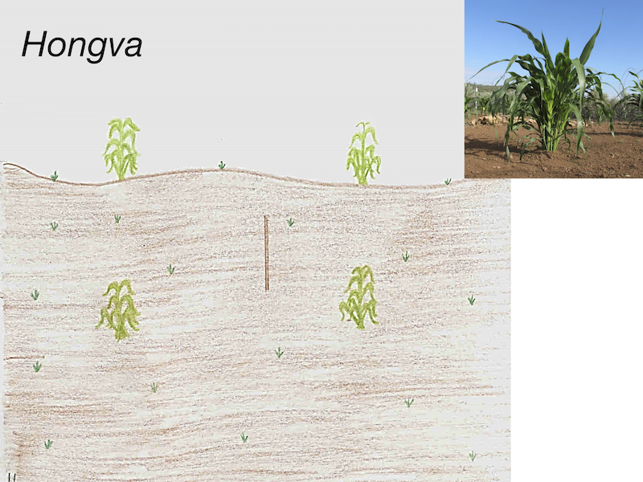
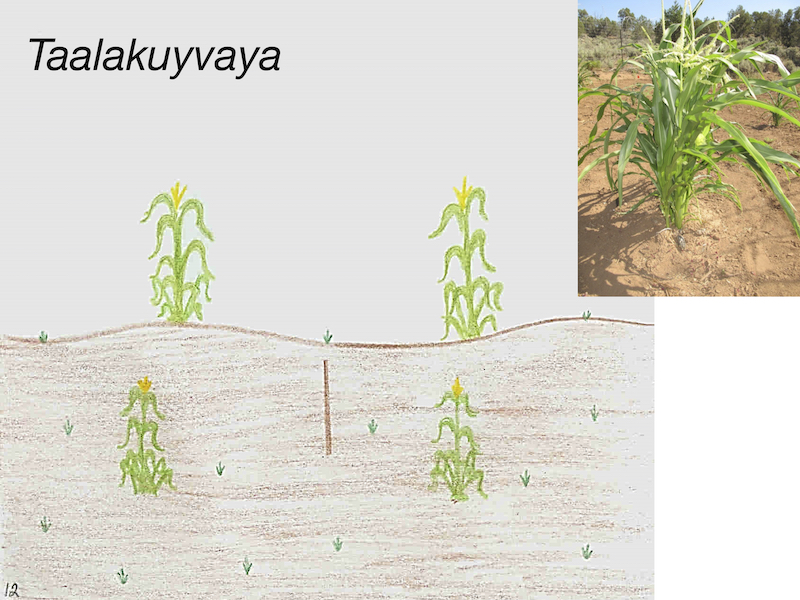
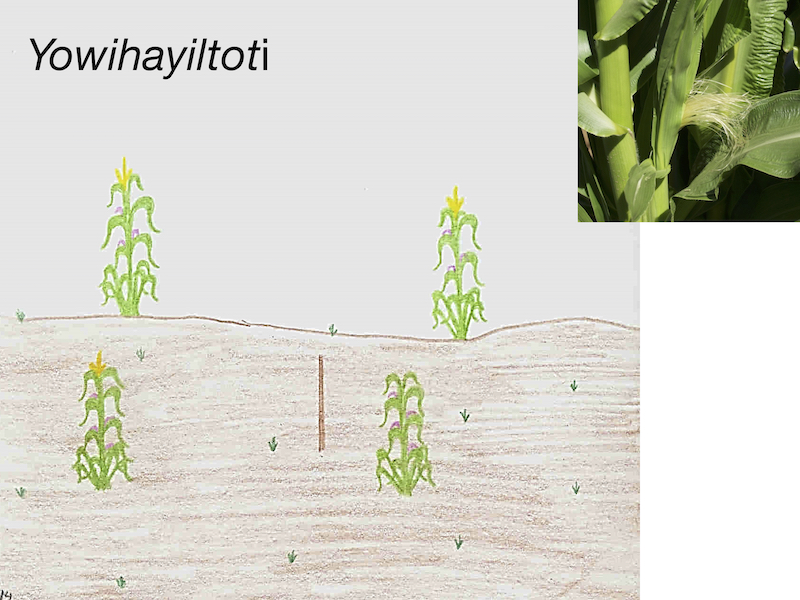
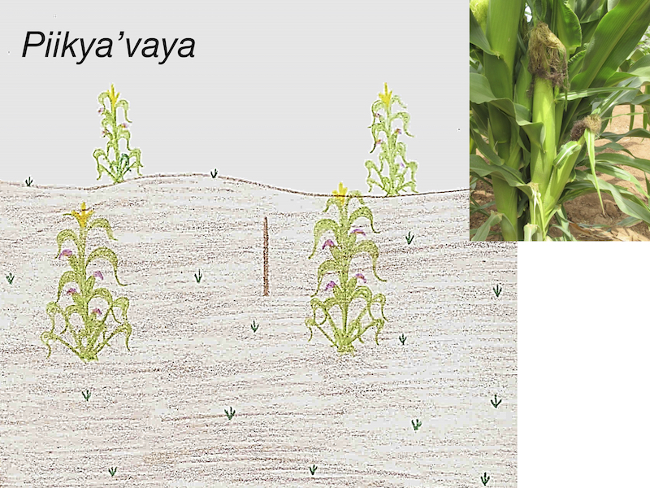
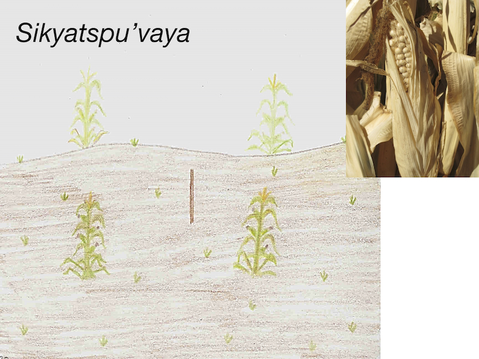
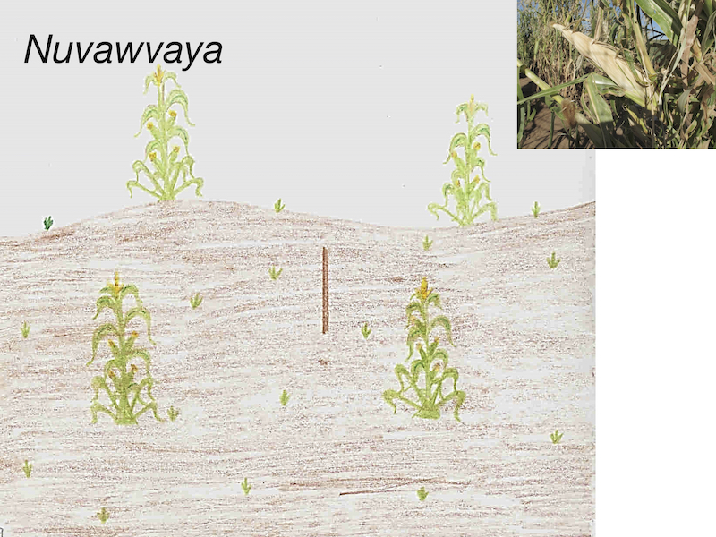

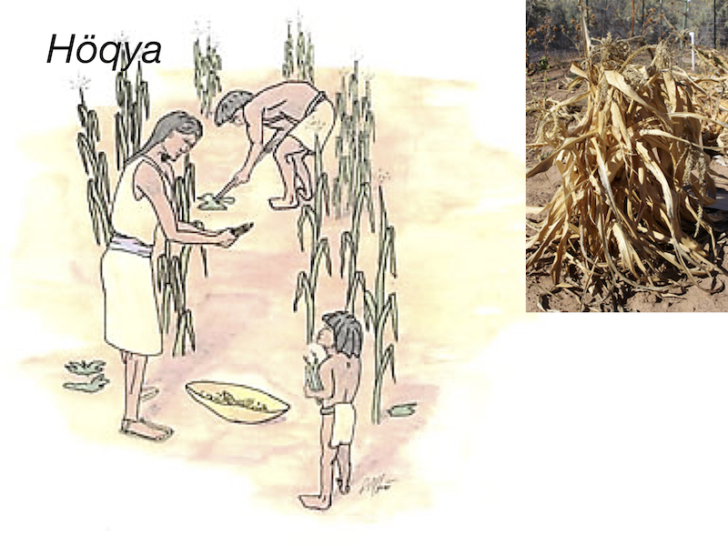

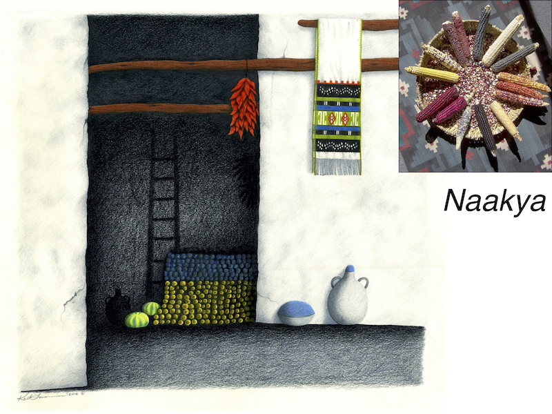

&nbsp;

## The phenology of maize

Like the Hopi, Pueblo Farming Project researchers also have desccriptions for the life-cycle of maize. PFP scientists use stages of maize growth from maize *phenology*, or the scientific study of plant life-cycles. The photographs below illustrate the growth stages that were recorded by PFP researchers during the growing season.

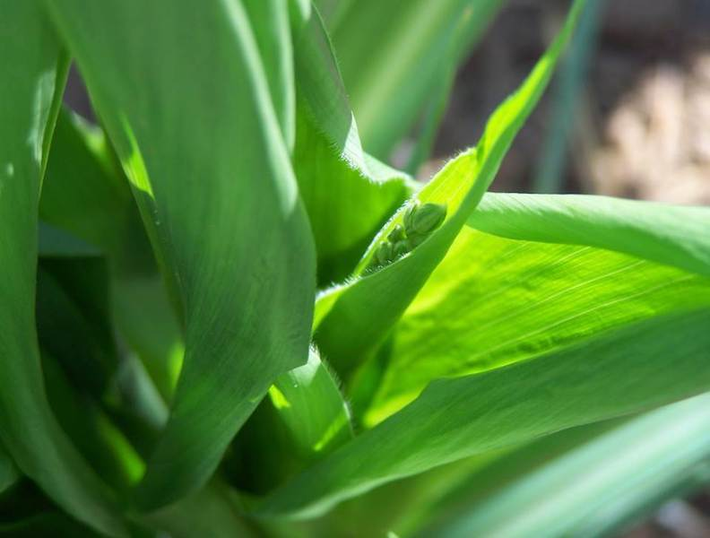
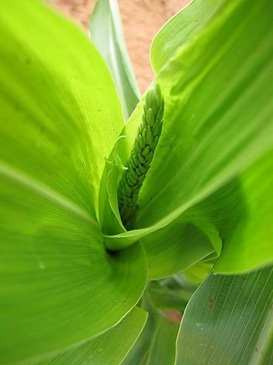
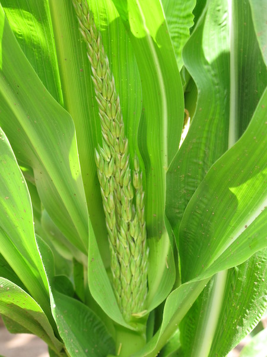
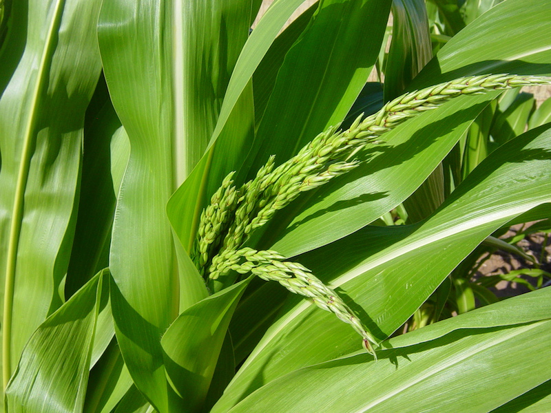
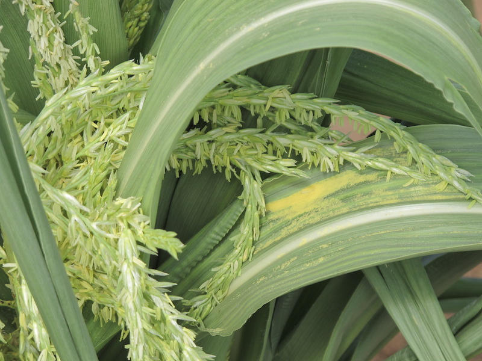
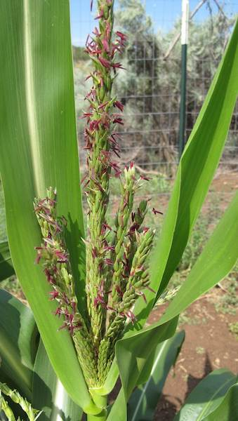
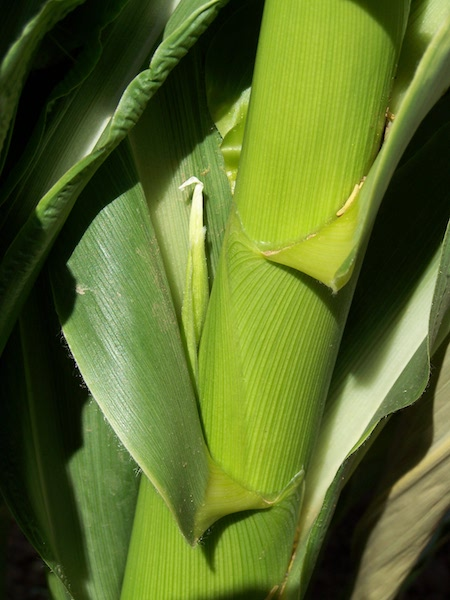
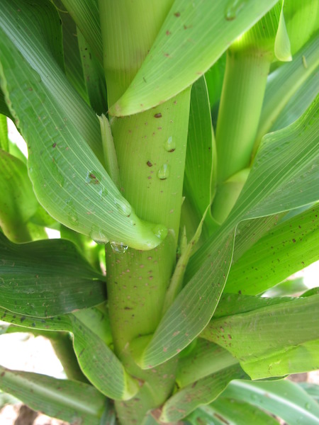

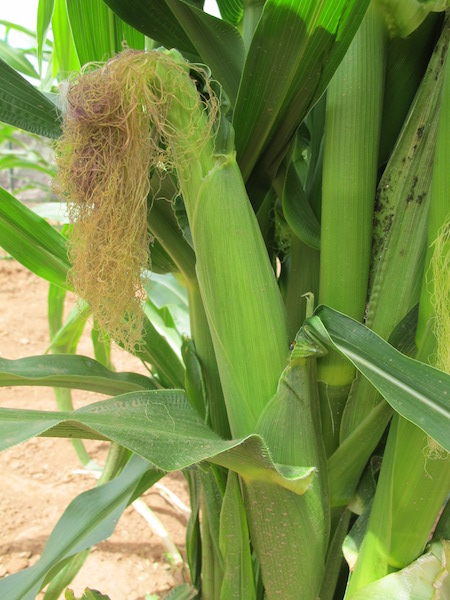
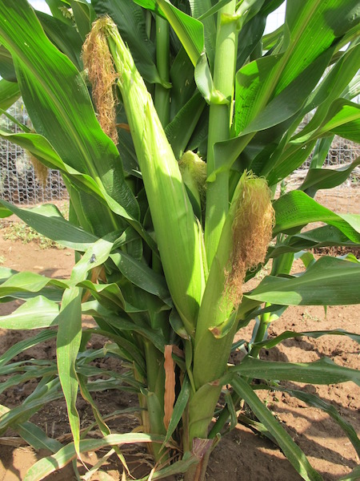
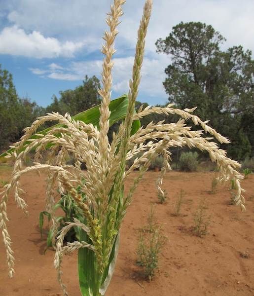

&nbsp;

