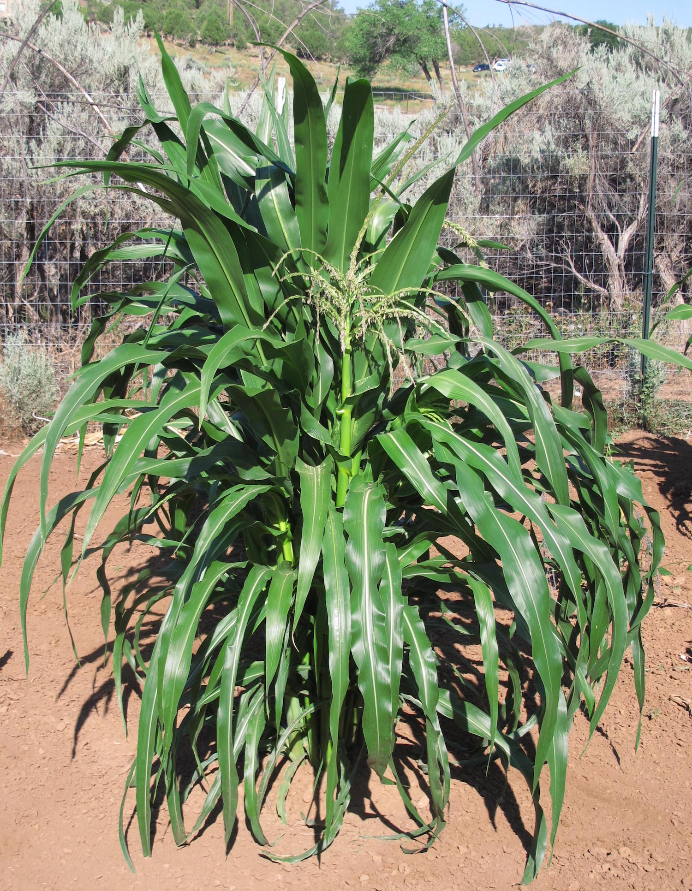
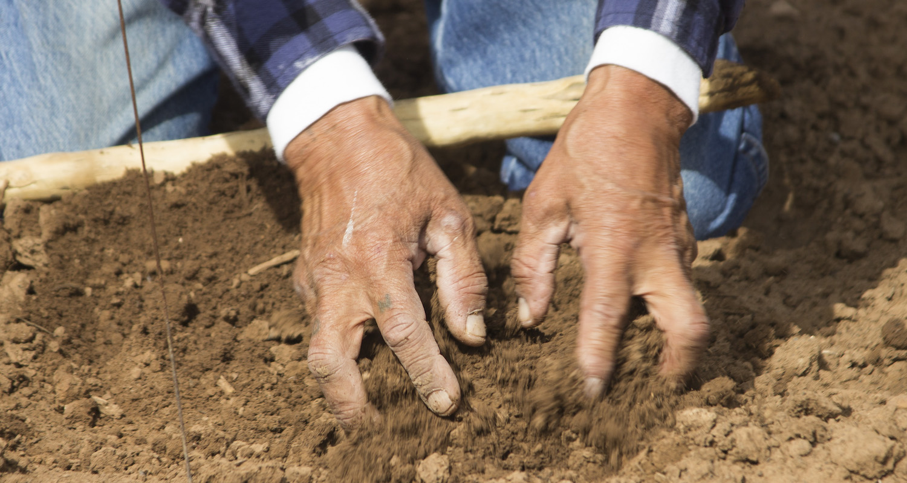
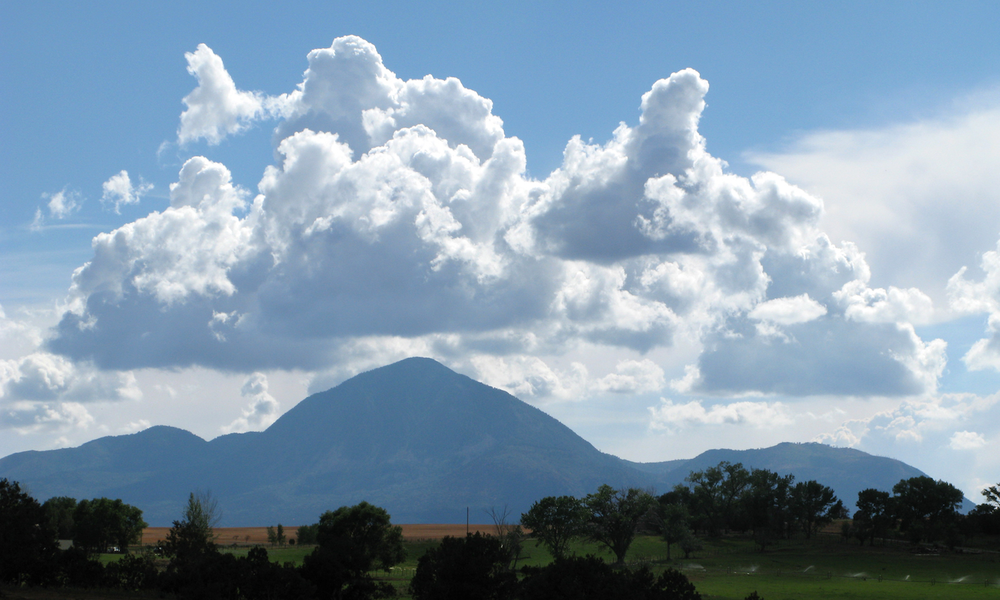
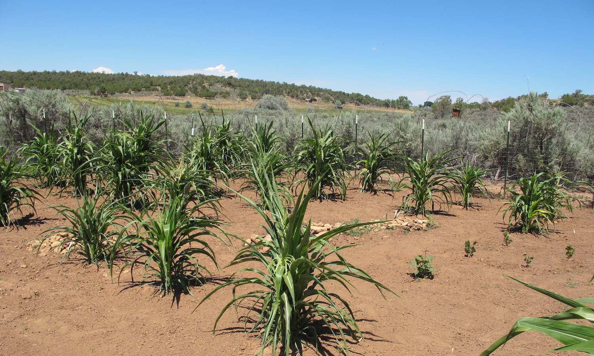

# What maize needs to flourish
<div style="text-align: center;">

</div>

Maize, like all crops, require nutrients from the [soil][Soil], [water][Water], and [heat and sunlight][Heat and sunlight] in order to flourish. In this chapter, we explore how Pueblo maize uses each of these resources, and learn about how those resources affected the Pueblo Farming Project gardens.

## Soil

<div style="text-align: center;">

</div>

### What are soils? {-}

Soil is made of a combination of minerals, organic matter, and sand. These three ingredients are combined in different amounts and travel long distances around the globe through the movements of glaciers, water, and wind. **Soils store water and nutrients that plants use to flourish.**

#### How does soil gain water? {-}
Water is delivered to the soil in two ways:

*   **The Earth's Water Cycle**: precipitation in the form of rain, snow and ice. In the Southwest, the most important weather events that deliver water to the soil are winter snowstorms and summer monsoon rains. 
*   **Water Management**: Humans capture and store water from the water cycle and spread it on the soil using irrigation systems. 

This video from [The Monsoon Project](https://themonsoonproject.org/) describes the importance of the North American Monsoon to the Southwest.

<div class="embed-responsive embed-responsive-16by9">
<iframe src="https://www.youtube.com/embed/wCRkLcLT1cE?modestbranding=1&rel=0&start=1&end=212" frameborder="0" gesture="media" showinfo="0" allow="encrypted-media" allowfullscreen></iframe>
</div>

#### How does soil lose water? {-}

Soils lose water through a process called **evapotranspiration**. This means the soil loses moisture through direct evaporation and through plant tissues, due to the wind and the sun.

Breaking this term into two parts helps reveal this definition:

*   **Transpiration** — plants sweat out and lose water they have received from the soil
*   **Evaporation** — the soil loses water due to the wind and the sun

To slow this process down, farmers often use a technique called **mulching**. Mulch is:

*   A material that is spread over a planting area, protecting the soil from the effects of the wind and the sun.
*   A layer of insulation that traps moisture and shades the soil, preventing the water in the soil from evaporating. 
*   Carbon-based materials such as straw or dry grass clippings.

Pueblo farmers, such as the Hopi, use dust and sand as a mulch; they covered the moist soil that held their seeds with a thick layer of sand and dust. 

#### Why do some farmers apply irrigation water to their soil? {-}

Some farmers irrigate because:

*   They are replacing the water that their plants and soils have lost due to evapotranspiration.
*   Some plants require more water than the environment has to offer; the farmers apply irrigation water to make up for water that does not arrive in the form of rain and snow.

Some modern farmers do not apply irrigation water to their soil: 

*   Hopi farmers who have vast dryland corn fields.
*   Farmers from the western states who have large dryland crop farms.

Many Hopi farmers and other farmers in the Southwestern US do not use irrigation systems; the keys to their success is understanding weather patterns, caring for their soil, planting drought-resilient seeds and having faith in natural cycles.

> **_"Dry-farming in the high desert....relying only on precipitation and runoff water, requires an almost miraculous level of faith and is sustained by hard work, prayer, and an attitude of deep humility."_**
> 
> --- <cite>Wall and Masayesva 2004:436</cite>

#### How do dryland farmers decide where to place their gardens and fields? Why is this decision so important? {-}

Choosing the location of a garden is called "site selection". It is important to dryland farming because the chosen site must be able to capture and hold water delivered by the Water Cycle, making it "drought-resilient". 

**These are the features that the ancestral Pueblo farmers of the past and the Hopi dryland farmers of today look for in a site that will be drought-resilient**:

*  **Geography:** Water that drains off of a mesa or cliff will collect and flood down into drainages, washes, arroyos or canyons. Where these features become less narrow and open up into sandy slopes, Pueblo farmers expect water and  good soil to collect because it is washed down with the floodwaters. This mouth or opening is also a place where they traditionally built **check dams**: rows of low rock walls to slow down the movement of runoff water.
*   **Garden slope**: North-facing slopes have more shade, therefore less water is lost to evaporation.
*   **Indicator plants**: The appearance of certain plants in early spring give information, or _indicate_, to Hopi and other Dryland farmers about where the best places are for a garden/field, how deep to plant and how much space to leave between plants. Farmers combine these indications with practice, experience and knowledge of the land. Some examples of plants that indicate these conditions are:

<table>
  <tr>
   <td>
<strong>CONDITION</strong>
   </td>
   <td><strong>INDICATOR PLANT</strong>
   </td>
  </tr>
  <tr>
   <td>Good soil moisture
   </td>
   <td>Rabbitbrush<br>
Four-wing saltbrush<br>
Mormon tea<br>
Rice grass<br>
Snakeweed
   </td>
  </tr>
  <tr>
   <td>Deep, well drained soil
   </td>
   <td>Rabbitbrush<br>
Oak trees
   </td>
  </tr>
</table>

*   **Soil moisture depth**: deep, soft soils that allows natural reservoirs of water to collect in and be held deep in the soil.
*   **Soil color**: darker colors often mean higher amounts of decomposed organic matter and nutrients in the soil. In the Southwest, this means dark red-brown.
*   **Large, open planting area**: the area must be large enough that clumps of seeds can be planted with wide spaces between them (2-3 adult paces/steps or 4 - 6 feet, between clumps.) This spacing allows little soil-moisture reservoirs to be created between clumps, providing long-term moisture. 


### Drought {-}
**When a normal amount of snow and rain does not arrive year after year, this is called a "drought".**

#### How do Puebloan farmers respond to drought? {-}

The Hopi people use the agricultural knowledge gained through their ancestral dryland farming practices. They want to ensure their crops will continue to be drought-resilient into the future. To survive drought, a dryland farmer must know a lot about their soil and their seeds. Ancestral Pueblo farmers responded to drought by:

*   anticipating the possibility that it could arrive any year, and preparing for it by saving seeds from plants that can survive drought. 
*   using the site selection factors listed above as test questions to decide whether or not a site will be drought-resilient. 
*   meeting these site requirements by planting in multiple locations.
*   using clumps of plants at the edge of the planting area, or tin cans placed around seedlings, as a windbreak to decrease evapotranspiration.
*   Covering holes that contain seeds with loose topsoil to act as a "dust mulch".

#### Do other dryland farmers use any of these same practices? {-}

Yes, though some farmers emphasize knowing the soil through soil testing:

*   First, farmers learn what is in their soil to determine what kind of soil they have. 
*   Second, farmers find out how much water their soil can hold. If the soil receives more water than it can hold, much of the extra water will drain away. Water that is wasted in this way is called **runoff**; it leads to **erosion**, when soil is carried away by the runoff. 

### Soils in the PFP gardens {-}
Pueblo Farming Project researchers used data from the USDA and local soil analysis to characterize the soils under the gardens on Crow Canyon's campus in southwestern Colorado. The map below displays the soils on Crow Canyon's campus. Click a soil to learn more information about it!

```{r, echo = FALSE}
library(magrittr)
library(sf)

garden_locations <- sf::st_read("./data/gardens.geojson",
                                quiet = TRUE)

garden_locations$color <- RColorBrewer::brewer.pal(length(garden_locations),"Dark2")

garden_centroids <- garden_locations %>%
  sf::st_transform(26912) %>%
  sf::st_centroid() %>%
  sf::st_transform(4326)

pfp_soils <- sf::st_read("./data/soils.geojson")

## Create color palettes for each soil layer
colorpal <- leaflet::colorNumeric(
      palette = "YlGn",
      c(300,1400))

pfp_soils %>%
  leaflet::leaflet(width = "100%") %>%
  leaflet::addProviderTiles("Esri.WorldImagery", group = "Satellite") %>%
  leaflet::addProviderTiles("Esri.WorldTopoMap", group = "Topography") %>%
  leaflet::addPolygons(
    data = pfp_soils,
    fillColor = ~colorpal(pfp_soils$Net.Primary.Productivity..kg.ha.),
    fillOpacity = 0.7,
    color = "white",
    weight = 3,
    opacity = 1,
    smoothFactor = 0.5,
    popup = ~popup
  ) %>%
  leaflet::addMarkers(data = garden_centroids %>%
                        dplyr::filter(Abbreviation != "MCG"),
                      popup = ~Popup) %>%
  leaflet::addPolygons(data = garden_locations %>%
                        dplyr::filter(Abbreviation != "MCG"),
                       fillColor = ~color,
                       popup = ~Popup) %>%
  leaflet::addLayersControl(
    baseGroups = c("Satellite", "Topography"),
    options = leaflet::layersControlOptions(collapsed = T)
  )

```

<!-- ### Soil moisture and temperature {-} -->
<!-- Plants are sensitive to soil moisture and temperature. PFP researchers installed soil moisture and temperature monitors in the PFP gardens on Crow Canyon's campus. This component of the PFP was completed in collaboration with the Lisa Nagaoka and Steve Wolverton of the University of North Texas as part of collaborative research funded by the National Science Foundation (BCS-1460122). Lisa and Steve are interested in thresholds of soil moisture and temperature that lead to crop failure. -->

<!-- The graphs below show the soil moisure and temperature through time at each garden sensor. -->

<!-- ```{r, echo=FALSE} -->
<!-- shiny::inputPanel( -->
<!--   shiny::selectInput("the_var_soil_moisture", label = "Soil measurement:", -->
<!--                      choices = c("Moisture","Temperature")), -->

<!--   shiny::selectInput("the_garden_soil_moisture", label = "Garden/Location:", -->
<!--                      choices = unique(gsub(" — NA","",paste0(soil_moisture$Garden," — ",soil_moisture$Location)))), -->

<!--   shiny::checkboxInput("freeze_y_soil_moisture", label = "Freeze y scale?", value = TRUE) -->

<!-- ) -->

<!-- output$download_soil_moisture <- shiny::downloadHandler( -->
<!--       filename = function() { -->
<!--         "soil_moisture.csv" -->
<!--       }, -->
<!--       content = function(con) { -->
<!--         readr::write_csv(soil_moisture, con) -->
<!--       } -->
<!--     ) -->

<!-- shiny::renderPlot({ -->
<!--   garden <- strsplit(input$the_garden_soil_moisture," — ")[[1]][1] -->
<!--   loc <- strsplit(input$the_garden_soil_moisture," — ")[[1]][2] -->

<!--   moisture_data <- soil_moisture %>% -->
<!--     dplyr::filter(Garden == garden) -->

<!--   if(!is.na(loc)){ -->
<!--     moisture_data <- moisture_data %>% -->
<!--       dplyr::filter(Location == loc) -->
<!--   } -->

<!--   if(input$the_var_soil_moisture == "Moisture"){ -->
<!--     moisture_data <- moisture_data %>% -->
<!--       dplyr::select(Time,contains("VWC")) %>% -->
<!--       reshape2::melt(id.vars="Time") -->

<!--     the_range <- c(0.05,0.35) -->
<!--   }else{ -->
<!--     moisture_data <- moisture_data %>% -->
<!--       dplyr::select(Time,contains("Temp")) %>% -->
<!--       reshape2::melt(id.vars="Time") -->

<!--     the_range <- c(32,85) -->
<!--   } -->

<!--   # xrange <- range(moisture_data$Time) -->
<!--   xrange <- as.POSIXct(c("2015-06-01 UTC","2016-12-31 UTC")) -->

<!--   soil_moisture_plot <- ggplot2::ggplot() +  -->
<!--     ggplot2::ggtitle(paste0("Soil ",input$the_var_soil_moisture,": ", input$the_garden_soil_moisture)) + -->
<!--     ggplot2::theme(axis.text = ggplot2::element_text(size=14), -->
<!--                    axis.title = ggplot2::element_text(size=16,face="bold"), -->
<!--                    legend.title = ggplot2::element_text(size=16,face="bold"), -->
<!--                    legend.text = ggplot2::element_text(size=14), -->
<!--                    plot.title = ggplot2::element_text(size=18,face="bold")) +  -->
<!--     ggplot2::xlab("Date") +  -->
<!--     ggplot2::xlim(xrange) -->

<!--   if(input$freeze_y_soil_moisture){ -->
<!--         soil_moisture_plot <- soil_moisture_plot + -->
<!--           ggplot2::ylim(the_range) -->
<!--   } -->

<!--   soil_moisture_plot <- soil_moisture_plot +  -->
<!--       ggplot2::geom_line(data = moisture_data, -->
<!--                          ggplot2::aes(y = value,  -->
<!--                              x = Time, -->
<!--                              col=variable -->
<!--                          ), -->
<!--                          size=2) -->

<!--   if(input$the_var_soil_moisture == "Moisture"){ -->
<!--     soil_moisture_plot <- soil_moisture_plot +  -->
<!--       ggplot2::ylab(bquote('Volumetric water content ('*m^3/m^3*')')) + -->
<!--       ggplot2::scale_colour_hue(name="Depth", -->
<!--                          breaks=c("VWC_15", "VWC_30", "VWC_45"), -->
<!--                          labels=c('15 cm', '30 cm', '45 cm')) -->

<!--       soil_moisture_plot <- soil_moisture_plot +  -->
<!--         ggplot2::ylab(bquote('Volumetric water content ('*m^3/m^3*')')) -->

<!--   }else{ -->
<!--     soil_moisture_plot <- soil_moisture_plot +  -->
<!--       ggplot2::ylab("Temperature (ºF)") + -->
<!--       ggplot2::scale_colour_hue(name="Depth", -->
<!--                          breaks=c("Temp_15", "Temp_30", "Temp_45"), -->
<!--                          labels=c('15 cm', '30 cm', '45 cm')) -->
<!--   } -->

<!--   soil_moisture_plot -->

<!-- }, width = "auto", height = 450) -->

<!-- # shiny::downloadLink(outputId = 'download_soil_moisture', label = 'Download soil moisture data') -->

<!-- ``` -->

## Water
<div style="text-align: center;">

</div>

## Heat and sunlight
<div style="text-align: center;">

</div>

### GDD sidebar {-}
