# The PFP field experiments
<div style="text-align: center;">
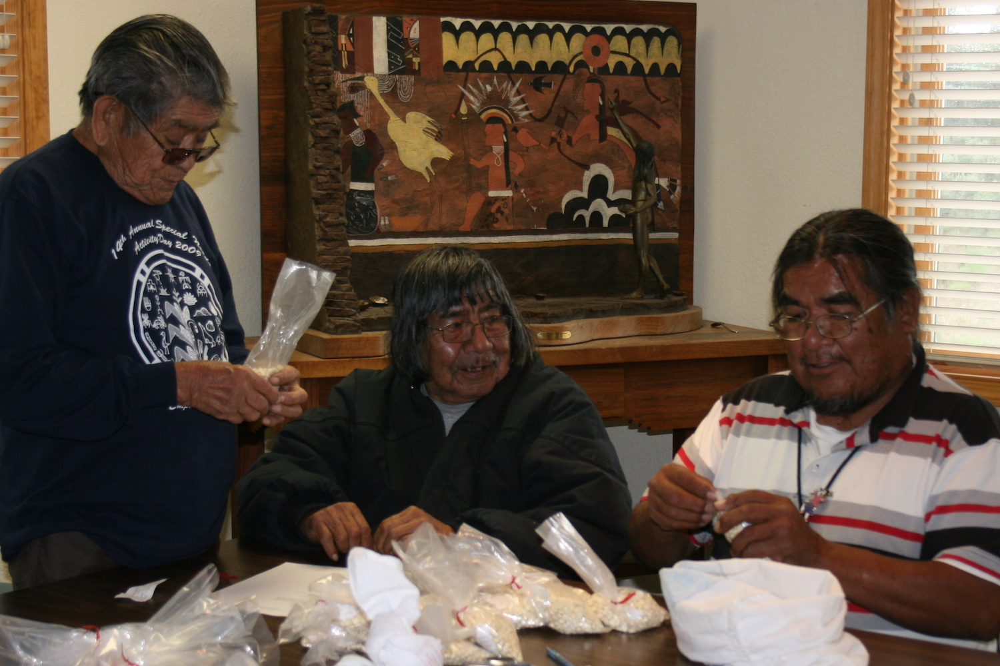
</div>


## Procedure
### Planting {-}
<div style="text-align: center;">
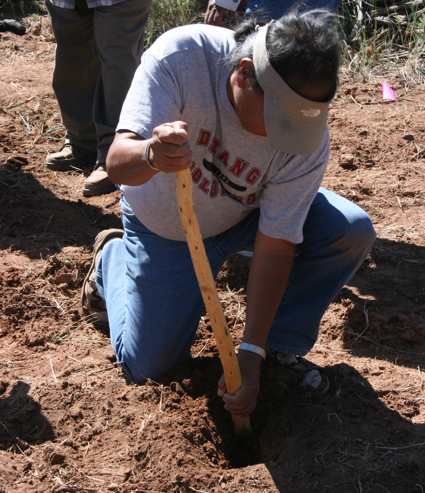
</div>

The primary tool for planting is a planting stick or, in the Hopi language, a *so'ya*. Traditionally a *so'ya* is made from greasewood (*Sarcobatus vermicalatus*), but some planting sticks today are made from a length of metal pipe with a narrow blade welded to one end.

Planting begins by using your foot to scrape away the upper layer of loose, dry dirt. This exposes the top of the underlying hard-packed soil. About a square foot area is cleared. The planter gets down on one knee and grabs the *so'ya* with one hand low and one hand higher up on the tool. A narrow hole is dug using a pulling motion toward the planter. Typically, the hole is dug to a depth of about 8 to 10 inches or to the depth where good soil moisture is encountered. The hole is dug deeper if the soil is drier and shallower if the soil is moist. This soil moisture is critical for plant germination and for the plant to be able to grow until there is more precipitation, which might not occur until many weeks after planting.

Hopi farmers plant corn in clumps. 10--20 seeds are deposited into the hole. The excavated earth is put back gently into the hole in the order it was removed with the moist soil covering the seeds on the bottom and the drier soil on top. The loose dry dirt is on the top, but a small basin is created on the surface to collect any precipitation that falls and to create a dust mulch that reduces evaporation. 

The farmer stands and takes two or three steps to measure where the next clump of corn will be planted. Because the soils in the PFP gardens hold a bit more moisture than those soils near the Hopi mesas, the PFP clumps are typically spaced about 1.5--1.75 meters apart rather than the three-meter spacing typically used at Hopi. The wide spacing of the planted clumps reduces competition for valuable sub-surface moisture.

Flick through these slides to see how planting is done the Hopi way! The descriptions are based on *Notes On Hopi Economic Life* by Earnest Beaglehole, 1937.

<div class="carousel">
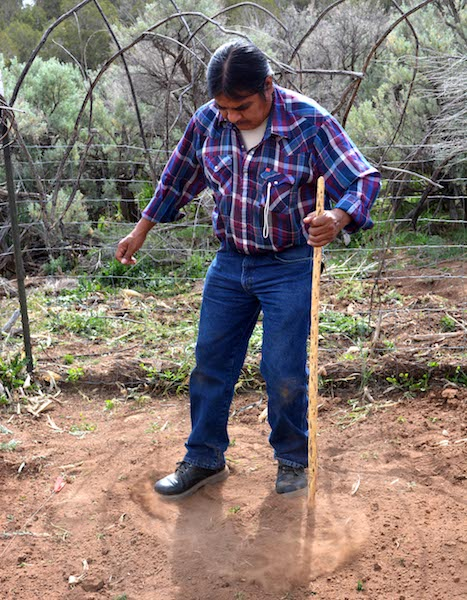
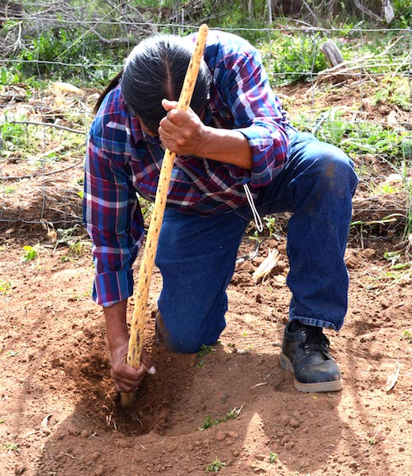
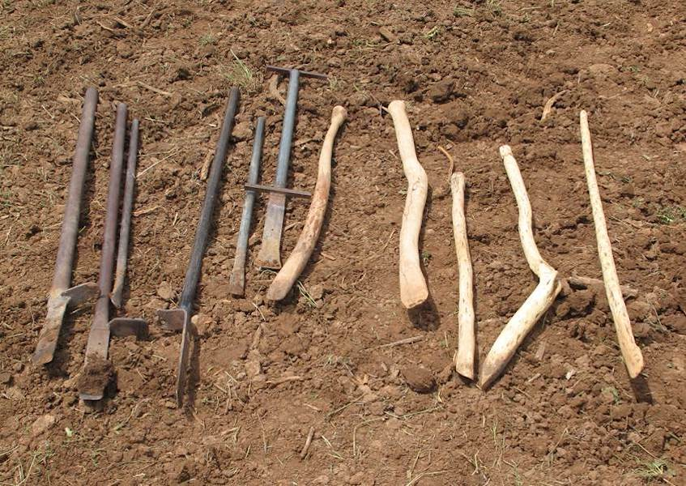
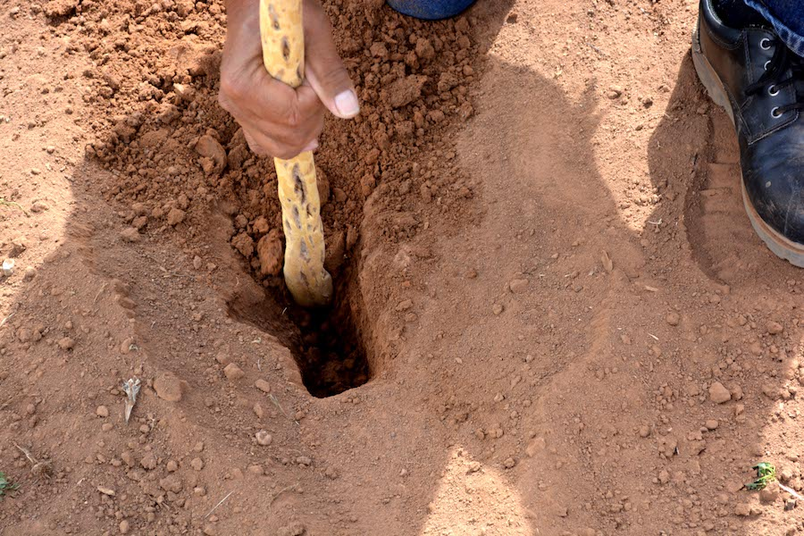
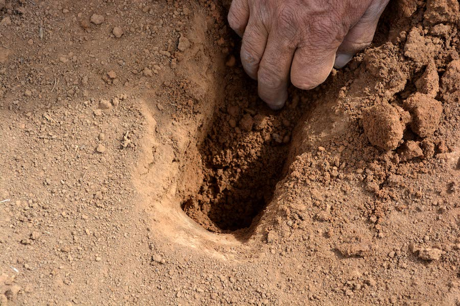
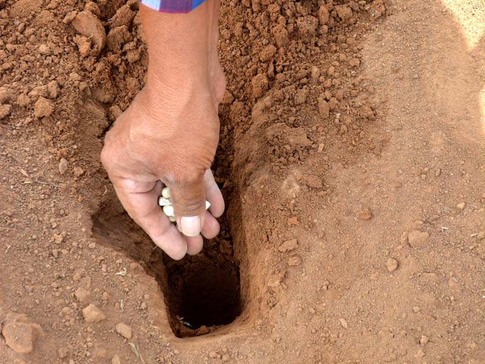
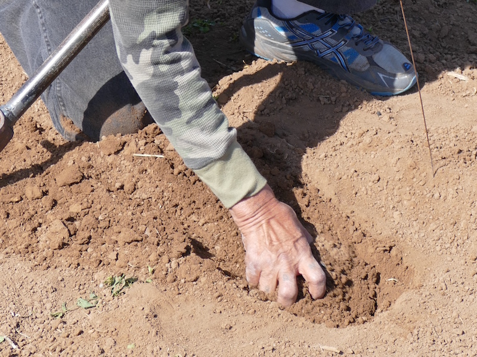
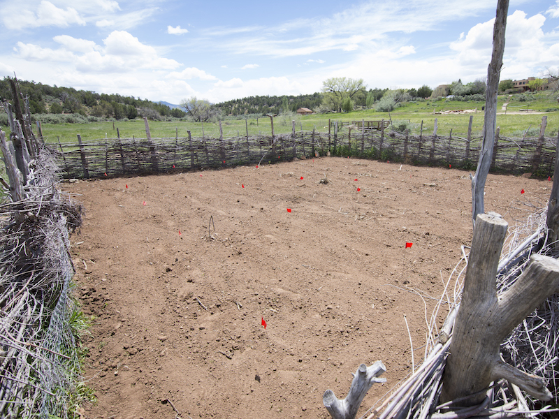
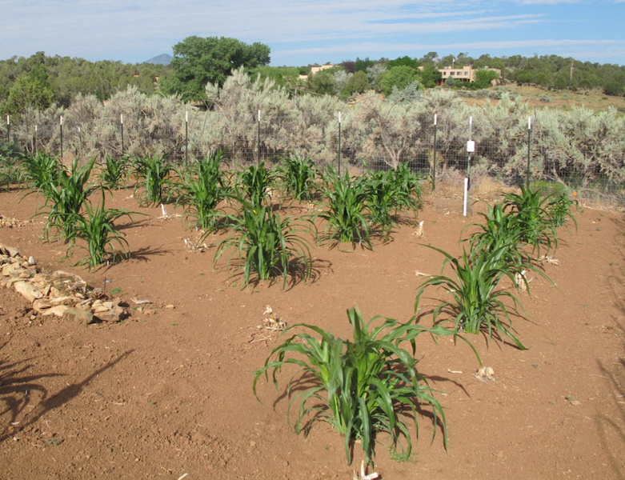
</div>

<div class="carcaption">
<p class="caption">&nbsp;</p>
</div>

### Monitoring {-}
<div style="text-align: center;">
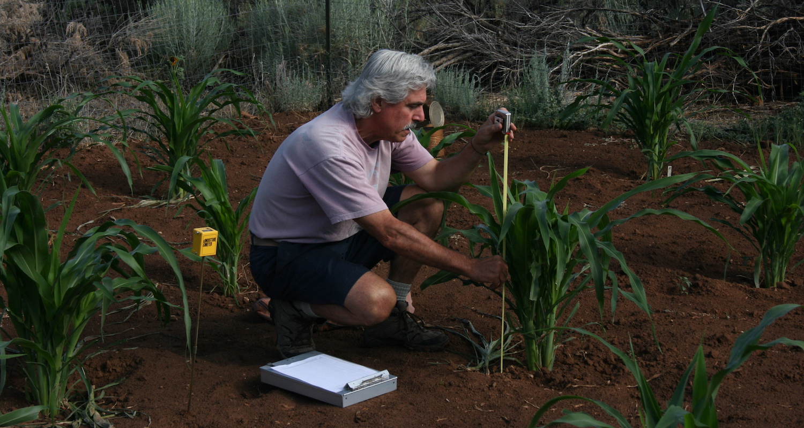
</div>

The procedures for monitoring Pueblo Farming Project gardens were based on those developed by Benjamin Bellorado in an experimental gardening study that he developed for the Animas-LaPlata archaeological project and for his MA thesis at Northern Arizona University. For the majority of the Pueblo Farming Project these procedures were implemented by Paul Ermigiotti and staff and volunteers who assisted him.

Monitoring was conducted each week. The primary objectives were to record growth stages, to document damage by pests, and to make other observations about the condition of the gardens. The data were recorded on paper forms in the field and later put into a database.

The data collected each week on growth stages includes the following:

* **Height** --- The height of the tallest plant in each clump was recorded to the nearest 5 cm.
* **Early Tassel Development** --- Early tassel development was recorded when it occurred on any plant in a clump. Early tassel development is defined as the time when the tassel bud starts to emerge from the central enclosing leaves at the top of the stalk to the time the tassel spike begins to branch.
* **Tassel Development** --- Tassel development was recorded when it occurred on any plant in a clump. Tassel development begins when the tassel emerges from the central cluster of leaves and begins to branch. This stage ends when the anthers (male flowers) emerge from the glumes of the tassel and the pollen begins to shed.
* **Tasseling** --- The period of tasseling was recorded when it occurred on any plant in a clump. The tasseling period is when the apex inflorescences (a group of flowers) begin to open. The anthers (male flowers) emerge and begin to shed pollen. At this stage the stalk has produced all its leaves, and the plant has reached full height.
* **Silk Development** --- Silk development was recorded when it occurred on any plant in a clump. Silk development is when ear shoots become visible in the nodes (between the leaf and stalk) until the silks have fully emerged and are ready to receive pollen.
* **Silking** --- Silk development was recorded when it occurred on any plant in a clump. Silking is when the silk has emerged from the husk surrounding the developing cob and is capable of receiving pollen. A single silk will deliver pollen and develop into individual kernel. Once the silks have begun to dry and shrivel, this growth stage has ended.
* **Ear Development** --- Ear development was recorded when it occurred on  any plant in  a clump.  Ear development begins once the silks have dried out, shriveled, and are no longer accepting pollen and continues until the kernels mature and the ear is ready to harvest.  A hard frost (below 28ºF.) will prematurely end ear development.


### Harvesting {-}
<div style="text-align: center;">
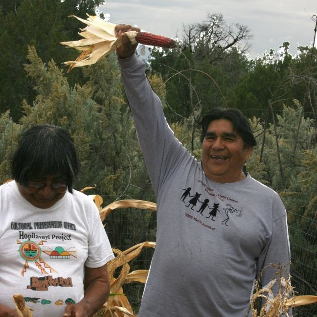
</div>

The harvest and yield data entry for the Pueblo Farming Project is a three-step process that includes collecting the corn from the field, weighing  the ears just after harvest, and, when they have dried completely, weighing the ears again to record the dry-kernel weight for each ear.

On harvest day, typically in mid-October after the ears have sufficiently ripened on the stalk, the farmers approach the garden with anticipation. All of the ears from each stalk in a clump are shucked, the silk is removed, and the ears are recorded and tagged according to the clump, stalk, and ear. After the ears are collected from a clump the stalks are bent over at the base and laid to rest on the ground. This laying to rest of the stalks is part of the life process that cycles through birth, maturation, and death. The stalks left in the garden also help with the spacing in the next year's planting. Planting between the stalks ensures that seeds are not planted in the same place two years in a row.

<div style="text-align: center;">
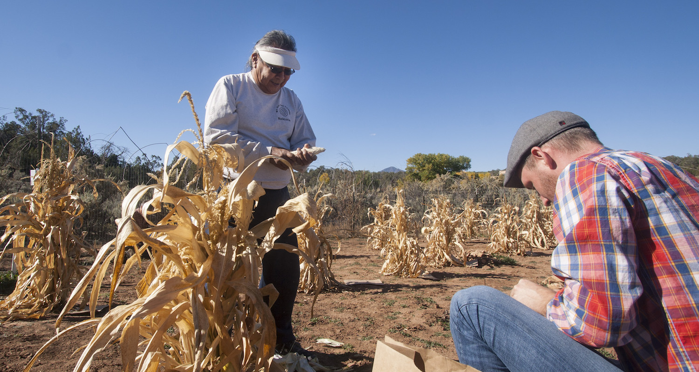
</div>

After harvest the ears are weighed to obtain a wet weight, because there is still considerable moisture remaining in the ears. The ears are then placed on trays and allowed to dry for two months.

When the ears have thoroughly dried, each ear is weighed with the kernels intact and after the kernels have been removed.  Ear, cob, and kernel weights are entered into the data base. Additional information on the ear is also recorded such as the number of rows of kernels, kernel color, and the completeness of kernel filling on the ear. The categories describing the condition of the ear include: 

* **Full**: more than two-thirds of the kernels are present
* **Partial**: one-third to two-thirds of the kernels are present
* **Sparse**: up to one-third of the kernels are present
* **Immature**: there are no kernels present on the cob

## Results
<div style="text-align: center;">
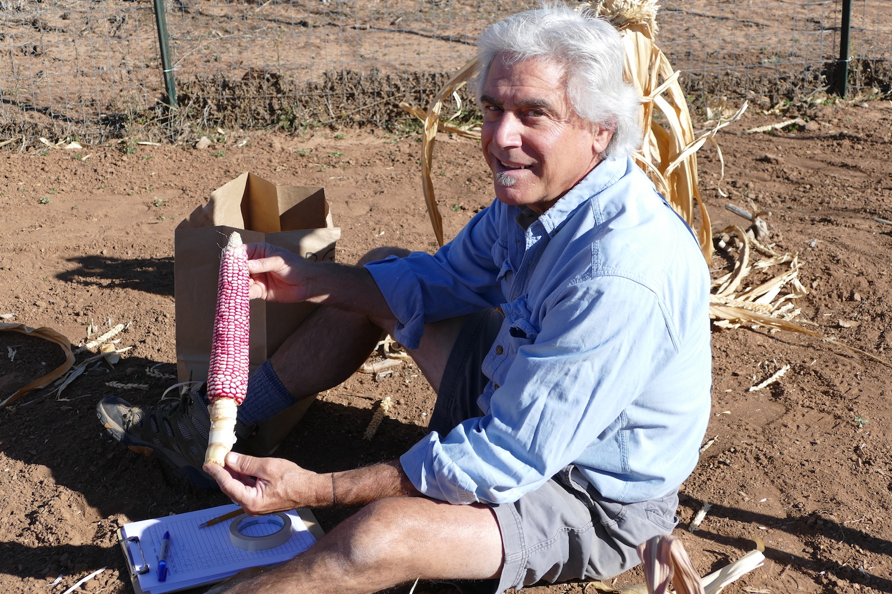
</div>

```{r pfp-results, echo=FALSE, warning=FALSE, message=FALSE}
library(plotly)
library(magrittr)

gardens <- readr::read_csv("./data/gardens.csv")
growth <- readr::read_csv("./data/growth.csv")
growth_summaries <- readr::read_csv("./data/growth_summaries.csv")
ears <- readr::read_csv("./data/ears.csv")
yields <- readr::read_csv("./data/yields.csv")

dir.create("./docs/plots",
           showWarnings = FALSE,
           recursive = TRUE)

dir.create("./docs/tables",
           showWarnings = FALSE,
           recursive = TRUE)

tabler <- function(x, file_out){
  x %>%
    dplyr::mutate_if(is.double, ~round(., digits = 3)) %>%
    DT::datatable(extensions = c('FixedColumns','Buttons'),
                  options = list(
                    dom = 'Bfrtip',
                    scrollX = TRUE,
                    fixedColumns = list(leftColumns = 1),
                    pageLength = 5,
                    buttons = list(list(extend = 'csv',
                                        filename = paste0(file_out,".csv")),
                                   list(extend = 'print',
                                        autoPrint = FALSE))),
                  rownames = FALSE,
                  width = "100%",
                  height = "100%") %>%
    widgetframe::frameWidget(width='100%')
}

```

PFP researchers were interested in how much Hopi maize could be grown in the Mesa Verde region, and whether the **phenotype**---or physical characteristics---of Hopi maize grown in the Mesa Verde region would be different from that grown on the Hopi Mesas. Here, we present analyses of [maize growth][Maize growth] (the **phenology** of maize), [maize yield][Maize yield], and [ear diversity][Ear diversity] (phenotype).

### Maize growth {-}
**The timing of maize growth stages was variable across the Pueblo Farming Project gardens.** The data and graph below report the growth data for each of the gardens for every year of the Pueblo Farming Project. Because the different clumps of maize (and even maize plants within a clump) mature at different rates, Pueblo Farming Project researchers reported the proportion of clumps that reached a given growth stage. So for example, in the table below, a "tasseling" proportion of `r growth_summaries %>% dplyr::filter(Garden == "CDG", Date == "2009-08-06") %$% Tasseling %>% round(digits = 3)` in the Check Dam Garden (CDG) on August 6, 2009, means that `r growth_summaries %>% dplyr::filter(Garden == "CDG", Date == "2009-08-06") %$% Tasseling %>% round(digits = 3) %>% magrittr::multiply_by(100)`% of clumps in the CDG showed signs of tasseling by that date. The data presented below are a summary of the raw growth data, which are available <a href="./docs/tables/growth_table.csv" download="PFP_growth_table.csv">here</a>.

```{r growth-summary-data, echo=FALSE, warning=FALSE, message=FALSE}
growth_summaries %>%
  tabler("growth_summary_table")

growth %>%
  readr::write_csv("./docs/tables/growth_table.csv")
```

<!-- <iframe src="./tables/growth_summary_table.html" width="100%" height="500px" frameborder="0" scrolling="no"></iframe> -->

An important thing to consider is the timing of tasseling relative to silking. The tassels of maize plants are their flowers---tassels produce pollen that must fall upon silks in order to produce maize kernels. If tasseling and silking don't happen at nearly the same time, pollenation doesn't occur, and the ears won't develop. If tasseling happens long before silking, the pollen will fall to the ground. The graph below allows you to select a year and visualize the relative timing of tasseling and silking (and the other growth stages). You'll notice that the highest yielding gardens such as the Check Dam Garden (CDG) have silk development and silking occurring within about a week after tasseling. In other gardens, such as Karen's Upper Garden (KUG), silking follows many weeks after tasseling; this prevents a majority of pollenation and leads to lower yields in that garden.

**Explore the plot below.** You can hover over the plot to view the individual values. Use the slider at the bottom of the graph to move through the growth stages. You can isolate a particular garden by double clicking its name in the legend at the right of the graph; a single click will turn a garden on or off. Finally, you can download an image of the graph by hovering over it and clicking the small camera icon in the upper right.

```{r growth-plot, echo=FALSE, warning=FALSE, message=FALSE}
2009:2023 %>%
  magrittr::set_names(2009:2023) %>%
  purrr::walk(function(season){
    test_data <- growth_summaries %>%
      tidyr::gather(`Growth stage`, 
                    `Proportion of clumps at growth stage`, 
                    `Early Tassel Development`:`Ear Development`) %>%
      dplyr::mutate(`Growth stage` = ordered(`Growth stage`, 
                                             levels = c("Early Tassel Development",
                                                        "Tassel Development",
                                                        "Tasseling",
                                                        "Silk Development",
                                                        "Silking",
                                                        "Ear Development"
                                             ))) %>%
      dplyr::filter(Season == season)
    
    out <-  test_data %>%
      plot_ly(
        x = ~Date, 
        y = ~`Proportion of clumps at growth stage`, 
        frame = ~`Growth stage`,
        color = ~Garden#,
        # width = 800,
        # height = 400
      ) %>% 
      add_lines() %>%
      animation_opts(
        transition = 0,
        redraw = FALSE
      ) %>% 
      animation_slider(
        currentvalue = list(prefix = "", 
                            font = list(size = 12,
                                        color = "black")),
        font = list(size = 8,
                    color = "black")
      ) %>%
      animation_button(visible = FALSE,
                       x = 1, xanchor = "right", y = 0, yanchor = "bottom"
      ) %>%
      layout(xaxis = list(title = "",
                          range = range(test_data$Date) %>%
                            as.POSIXct(format="%Y-%m-%d") %>%
                            as.numeric() %>%
                            magrittr::multiply_by(1000),
                          type = "date"),
             yaxis = list(title = "Proportion of clumps\nat growth stage")
      ) %>%
      config(displaylogo = F,
             scrollZoom = F,
             modeBarButtonsToRemove = list("toggleSpikelines",
                                           "hoverClosestCartesian",
                                           "hoverCompareCartesian",
                                           "resetScale2d")) %T>%
      htmlwidgets::saveWidget(file = stringr::str_c("./growth_",season,".html"),
                              selfcontained = FALSE,
                              libdir = "./libs")
    
    out %>%
      htmlwidgets:::toHTML() %>%
      htmltools::save_html(file = stringr::str_c("./growth_",season,".html"), 
                           libdir = "./libs")
    
    file.copy(stringr::str_c("./growth_",season,".html"),
              stringr::str_c("./docs/plots/growth_",season,".html"),
              overwrite = TRUE)
    
    unlink(stringr::str_c("./growth_",season,".html"))
    
  })

system("cp -R libs/. docs/plots/libs/")

```


<form name="change">
<select name="options" onchange="document.getElementById('youriframe').src = this.options[this.selectedIndex].value">
<option value="./plots/growth_2023.html">Select a year to view the growth data:</option>
<option value="./plots/growth_2023.html">2023</option>
<option value="./plots/growth_2022.html">2022</option>
<option value="./plots/growth_2021.html">2021</option>
<option value="./plots/growth_2020.html">2020</option>
<option value="./plots/growth_2019.html">2019</option>
<option value="./plots/growth_2018.html">2018</option>
<option value="./plots/growth_2017.html">2017</option>
<option value="./plots/growth_2016.html">2016</option>
<option value="./plots/growth_2015.html">2015</option>
<option value="./plots/growth_2014.html">2014</option>
<option value="./plots/growth_2013.html">2013</option>
<option value="./plots/growth_2012.html">2012</option>
<option value="./plots/growth_2011.html">2011</option>
<option value="./plots/growth_2010.html">2010</option>
<option value="./plots/growth_2009.html">2009</option>
</select>

<iframe name="iframe" id="youriframe" src="./plots/growth_2023.html" height="400" width="100%" frameborder="0" scrolling="no"></iframe>

### Maize yield {-}

```{r yield-summary-data, echo=FALSE, warning=FALSE, message=FALSE}
yields_summary <- yields %>%
  dplyr::group_by(Season,Garden,Variety) %>%
  dplyr::summarise(`PFP experimental yield (kg/ha)` = mean(`PFP experimental yield (kg/ha)`)) %>%
  dplyr::mutate(`PFP experimental yield (kg/ha)` = round(`PFP experimental yield (kg/ha)`))

drop_current_season <- 
  yields_summary %>%
  dplyr::filter(Season == max(yields_summary$Season)) %$%
  `PFP experimental yield (kg/ha)` %>%
  magrittr::equals(0) %>%
  all()

yields_summary %<>% 
  {
    if(drop_current_season)
      dplyr::filter(., Season != max(.$Season)) 
    else .
  }

# yields_summary %>%
#   tabler("yield_summary_table")

max_yield <- yields_summary %>% 
  dplyr::ungroup() %>%
  dplyr::filter(`PFP experimental yield (kg/ha)` == max(`PFP experimental yield (kg/ha)`, na.rm = TRUE))

yields %>%
  readr::write_csv("./docs/tables/yield_table.csv")
```

**Hopi maize grown during the PFP flourished in the Mesa Verde region.** Although some gardens failed to produce yields in some years, many of the gardens produced substantial yields. The highest yielding garden was the Mike Coffey Garden (MCG) in `r max_yield$Season`, which produced an average yield of `r max_yield[["PFP experimental yield (kg/ha)"]]` kg/ha of maize. To put that into perspective, such a yield rate would have easily supported `r (max_yield[["PFP experimental yield (kg/ha)"]]/160) %>% floor()` people for one year from a one hectare field! The average yield for all of the gardens from `r min(yields_summary$Season)` to `r max(yields_summary$Season)` was `r (yields_summary[["PFP experimental yield (kg/ha)"]]) %>% mean() %>% round()` kg/ha, enough to support about two people for one year from a one hectare field. The data presented above are a summary of the raw yield data, which are available <a href="./docs/tables/yield_table.csv" download="PFP_yield_table.csv">here</a>.

```{r yield-summary-table, echo=FALSE, warning=FALSE, message=FALSE}

yields_summary %>%
  tabler("yield_summary_table")

```

<!-- <iframe src="./tables/yield_summary_table.html" width="100%" height="500px" frameborder="0" scrolling="no"></iframe> -->

Even though there were really good years with high yields in some gardens, many gardens produced very low yields (although see [What we learned] for a discussion of low yields). The graph below displays estimated yields from each garden in each year. The yields are displayed as box plots; they show the **distribution** of possible yields as calculated from the clump data [see @Bocinsky2017 for a discussion of our methods]. The box represents the middle 50% of values; the line in the box is the median, or middle value; the lines extending from the boxes represent the middle 95% of values. Values outside the middle 95% appear as dots above and below the lines. As above, you can isolate a garden by double-clicking its name in the legend at the right of the graph. These data show the importance of traditional ecological knowledge in selecting garden locations---subsistence farmers quickly learn the best places to plant fields, and then they avoid planting in less-optimal places.

```{r yield-plot, echo=FALSE, warning=FALSE, message=FALSE}
yields %>% 
  {
    if(drop_current_season)
      dplyr::filter(., Season != max(.$Season)) 
    else .
  } %>%
  plot_ly(x = ~Season, 
          y = ~`PFP experimental yield (kg/ha)`, 
          color = ~Garden, 
          type = "box") %>%
  layout(boxmode = "group") %>%
  layout(xaxis = list(title = "",
                      autotick = FALSE),
         yaxis = list(title = "PFP experimental yield (kg/ha)")
  ) %>%
  config(displaylogo = F,
         scrollZoom = F,
         
         modeBarButtonsToRemove = list("toggleSpikelines",
                                       "hoverClosestCartesian",
                                       "hoverCompareCartesian",
                                       "resetScale2d")) %>%
  widgetframe::frameWidget(width='100%')

```

### Ear diversity {-}
**The phenotypes presented by Hopi maize are strongly related to growing conditions.** Hopi maize is conventionally thought of as having 12--14 rows; however, under certain conditions, the PFP maize demonstrates that Hopi maize can produce ears with up to `r ears %>% dplyr::filter(Rows == max(Rows, na.rm = TRUE)) %$% Rows` rows, as occurred in `r ears %>% dplyr::filter(Rows == max(Rows, na.rm = TRUE)) %$% Season` in the `r ears %>% dplyr::filter(Rows == max(Rows, na.rm = TRUE)) %$% Garden` garden. Still, the median number of rows in full ears in all the gardens during all years was `r ears %>% dplyr::filter(Condition == "Full") %$% Rows %>% median(na.rm = T)`, much closer to the conventional number. The average kernel weights for full ears was `r (ears %>% dplyr::filter(Condition == "Full"))[["Kernel weight"]] %>% mean(na.rm = T) %>% round(digits = 1)` grams. The data presented below are a summary of the raw ear measurement data, which are available <a href="./docs/tables/ears_table.csv" download="PFP_ears_table.csv">here</a>.

```{r ear-summary-data, echo=FALSE, warning=FALSE, message=FALSE}
ears %>%
  dplyr::group_by(Season,Garden, Variety) %>%
  dplyr::summarise(`Median Rows` = median(Rows, na.rm = TRUE),
                   `Avg. Ear weight (g)` = mean(`Ear weight`, na.rm = TRUE),
                   `Avg. Cob weight (g)` = mean(`Cob weight`, na.rm = TRUE),
                   `Avg. Kernel weight (g)` = mean(`Kernel weight`, na.rm = TRUE)) %>%
  tabler("ear_summary_table")

ears %>%
  readr::write_csv("./docs/tables/ears_table.csv")
```

<!-- <iframe src="./tables/ear_summary_table.html" width="100%" height="500px" frameborder="0" scrolling="no"></iframe> -->

The relationship between ear metrics and yield is clear: years with higher yields produced larger ears with more rows and higher kernel weights. Compare the graph below to the yield graph above.

**These results suggest that Hopi farmers have developed and maintained the ability of Hopi maize to adapt to a variety of growing conditions. Hopi maize flourishes in the Mesa Verde region, an ancestral Hopi homeland.**

```{r ears-plot, echo=FALSE, warning=FALSE, message=FALSE}
c("rows" = "Rows",
  "ear_weight" = "Ear weight",
  "cob_weight" = "Cob weight",
  "kernel_weight" = "Kernel weight") %>%
  purrr::map(function(var){
    out <- plot_ly(x = ears$Season, 
                   y = ears[[var]], 
                   color = ears$Garden, 
                   type = "box") %>%
      layout(boxmode = "group") %>%
      layout(xaxis = list(title = "",
                          autotick = FALSE),
             yaxis = list(title = var)
      ) %>%
      config(displaylogo = F,
             scrollZoom = F,
             
             modeBarButtonsToRemove = list("toggleSpikelines",
                                           "hoverClosestCartesian",
                                           "hoverCompareCartesian",
                                           "resetScale2d"))
  }) %>%
  purrr::iwalk(function(x,name){
    out <- x %T>%
      htmlwidgets::saveWidget(file = stringr::str_c("./ears_",name,"_plot.html"),
                              selfcontained = FALSE,
                              libdir = "./libs")
    
    out %>%
      htmlwidgets:::toHTML() %>%
      htmltools::save_html(file = stringr::str_c("./ears_",name,"_plot.html"), 
                           libdir = "./libs")
    
    file.copy(stringr::str_c("./ears_",name,"_plot.html"),
              stringr::str_c("./docs/plots/ears_",name,"_plot.html"),
              overwrite = TRUE)
    
    unlink(stringr::str_c("./ears_",name,"_plot.html"))
  })

system("cp -R libs/. docs/plots/libs/")

```


<form name="change">
<select name="options" onchange="document.getElementById('ears').src = this.options[this.selectedIndex].value">
<option value="./plots/ears_rows_plot.html">Select a variable to view the ear data:</option>
<option value="./plots/ears_rows_plot.html">Rows</option>
<option value="./plots/ears_ear_weight_plot.html">Ear weight</option>
<option value="./plots/ears_cob_weight_plot.html">Cob weight</option>
<option value="./plots/ears_kernel_weight_plot.html">Kernel weight</option>
</select>

<iframe name="iframe" id="ears" src="./plots/ears_rows_plot.html" height="400" width="100%" frameborder="0" scrolling="no"></iframe>


### Maize genetics {-}
Compared to other Native American groups, Hopi communities have been cultivating maize for millennia with very little influence by Western methods or contemporary industrialized agriculture. As part of the Pueblo Farming Project, researchers performed a genetics study characterizing 95 individual plants from 12 named varieties grown by 6 farmers at the Hopi Mesas ("in situ Hopi" samples) to provide a genetic baseline for Hopi corn today. Kelly Swarts, currently a postdoctoral scholar at the Max Planck Institute for Developmental Biology in Tübingen, Germany, directed the analysis of these 95 plants and compared the results with previously published genotypes in order to contextualize Hopi genetic variation in a global context. The comparative data consist of the following: (1) ancestral Pueblo maize from the site of Turkey Pen ruin in southern Utah, which dates from AD 200; (2) a collection of wild-collected teosinte; and (3) landrace varieties adapted to local conditions---including Hopi accessions ("*ex situ* Hopi" samples) from across the Americas and held in collections at the [USDA Agricultural Research Service](https://www.ars.usda.gov/) and [Native Seeds/SEARCH](https://www.nativeseeds.org/) (a non-profit seed-saving organization in Arizona).

#### Results {-}

* *In situ* Hopi maize is genetically unique, though very closely related to other temperate maize from the Southwest. Hopi varieties differ from other maize with respect to environmental responses, growth, and physiology.
* Ancestral Pueblo samples from Turkey Pen Shelter are closely associated with the *in situ* Hopi samples (as to other samples from the temperate Southwest), but *in situ* Hopi maize has undergone continued selection for desirable traits over the last 2,000 years.
* Hopi material from the *ex situ* collections demonstrates tropical traits that are not found in the *in situ* Hopi samples from this study. The cause of this is inconclusive, but this absence demonstrates the necessity of not relying on banked corn from services like USDA-ARS and Native Seeds/SEARCH. That is, analysis on Hopi maize should be performed on new *in situ* collections.
* Named varieties of Hopi corn are genetically different from one another, although there is a fair amount of genetic overlap between them as well. This suggests that, although contemporary Hopi farming techniques seek to isolate named types, genetic mixing has occurred in the past. 
* There is little population structure within the Hopi germplasm (variation is widely distributed), despite the clear morphological and physiological characteristics of the different varieties. This pattern typically results from past intermating between varieties and also indicates seed sharing between farmers across the Hopi Mesas.
* Breeding population sizes, as indicated by estimated inbreeding within populations, are within the healthy range.

These data will all be available for future studies to monitor changes within *in situ* Hopi germplasm.
