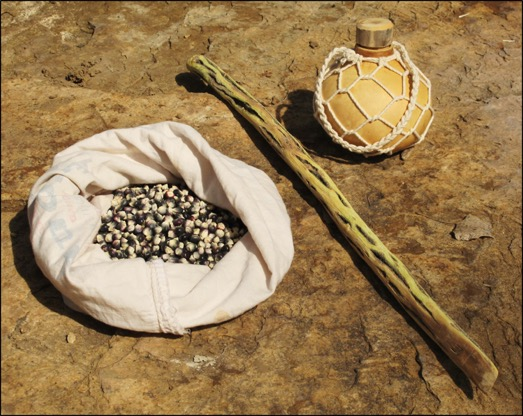
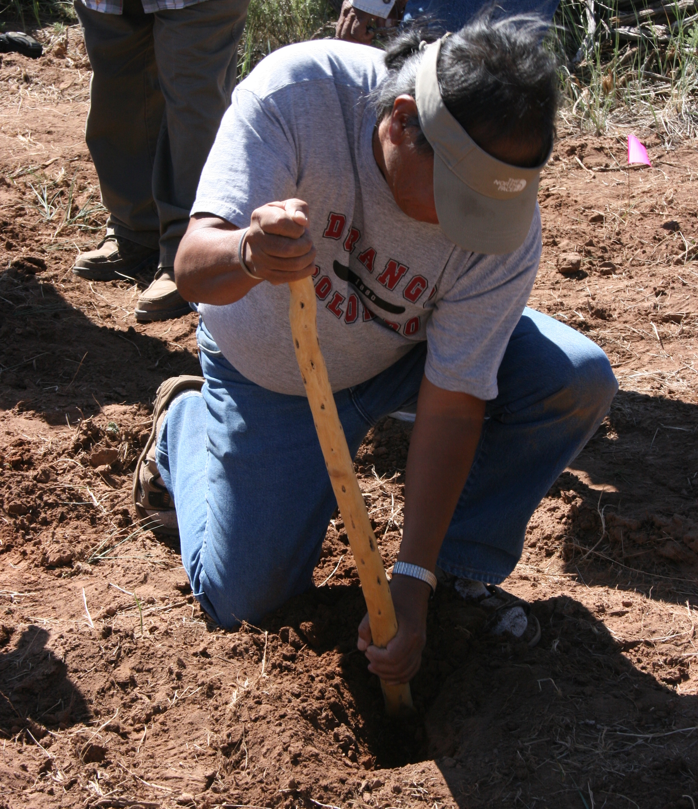

# What we learned
<div style="text-align: center;">

</div>

Through the Pueblo Farming Project (PFP), researchers, educators and volunteers have gained a deeper appreciation of traditional Pueblo Indian agricultural practices and the role of corn, or maize, in Pueblo society, both past and present. The Pueblo farmers, especially our Hopi colleagues, shared their knowledge of corn farming with us, and they taught us how this plant-and the preservation their agricultural practices-are essential to their cultural continuity.

The PFP's Pueblo consultants agreed that the Hopi farmers should take the lead in the project, as they still practice direct-precipitation farming on the Hopi Mesas in northeastern Arizona. This type of farming relies strictly on direct precipitation and rainfall runoff. The length of the growing season is longer in the Hopi region, the soil makeup is different, and annual precipitation is less compared to the Mesa Verde region. Despite these differences, the Hopi consider the Mesa Verde region part of their ancestral homeland, and they wanted to know if their farming techniques would work in this area that was almost 200 miles distant.

<div style="text-align: center;">

</div>

Archaeological remains show that maize spread into the greater American Southwest about 4,000 years ago. For archaeologists, the appearance of corn farming signals the beginning of Pueblo Indian culture. The Hopi also see their origins as tied to the appearance of maize. The Hopi oral history tells how Masau'u, ancient caretaker of the earth, presented them with the gift of corn (qa'ö) upon their emergence from the underworld. The gift included a bag of seed, a planting stick, and a gourd filled with water. Farming corn became their identity, and this lifeway based on humility and perseverance in a harsh landscape, offered them a long and spiritually rich life.

<div style="text-align: center;">

</div>

Scientific studies have determined that by 2,400 years ago the earliest farmers in the Four Corners region had a diet that was heavily dependent on maize. It appears that by that time, maize made up about 70% of Pueblo people's caloric intake. 

<div style="text-align: center;">

</div>

DNA testing of 12 named Hopi maize varieties, undertaken by the PFP, show that Hopi maize is genetically distinct, although it is closely related to other temperate maize from the US southwest. The Hopi samples are closely associated with ancient corn samples that were tested in separate studies. The studies also show the Hopi varieties have also undergone continued selection over the past 2,000 years.

<div style="text-align: center;">

</div>

Archaeological evidence of farming in the region include items such as planting sticks, manos, metates, check-dams, storage facilities and abundant corn remains. These artifacts attest to the persistence of agricultural practices in the Southwest since maize was first introduced, and reinforce the continuity of these traditional practices at Hopi.

In summarizing what we have learned about Pueblo farming in the Mesa Verde region, a good place to begin is with a discussion of how and why "Pueblo farming" is different from conventional "modern farming" practices?" The Colorado Plateau poses many challenges to farming not present elsewhere. The elevation ranges from 4,500 to 13,000 feet above sea level, with the direct-precipitation farming belt running from about 5,500 to 7,500 feet. Daily temperatures fluctuate widely here during the growing season with hot days and cool nights. Cold air drains and settles into lower elevations on the landscape, and PFP temperature monitors have shown that in cold air drainages the length of the frost-free growing season can often be well below the 120 day span typically thought necessary for corn production. For one of the PFP gardens, POG, the frost-free growing season had been just over 100 days on several occasions. Two gardens, POG and MCG, illustrate the differences in cold air drainage. The MCG is located 30 miles north of the other gardens and is 1,100 ft. higher in elevation; however, because nearby canyons drain cold air away from the plot, the MCG had a longer frost-free season. In contrast, the POG is located at a lower elevation and should be warmer but it is situated at the bottom of a canyon that collects cold air from the adjacent higher ground, resulting in a shorter growing season. 

Precipitation can vary greatly across the Southwest. This variation can be affected by elevation as well as annual jetstream patterns. Extended droughts are not uncommon. Annual precipitation ranges from 5 inches to 19.5 inches across of the Four Corners region. The annual precipitation for the PFP study area averaged 11.9 inches during the 10 years between 2008 and 2017, which is close to the long-term average for nearby Cortez, Colorado. The Mesa Verde region experiences a bimodal weather pattern that delivers the majority of its precipitation in the winter months of November through March, and during the summer monsoons which typically occurs from July to September. Some of the hottest and driest weather occurs in the months of May, June and early July. 

<div style="text-align: center;">

</div>

The most favored agricultural locations are often on the deep eolian or wind-blown soils, which are reddish in color. These soils, and good winter precipitation, are the key to successful farming without irrigation in the Mesa Verde region. These soils retain valuable subsurface moisture that carries seedlings and young plants through the driest part of the year without supplemental water. Caliche (a rock-hard layer of calcium carbonate) and mineral salts can build up in some soils, restricting root growth and affecting plant development. 

The KUG experimental garden was placed in a mesa top location not far from ancestral Pueblo archaeological sites. This seemed like an ideal location with deep soil and a long frost-free growing season. Relatively poor yields from this garden, however, indicate a deficiency in some unseen factor that affects yields, and soil profiles taken in that area revealed significant caliche formation not too far below the surface. With such variability in precipitation, soil, temperature and cold air drainage, the nature of direct-precipitation farming in the Mesa Verde region could be considered a "roll of the dice" in any given year. Pueblo subsistence farmers would have to have had a very specific understanding of the landscape and the conditions that can result in crop success or failure.

The first step in the process was selecting the garden locations. Prime locations for gardening on Crow Canyon's campus were somewhat limited due to preexisting infrastructure, so the placement of our gardens was not ideal. In the areas available, the Pueblo farmers used the growth of certain native plants to guide their selection of appropriate field locations. Rabbitbrush (Chrysothamnus nauseosus), snakeweed (Guitierrezia sarothrae) and dense stands of big sagebrush (Artemisia tridentata) grow in soils thought to be indicative of good areas for raising corn. Five gardens on the Crow Canyon campus and one garden-located almost 40 miles northwest of campus-in a prime direct-precipitation bean farming area presented a variety of conditions that allowed us to measure and compare different settings in terms of their agricultural potential. 

Initially, several different varieties of Hopi maize were planted in the PFP gardens. Over the years the selection was reduced to two: white flour corn (qotsaqa'ö) and blue flour corn (sakwapqa"ö). 

<div style="text-align: center;">

</div>

Most Americans would be familiar with the modern practice of planting corn closely spaced in long rows. Many have heard the story of how American Indians taught the pilgrims to plant corn in hills with fish a fertilizer. Traditional Hopi farming is quite distinct from these farming techniques. Planting technology is limited to a single tool: the planting stick or soya. Traditionally made from of greasewood (Sarcobatus vermicalatus), planting sticks today are often made from a length of metal pipe with a narrow blade welded to one end. 

Planting begins by scraping the area with sideways motion of the foot to push aside the loose and dry upper dust layer. This exposes the top of the underlying hard-packed soil. About a square foot, or slightly larger area, is cleared. The planter gets down on one knee and grabs the planting stick with one hand low and the other hand higher up on the tool. Then a narrow hole is dug in a pulling motion toward the planter to the desired depth. The hole is dug about 8 to 10 inches deep, or to the point where good soil moisture is encountered. It is important that there is sufficient soil where the seeds are deposited to ensure germination. The hole is dug deeper if the soil is drier and shallower if the soil is moist. 

<div style="text-align: center;">

</div>

The base of the hole is enlarged and about 10-20 seeds are deposited into the hole. The excavated earth is put back gently into the hole in the order it was removed, the moist soil covering the seeds on the bottom and the drier soil on top. A small well or basin is created around the planting with some of the loose top soil. This collects any precipitation that may fall and creates a mulch of dust that reduces evaporation. 

The farmer then stands and paces off two or three steps to where the next clump of corn will be planted. Because the soils in the PFP gardens hold a bit more moisture than those soils near the Hopi mesas, the clumps are typically spaced about 1.5- 1.75 meters apart rather than the three meter spacing typically used at Hopi. The wide spacing of the planted clumps reduces competition for valuable sub-surface moisture. When the garden planting has been completed the farmers call out "kwakwhay", thank you!

<div style="text-align: center;">

</div>

After germination, the seedlings emerge in about ten days. The closely grouped seedlings in each clump provide some mutual protection from the sun and wind. By early July, when the plants are about 18 inches tall, the leaves begin to bend over as if to touch the ground. At this time the number of young corn plants is reduced to about six in each clump.

<div style="text-align: center;">

</div>

Weeding and monitoring for pests are ongoing tasks throughout the growing season. Newly emerged seedlings are vulnerable to cutworms that attack the stem just under the ground surface. Grasshoppers and ants can chew young plants to the ground. Rabbits destroyed whole gardens one dry summer. At Hopi today, and in our gardens, large cans with the tops removed are placed over the newly planted clumps to prevent cut worms, shade young plants, and protect them from spring winds. The Hopi deter rodents by soaking dog dung in a bucket, then spraying plants with the liquid by means of a rabbit brush switch. Crows, ravens and jays can pluck out young seedlings early in the season and, perhaps even more devastatingly, raid the garden at the end of a successful season. In unfenced fields such as those at Hopi, deer, elk and cattle are also known to destroy crops. 

Weeding to reduce any competition from other plants is especially important in direct-precipitation farming. By far the most damaging invasive weed species in our gardens is field bindweed (*Convolvulus arvensus*). This rapidly spreading plant is native to Europe and was not a problem for ancestral Pueblo farmers and so far it doesn't seem to be very common in the Hopi area. This plant is hard to eradicate and certainly is the biggest competitor for moisture and nutrients in our gardens. Some wild or semi cultivated plants are tolerated and allowed to remain in the garden. The young leaves of Rocky Mountain beeplant (*Cleome serrulata*), called "tuma" or wild spinach, are cooked and eaten. The leaves are also boiled down to make paint for pottery designs. Wild tobacco (*Nicotonia attenuate*) is widely used for ceremonial purposes. These plants and a small patch of wild potato (*Solanum jamesii*) have at times been allowed to grow in some of the PFP gardens. Hopi farmers have indicated the allowing tobacco to grow to close to the corn will impart a bad taste. 

The Hopi farmers have repeatedly stressed the importance of good thoughts and actions while tending to their fields. It is of utmost importance that the farmer's heart be filled with good intention in the garden to ensure a bountiful harvest. When approaching a field, the farmer announces his return. Songs are composed and sung to the plants to provide encouragement for growth. Prayers for moisture are said while work in the field is carried out. The Hopi liken the development of their corn to the stages of a human life. The relationship of the farmer to the plant is analogous to that of a parent to a child. The corn goes through life much as a person does; as a child born, so too do the seedlings emerge from the earth. The plant sends out their first long leaves that bend over to touch the ground much as an infant learns to crawl. As a toddler they begin to stand upright and then grow tall. The plants reach sexual maturity as they tassel and silk. Finally they produce offspring of their own as fully mature ears of corn. A perfect ear of white corn, full to the tip with kernels, is called a "mother ear" (tsotsmingwa). Such ears are presented to a child at birth and later used at important stages in an individual's life. When the ears are harvested the plants are pushed over to the ground, so they can rest as they have completed their life.

<div style="text-align: center;">

</div>

One of the research goals of the Pueblo Farming Project was to use the harvest yields from the gardens to evaluate the Village Ecodynamics Project (VEP) paleoproductivity model for ancestral Pueblo maize farming in the Mesa Verde region. The VEP modeled maize productivity estimates for all the soil types in the region, including estimates for the locations of the PFP gardens. The productivity estimates were created using soil type, a compilation of historical yields for those soils, reconstruction of annual precipitation based on tree rings, and calculation of the Palmer Drought Severity Index, which is a measure of stored soil moisture available for plant growth. 

Over the project's history the harvest yields have varied greatly between gardens and even between clumps within the same garden, due in part to many of the factors stated previously. There is a high degree of correlation between yields from the gardens and the model estimates, but in some of the better years (greater precipitation) the PFP garden yields produced much more than the model estimated, and in bad years (less precipitation) the garden harvests were lower than the VEP estimates. As a result, there is far less variability in the VEP estimate yields compared to the PFP garden yields.

The small size of our experimental gardens may have the effect of exaggerating some results. For example, there are years where our harvest yields for some gardens were near zero. It is possible that a larger plot would have produced better yields. 

The total precipitation and the timing of that precipitation seemed to be the greatest contributing factor in yields. Lower than average winter precipitation and a dry spring slows growth and causes plants to wilt early in the season. Heat stress during the reproductive stages brought on by delayed monsoon rains can also result in drastically lowered yields. In years when other vegetation suffered the effects of drought, gardens increasingly became the target of grasshoppers and rabbits. These nuanced occurrences might not be calculated into the modeling programs, but they would be noticed by the farmers.

```{r yield-estimates, echo=FALSE, warning=FALSE, message=FALSE}
library(magrittr)

yields <- readr::read_csv("./data/yields.csv") %>%
  dplyr::group_by(Season,Garden,Variety) %>%
  dplyr::summarise(`PFP experimental yield (kg/ha)` = mean(`PFP experimental yield (kg/ha)`)) %>%
  dplyr::mutate(`PFP experimental yield (kg/ha)` = round(`PFP experimental yield (kg/ha)`)) %>%
  dplyr::ungroup()

max_yield <- yields %>%
  dplyr::filter(`PFP experimental yield (kg/ha)` == max(`PFP experimental yield (kg/ha)`))

ccac_max_yield <- yields %>%
  dplyr::filter(Garden != "MCG") %>%
  dplyr::filter(`PFP experimental yield (kg/ha)` == max(`PFP experimental yield (kg/ha)`))

mean_yield <- yields %>%
  dplyr::summarise(`PFP experimental yield (kg/ha)` = mean(`PFP experimental yield (kg/ha)`))
```

The annual PFP garden harvests were used to estimate maize yields as kilograms per hectare (10,000 m<sup>2</sup>, or 2.47 acres). These estimates can be translated into the number of people the yields from a specific garden could have fed in a given year. An average of 160 kilograms of corn per year per person has been estimated for a diet where about 70% of the calories come from corn. Our highest yields came from the `r max_yield$Garden`, planted with `r max_yield$Variety` maize in the year `r max_yield$Season`. This garden produced an estimated `r max_yield[["PFP experimental yield (kg/ha)"]]` kilograms per hectare, a yield rate that could have fed `r floor(max_yield[["PFP experimental yield (kg/ha)"]]/160)` people for a one hectare field. Among gardens on Crow Canyon's campus, the `r ccac_max_yield$Garden` in `r ccac_max_yield$Season`, planted with `r ccac_max_yield$Variety` maize, produced the highest yields, with an estimated `r ccac_max_yield[["PFP experimental yield (kg/ha)"]]` kg/ha, high enough for a one hectare field to feed `r floor(ccac_max_yield[["PFP experimental yield (kg/ha)"]]/160)` people. The average yields of all gardens over the years (`r round(mean_yield[["PFP experimental yield (kg/ha)"]])` kg/ha) would feed `r round(mean_yield[["PFP experimental yield (kg/ha)"]]/160, digits = 1)` persons per hectare. A family of six would need approximately `r round(1/(mean_yield[["PFP experimental yield (kg/ha)"]]/(160*6)), digits = 1)` hectares of farmland for one year, and much more if a several year supply of food would be required in anticipation of a year of crop failure.

The low average yields from the combined PFP gardens may be misleading. The gardens on the Crow Canyon Archaeological Center campus were not located in the prime agricultural lands available in the Mesa Verde region. Also, the amount of labor invested, such as that devoted to weeding and pest control, in the PFP gardens was likely minimal compared to the effort expended by a subsistence farmer. Again, the small size of the garden plots may have played a role in reduced yields. Increased vulnerability of crops to damage by pests, and edge effect (where the roots from vegetation surrounding the garden compete for valuable moisture) could impact yields when compared to those of a larger field. The time devoted to crops and the knowledge of the land gained from generations of farming is inestimable. 

The Hopi farmers have shown us that their seed and farming practices did produce yields in their ancestral homeland. The Village Ecodynamics Project paleoproductivity modeling has provided a means to assess agricultural productivity in the Mesa Verde region in the past and possibly the future. As we face the possibility of climate change and the challenge of feeding an ever increasing population, the lessons learned from the success and failures of the drought-prone farming in the American Southwest provide a unique opportunity to learn from and honor this traditional means of food production.

**As our Hopi teachers have taught us "keep a good heart, and pray for rain."**

<div style="text-align: center;">

</div>
