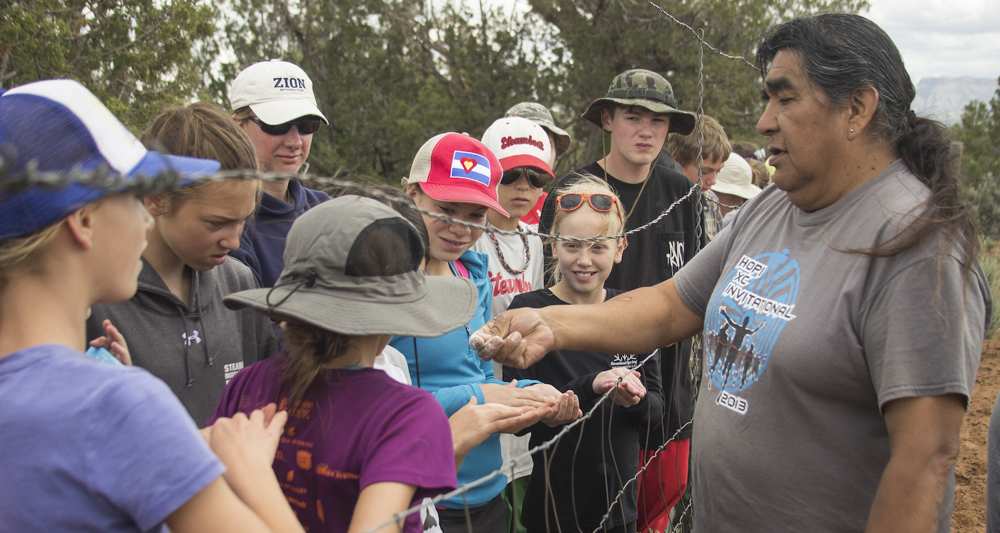
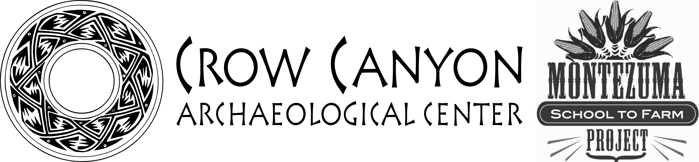

# Lesson plans

<div style="text-align: center; font-weight: bold;">

<br>

Ancestral Methods and Materials and Adaptations<br>
+<br>
Future Methods and Materials and Innovations<br>
=<br>
Self-Sufficiency & Food Security

</div>

These lessons were developed as a collaboration between the [Montezuma School to Farm Project](http://www.montezumaschooltofarm.org/) and the [Crow Canyon Archaeological Center](http://www.crowcanyon.org/) to reflect the educational sphere where archaeology, experiential education and agriculture intersect. 

The Montezuma School to Farm Project and Crow Canyon work with children and adults alike to bring the heritage of southwestern Colorado to life: providing hands-on experiences with the land and with the human legacy of farming in an arid and ancient landscape. 

The mission of the Montezuma School to Farm Project is to unite our local agricultural heritage with our growing future by engaging students at the crossroads of sustainable agriculture, resource conservation, health and economics through educational experiences in outdoor garden classes. The mission of Crow Canyon Archaeological Center is to empower present and future generations by making the human past accessible and relevant through archaeological research, experiential education, and American Indian knowledge. Together, we have created these lesson plans in order to link Crow Canyon's *Pueblo Farming Project* research gardens to the academic lives of middle school students in the Four Corners region.

<div style="text-align: center;">

</div>

#### Lesson Formats {-}
The lessons are presented in two formats to reflect the varying contexts in which the lessons may be used: long sessions of approximately 90 minutes, and short short sessions of approximately 45 minutes. 

The long sessions can be used during  multi-day field trips students experience when they attend Crow Canyon's school group archaeology programs. The short sessions can be used during the school day in a class that is held during a middle school science, social studies, or health class period. You will find both long and short sessions in the tabs at the top of the online version of each lesson.

Both the long-form and short-form lessons are structured using three phases: ***Opening Circle***, ***Working Groups or Procedure***, and ***Closing Circle***:

Opening Circle
: When students arrive, they gather on outdoor classroom benches. We begin class with the opening circle and use this time to: 
    
    - Welcome and create a communicative atmosphere with students                              
    - Introduce the activity or lesson, showing their connection to academic concepts in the Colorado Academic Standards

Working Groups
: Students break into groups of approximately 6--8. During this time, we:

    - Teach students to use real tools for authentic garden jobs, assisting if necessary
    - Encourage decision making that utilizes the five senses

Closing Circle
: Class concludes with the closing circle. Students reflect on their time in the garden with review of opening circle concepts or a brief activity.  

The eBook version of each lesson plan includes embedded videos and other interactive teaching materials. You may also download PDF versions of the lesson plans---links are at the top of each lesson.

#### Unique Considerations: Living Props and Teaching to Climate Change {-}

##### Standards in Garden Lessons: How do these lesson plans integrate state educational standards? {-}

This manual aims to draw clear connections between food production (both ancestral and modern) and academic concepts central to middle school learning. Colorado's science, comprehensive health, physical education, reading, social studies, and math standards met are listed at the conclusion of each lesson. 

For further information in regards to the Colorado Academic Standards: [http://www2.cde.state.co.us/scripts/allstandards/COStandards.asp](http://www2.cde.state.co.us/scripts/allstandards/COStandards.asp)

##### What are the benefits of using live teaching props? {-}

Some lessons require extra preparation, such as preparing soil or assembling materials, often multiple days in advance. In exchange for this preparation, educators gain a unique and high quality teaching prop. The use of living props ensures that the lesson will have a direct connection to the world outside of the classroom. They provide memorable examples and experiences that impact the senses, leading the concepts to be more thoroughly understood and strongly committed to memory. When we use living props, scientific concepts are brought to life.

##### Why do we teach children about the Puebloan Farmers? {-}

Through learning the ancestral roots of our modern approaches to agriculture, children learn human history but also the history of the land they live on. This is a cornerstone of teaching student to be environmentally literate. It fosters an understanding of environmental issues by providing experiences that allow children to feel connected and related to all living creatures, helping them to fall in love with the world outside their back door. 

Beginning when they are very young, children easily and joyfully engage with the Earth's cycles. Such experiences will lay a foundation of love and loyalty to their local ecosystems. On this foundation, the world's most critical environmental challenges can be explored with optimism, challenging young minds to think deeply and critically about solutions. Confident of their place in the web of life, our younger generations can lead us back to the heartfelt awe nature so easily inspired during childhood.

#### Optimal Garden Setup for Creating a Garden Classroom {-}

No two educational gardens are ever quite the same. Available space, materials, and resources influence a garden's growth and allow it to become a living piece of the community.  Sourcing talents and expertise locally adds further character to a garden and simultaneously builds relationships that sustain it.  A garden's educational opportunities are only amplified by its unique components. There are few constraints as far as what must exist in the space to maximize its educational potential. To complete the lessons in this manual, we suggest the following conditions:

##### Bare Minimum Conditions {-}

- Two 10' x 4' x 1' raised beds or the equivalent in-ground row space.
- Access to a water spigot.
- A compost area or a space designated for a future compost site. The space should accommodate rotation through a three pile system:
    - Active, building pile
    - Aging pile
    - Ready-for-use pile
- A large volume of dry, carbon-based materials to use as mulch and in the compost system. See below for advice on securing safe, herbicide-free sources. 
- A source of nitrogen-based materials to use in the compost system. See page 7 for advice on securing safe, herbicide-free sources.

##### Recommended Conditions {-}

- Drip irrigation system with a timer - or plans for installation of a drip system
- Circle of benches and whiteboard to create an outdoor classroom space
- Tool shed
- Work table

##### Securing Safe Sources:<br>Carbon & Nitrogen-Based Materials for Building Compost and Amending Soil {-}

Very often, carbon and nitrogen-based materials will have persistent herbicides in them (herbicides are substances that are toxic to plants and are used to destroy unwanted vegetation). Once sprayed, these chemicals will be absorbed by and persist in the plants' bodies, even after they have passed through an animal's digestive system; they will continue to persist in grass clippings or manure and end up in your compost pile. The resulting finished compost can deform or dramatically reduce yield, may kill your plants, and can contaminate your soil for years to come.

When importing externally sourced materials, considering a donation, or purchasing of materials, it is very important to: 

- Maintain the school garden use of herbicide-free methods. This includes interviewing the maintenance department staff about their methods of lawn and landscape care. This will help inform decisions about using grass clippings from the campus and can also lead to an agreement or understanding about herbicide use on the campus near the garden site. 
- Carefully interview potential merchants or donors of any compost materials to attain the following information:
  - Have herbicides of any kind been used on the straw, hay, grass clippings, weeds, leaf, or yard debris?
  - Have the animals that produced the manure been fed hay, straw, other feed that was sprayed with herbicide?

This can sometimes be an awkward conversation, as the person you are interviewing may become defensive. Many people are unaware of the term "persistent herbicides," or lack a full understanding of how persistent herbicides affect vegetable production. Be prepared to be friendly but firm in your need to gather this information about your sources. These conversations can also be informative and eye-opening for all involved.

Please use this link to the US Composting Council's frequently asked questions about persistent herbicides: 
[http://compostingcouncil.org/persistent-herbicide-faq/#3](http://compostingcouncil.org/persistent-herbicide-faq/#3)

#### Seed Donations {-}

Often, it is possible to attain seeds on a donation basis from individuals, families, or grocery/nursery/garden stores.  It is important to assess the viability of these older seeds as some, but not all, will germinate beyond the "packed for/sell by" date listed on their packaging. It is deeply disappointing and disrupting when carefully planted and watered seeds do not germinate. The following are some examples of estimated time frames that seed varieties can be expected to last, past the "packed for/sell by" date. Please research the viability of additional seed varieties as needed. 

- Up to 5 Years:  annual flowers, collard greens, melon, radish
- Up to 4 Years:  eggplant, squash, tomato
- Up to 3 Years:  beans, peas, cabbage and carrot family varieties
- Up to 2 Years:  leek, mesclun, sweet corn
- Up to 1 Year:   lettuce, onion


```{r echo=FALSE, background=TRUE, message=FALSE, child = 'lessons/PFP_Lesson-1_The-People-of-Corn.Rmd'}
```

```{r echo=FALSE, background=TRUE, message=FALSE, child = 'lessons/PFP_Lesson-2_Farming-Through-Drought.Rmd'}
```

```{r echo=FALSE, background=TRUE, message=FALSE, child = 'lessons/PFP_Lesson-3_Know-Your-Soil.Rmd'}
```

```{r echo=FALSE, background=TRUE, message=FALSE, child = 'lessons/PFP_Lesson-4_Ancient-Technologies.Rmd'}
```

```{r echo=FALSE, background=TRUE, message=FALSE, child = 'lessons/PFP_Lesson-5_The-Short-Blue-Ear.Rmd'}
```
