--- 
title: "The Pueblo Farming Project"
subtitle: |
  | A collaboration between
  | Hopi farmers and 
  | the Crow Canyon Archaeological Center
author: |
  | Paul Ermigiotti,
  | Mark Varien,
  | Erin Bohm,
  | Kyle Bocinsky,
  | the Hopi Cultural Preservation Office, and 
  | the Hopi Cultural Resources Advisory Task Team
date: "`r Sys.Date()`"
knit: "bookdown::render_book"
bibliography: [pfp_ebook.bib]
biblio-style: apalike
link-citations: yes
colorlinks: yes
lot: yes
lof: yes
fontsize: 12pt
monofont: "Source Code Pro"
monofontoptions: "Scale=0.7"
site: bookdown::bookdown_site
description: "A collaboration between Hopi farmers and the Crow Canyon Archaeological Center"
url: https\://pfp.crowcanyon.org
github-repo: crowcanyon/pfp_ebook
cover-image: /images/section_2.3_header.jpg
---

```{r setup, include=FALSE}
rm(list=ls()) ### To clear namespace
library(knitr)
opts_chunk$set(fig.path = 'images/',
               echo = FALSE, 
               warning = FALSE, 
               message = FALSE,
               widgetframe_widgets_dir = 'widgets')

options(
  htmltools.dir.version = FALSE, formatR.indent = 2,
  width = 55, digits = 4, warnPartialMatchAttr = FALSE, warnPartialMatchDollar = FALSE
)

lapply(c('dygraphs', 'DT', 'citr', 'formatR', 'svglite', 'widgetframe'), function(pkg) {
  if (system.file(package = pkg) == '') install.packages(pkg, repos = "https://cran.us.r-project.org")
})

```

# Preface {-}

<div style="text-align: center;">
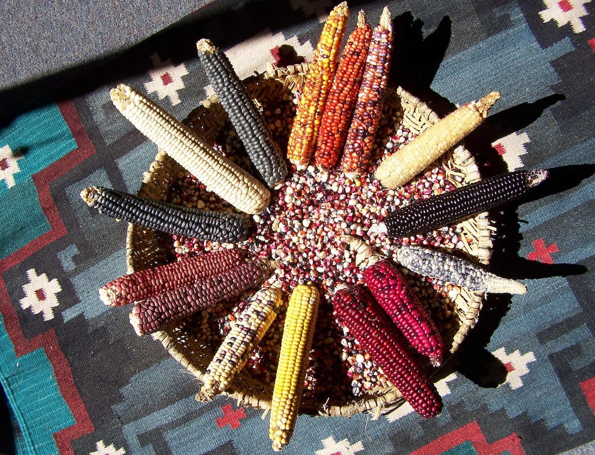
</div>

The Pueblo Farming Project is an ongoing collaboration between the Hopi tribe and the Crow Canyon Archaeological Center. The project examines traditional Pueblo Indian farming techniques to help us understand ancient farming in the Mesa Verde region of southwestern Colorado. The project conducts research, develops educational programs, and pursues Hopi interests in corn and corn farming as an essential element of their culture. This eBook presents the methods and results from the Pueblo Farming Project, as well as a set of lesson plans developed for middle school students to learn about Hopi agriculture.

The Pueblo Farming Project was funded in part by a History Colorado State Historical Fund grant. The content and opinions contained herein do not necessarily reflect the views or policies of History Colorado.

<div align = "center">
<a href="https://www.crowcanyon.org/" target="_blank"></a><a href="https://www.crowcanyon.org/institute/" target="_blank"></a>

<a href="https://www.historycolorado.org/state-historical-fund" target="_blank"></a>
</div>

<br>
<p>

The online version of this book is licensed under the [Creative Commons Attribution-NonCommercial-ShareAlike 4.0 International License](https://creativecommons.org/licenses/by-nc-sa/4.0/). 
</p>

## Acknowledgments {-}

The Pueblo Farming Project is a collaboration with the Hopi Cultural Preservation Office, initially under the direction of Leigh Kuwanwisiwma and presently under the direction of Stewart Koyiyumptewa. The Pueblo Farming Project would not have been possible without the support of the [Crow Canyon Archaeological Center’s Native American Advisory Group](https://www.crowcanyon.org/index.php/native-american-advisory-group), which was under the direction of Margie Connolly when the project began. Paul Ermigiotti, Grant Coffey, and Mark Varien tended the gardens and recorded the data presented here, and they have been assisted by staff members at Crow Canyon, researchers at the University of North Texas, and devoted volunteers. In particular, Read Brugger participated in monitoring the gardens and took many of the beautiful photos presented in this eBook. This eBook was edited by PFP team members and members of the public using open review enabled by [hypothes.is](https://hypothes.is/). An archive of comments and edits can be found at [https://via.hypothes.is/https://crowcanyon.github.io/pfp_ebook/](https://via.hypothes.is/https://crowcanyon.github.io/pfp_ebook/). We thank all those who contributed to making this eBook better---especially Kristin Kuckelman, Katie Arntzen, and Karen Adams.

The Pueblo Farming Project began when the Hopi Cultural Preservation Office requested that Crow Canyon conduct research into Pueblo agriculture. An initial planning meeting was conducted in 2006, and the gardens were first planted and harvested in 2008; this work was partly funded by two grants from The Christensen Fund. Subsequent funding was provided by National Geographic Society’s Genographic Legacy Fund (2009) and by National Science Foundation grants DGE-1347973 and DEB-0816400 that supported the Village Ecodynamics Project. Recently, the PFP received funding from the History Colorado State Historical Fund (grant 2015-02-025).

<div style="text-align: center;">


</div>

-----
This book is published with:

<div style="text-align: center;">
<a href="https://bookdown.org" target="_blank"></a>
</div>
        

<!--chapter:end:index.Rmd-->

\mainmatter

# Introduction
<div style="text-align: center;">

</div>

**Farming is a fundamental part of Pueblo identity**. It is is integrated into every aspect of traditional Pueblo culture.

Pueblo leaders are concerned with preserving knowledge about farming and ensuring that this knowledge is transmitted to younger generations. Crow Canyon researchers and educators are interested in learning about traditional agriculture in order to better understand ancient farming practices and to gain a deeper appreciation for the role of corn in Pueblo society, past and present. **The Pueblo Farming Project** is a collaborative effort that addresses the interests of both groups.

Since 2006, the Crow Canyon staff has worked with traditional Pueblo farmers from Hopi, Arizona, to document their farming practices and the cultural context in which they take place. Every year, Hopi farmers have visited Crow Canyon in the spring and fall to teach the Center's researchers and educators about Pueblo Indian farming, food storage, and food preparation. Together, farmers and staff have planted and harvested several experimental gardens on Crow Canyon's campus, testing farming techniques and varieties of seeds used by the Pueblo farmers in their own fields.

Documentation for the project includes still photography, video, and audio recordings of planting and harvesting, and a variety of written records that include detailed measurements of plants at different stages of growth, daily temperature and precipitation values, crop yields, and preliminary results of corn DNA analysis. Data generated as part of the Pueblo Farming Project have already proven useful in broader research. For example, Village Ecodynamics Project scientists have compared the results of their computer simulations with corn harvest yields from the Pueblo Farming Project to better understand ancient environmental conditions and agricultural productivity—and the effects of both on human settlement patterns.

## What was the PFP?

### History of the Pueblo Farming Project: 2004–2018 {-}

#### The Beginning {-}

The beginning of the Pueblo Farming Project can be traced to a September 2004 Native American Graves Protection and Repatriation Act (NAGPRA) consultation for Crow Canyon's Goodman Point Archaeological Project. National Park Service staff and Crow Canyon archaeologists met with Hopi Cultural Preservation Office staff at their office in Kykotsmovi, Arizona to discuss the research design for this project. When we concluded our discussion we asked the Hopi if there were research topics that interested them that were not covered in the research design, and they quickly responded that they wanted to know more about ancestral Pueblo farming and how it compared to the agricultural practices of Hopi and other Pueblo people today.

From these beginnings, the PFP has been developed through a partnership between Crow Canyon and Pueblo farmers, especially the farmers from Hopi whose participation in the project has been coordinated through the Hopi Cultural Preservation Office.

#### Designing the Project {-}
<div style="text-align: center;">
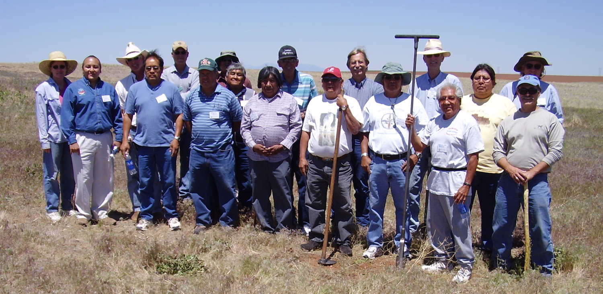
</div>

To follow through on this request, Crow Canyon developed the first of a series of grants to support a collaborative project on Pueblo farming (see section below on Who Funded the Pueblo Farming Project). The initial grant funded a planning meeting in May 2006 where we discussed the various types of research that could investigate ancestral Pueblo farming practices and link them to techniques used by modern Pueblo farmers. Participants at the meeting included traditional Pueblo farmers from Hopi, Jemez, Ohkay Owingeh, and Tesuque; Crow Canyon staff; and other anthropologists who specialize in the study of ancestral and modern Pueblo agriculture.

After two days of discussion, this group decided to implement an experimental gardening project that focused on direct-precipitation farming because this was the main type of farming practiced by the ancestral Pueblo in the Mesa Verde region. We use the term "direct-precipitation farming" to represent agricultural practices that use little to no large-scale landscape modification, but that readily take advantage of local landform and soil characteristics to enhance soil moisture (such as areas of higher runoff or greater snow accumulation) and often include small-scale anthropogenic modifications such as check dams. Direct-precipitation farming is sometimes referred to as "dry-land" or "rain-fed" farming. The group agreed that Hopi should take the lead as the traditional farming experts, since they still practice direct-precipitation farming whereas most other contemporary Pueblo tribes use more intensive flood-plain and canal irrigation techniques. Crow Canyon agreed to seek grant funding for the project that became known as the Pueblo Farming Project.


#### Selecting Garden Locations {-}
<div style="text-align: center;">
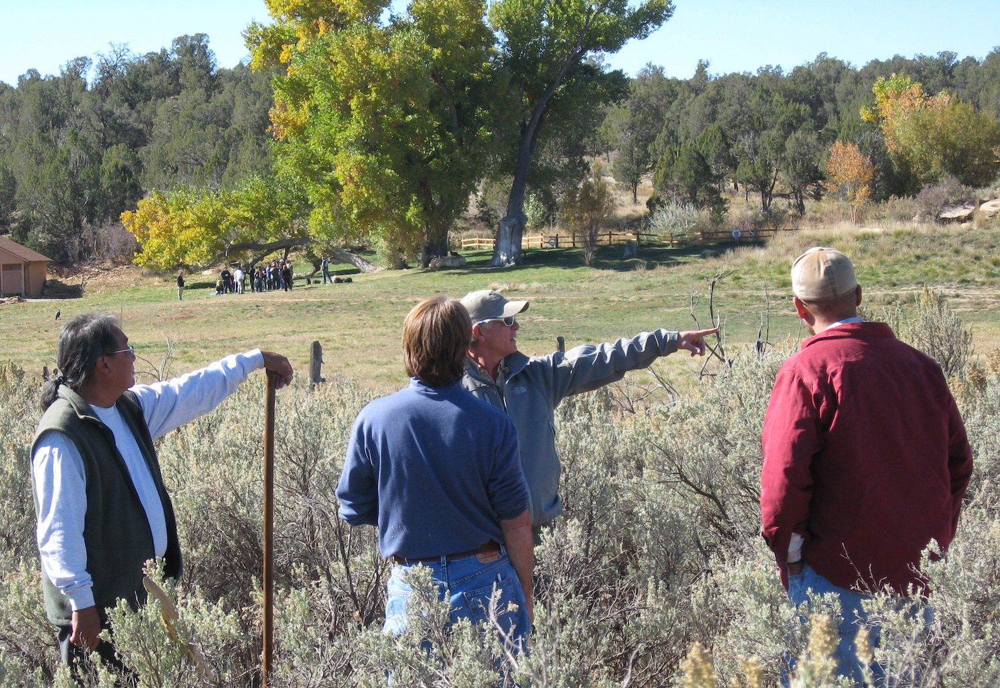
</div>

The next step occurred in 2007 when Hopi farmers met to select locations for the gardens. We originally hoped to place these gardens at the Goodman Point Unit of Hovenweep National Monument to complement our ongoing research there, but we did not get permission for this and decided instead to locate the gardens on Crow Canyon's campus to integrate the PFP into the Center's education programs.

Pueblo farmers used traditional ecological knowledge to select the garden locations, focusing on the native plants that indicate good areas for farming. Rabbitbrush and snakeweed are two plants they see as indicating prime areas, but dense stands of those plants were not present on Crow Canyon's campus. In the absence of such indicator species, they selected two areas in small washes on the east side of Crow Canyon that are dominated by sagebrush today. The sagebrush in these areas was taller because their location in small drainages provided more moisture than the areas outside the drainages. The farmers assessed soils for their texture and moisture-holding capacity and examined the details of specific settings including slope, aspect, and other factors. Although the Hopi farmers did not consider these two locations as ideal, they thought they would be adequate.

One location had sage that was unusually tall; this area was located near the mouth of a small wash coming from the east slope of the Crow Canyon drainage. When this area was cleared, an ancient check dam was found and subsequently recorded (5MT19690). This was named the Check Dam Garden (CDG). The other plot was located higher up in a small drainage to the north in an area where there was a thick patch of verdant grass. The Hopi farmers thought there might be a spring in this area but subsequent work showed this was not the case. We call this plot the Pueblo Learning Center (PLC) garden because it is on the way to one of Crow Canyon's outdoor classrooms.

In addition to these new plots, the Hopi farmers suggested we continue planting a garden that Paul Ermigiotti had earlier developed for Crow Canyon's educational programs. We call this Paul's Old Garden (POG), and it is located on the valley floor in the bottom of Crow Canyon.

In 2009, we added two additional garden areas. The first, the Pithouse garden (PHG), was placed on the west slope of Crow Canyon and adjacent to Crow Canyon's Pithouse Learning Center to incorporate the garden into the lessons that occur there. The PHG garden had anomalously low yields for several years and soil profiles showed that the area had been disturbed when the adjacent replica pithouse was constructed (the garden soils contained construction materials), so we abandoned this garden after the 2014 growing season.

<div style="text-align: center;">

</div>

The second garden added in 2009 was Karen's Upper Garden (KUG), which was a plot farmed by Karen Adams in the 1990s and located on the mesa just west of Crow Canyon. Karen farmed this garden as part of Crow Canyon public education program and to quantify yields. Karen's Upper Garden has produced relatively low yields, which surprised us because evidence suggests that the mesa tops covered in Mesa Verde loess-derived soils were the area most intensively farmed by ancestral Pueblo people. This evidence includes the fact that most ancestral Pueblo habitation sites are near these loess soils on the mesa tops, and the fact that these loess-derived, mesa-top soils are the focus of contemporary direct-precipitation farming. To better evaluate the variation in these mesa-top settings, we added an additional garden in 2015 at Mike Coffey's farm near Dove Creek, Colorado (the Mike Coffey Garden or MCG).

The [PFP garden locations][Where did the PFP take place?] allow us to measure the effect of a variety of microenvironmental factors on agricultural potential. For example, the Crow Canyon gardens allow us to evaluate the effect of cold air that flows in drainages. The length of the frost-free period varies considerably despite relatively small differences in elevation and in the distance between the plots. The gardens are also located on soils with different characteristics and the effects of soil variability are the primary focus of this study.

#### Planting and Harvesting: 2008–2018 {-}
<div style="text-align: center;">
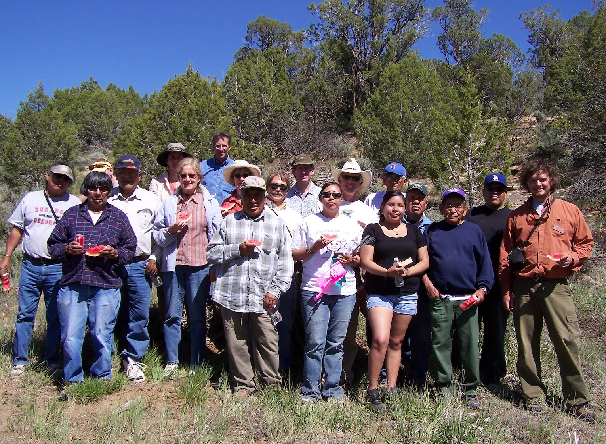
</div>

We planted and harvested gardens for the first time in 2008, with the work focused on the Check Dam Garden, Pueblo Learning Center garden, and Paul's Old Garden. From 2009–2014 we planted five gardens: the Check Dam Garden, Pueblo Learning Center garden, Paul's Old Garden, Pit House Garden, and Karen's Upper Garden. From 2015–2018 we planted the Check Dam Garden, Pueblo Learning Center garden, Paul's Old Garden, Karen's Upper Garden, and Mike Coffey Garden. During this time, Pueblo farmers served as the expert consultants for planting and harvesting. Most of the farmers are from Hopi, but farmers from other Pueblos have also participated. Crow Canyon staff members learn from the Pueblo farmers and assist in the planting and harvesting.

#### Pueblo Farming Project Goals {-}
<div style="text-align: center;">

</div>

From the beginning, the Pueblo Farming Project has pursued educational and research goals that were developed by Hopi and Crow Canyon working together. Since 2008, Hopi farmers have traveled to Crow Canyon twice a year: once in the spring for a planting meeting and again in the fall for a harvest meeting. Each meeting includes discussions to review goals, evaluate the project's progress, and develop a plan for how to proceed with current and future initiatives. Of course, each meeting also includes work in the agricultural plots.

All Pueblo Farming Project activities have been recorded using numerous techniques: written notes from each meeting, audio and video recording, still photography, and written documentation that include detailed metrics on the plants and their growing environments. This has produced a rich dataset from which we produced several research and educational products.

<div style="text-align: center;">

</div>

One of the Pueblo Farming Project research goals was to evaluate how agricultural yields were affected by annual variation in temperature and precipitation. These data were integrated into another research project known as the Village Ecodynamics Project or VEP. The Village Ecodynamics Project was funded by two National Science Foundation grants awarded to Washington State University; Crow Canyon was a subcontractor on the project. A multidisciplinary collaboration, the Village Ecodynamics Project included archaeologists, geologists, hydrologists, geographers, computer scientists, and economists from institutions across the US and Canada. Village Ecodynamics Project researchers studied the interaction between Pueblo Indian people and their environment over more than a thousand years, beginning in AD 600. One aspect of the Village Ecodynamics Project was to use computer modeling to estimate ancestral Pueblo agricultural yields and how they varied through time and across the project study areas. Actual Pueblo Farming Project yields were compared to the Village Ecodynamics Project estimates to evaluate the accuracy of the computer model. Detailed information about the Village Ecodynamics Project can be found at this website: [http://www.veparchaeology.org/](http://www.veparchaeology.org/).

Hopi goals for the project were tied to the central role of corn and corn farming in Hopi culture. Fundamentally, they were interested in whether their seed and their traditional farming techniques would result in successful harvests in the Mesa Verde region, a place they consider as part of their ancestral homeland. For Hopi, the Pueblo Farming Project provided a substantive link between their past and the present. For Hopi, the Pueblo Farming Project helped demonstrate their cultural affiliation to the Mesa Verde region, and beyond planting and harvesting gardens they pursued this goal through another Pueblo Farming Project research initiative: the DNA analysis of modern Hopi corn.

#### Education Products {-}
<div style="text-align: center;">

</div>

From the beginning, the Pueblo Farming Project was integrated into Crow Canyon's education programs. School groups who are at Canyon when planting and harvesting occurs observe and at times participate in these activities. Pueblo farmers speak to the students about the project and the role of farming in Pueblo culture, creating a unique and memorable learning experience for these students. The Pueblo Farming Project gardens are also integrated into Crow Canyon education programs during the growing season, providing the students with a powerful visual as the Center's educators teach about the importance of corn farming in ancestral and modern Pueblo communities.

<div style="text-align: center;">
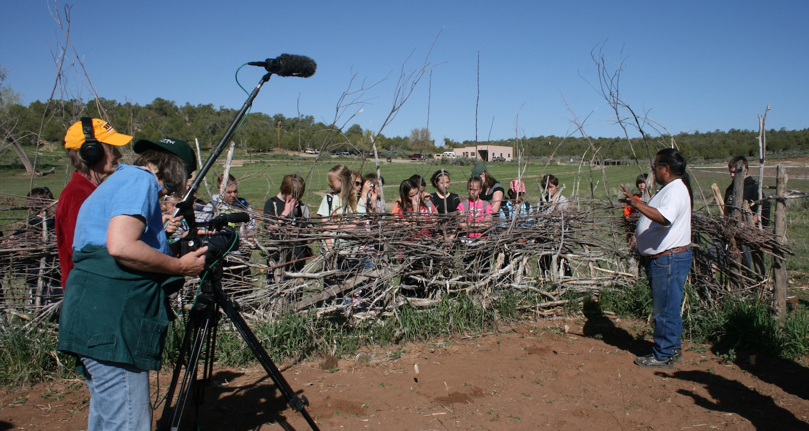
</div>

We also developed series of educational initiatives to reach a larger audience with what we have learned through the Pueblo Farming Project. We highlight three of these initiatives here. The first educational product we highlight is a documentary film, _More than Planting a Seed_:

<div class="embed-responsive embed-responsive-16by9">
<iframe src="https://www.youtube.com/embed/2x23FF_kUyo?modestbranding=1&rel=0&start=1" frameborder="0" gesture="media" showinfo="0" allow="encrypted-media" allowfullscreen></iframe>
</div>

<br>
A second educational product is an exhibit on display at the Crow Canyon Archaeological Center. This exhibit describes the project, presents our results, and tells the story of corn. Finally, we created and piloted five standards-aligned lessons for the classroom. Those lessons plans are included in this eBook.

Public education initiatives also include lectures for the public and presentations at professional meetings. Information about the Pueblo Farming Project was also disseminated through Crow Canyon's electronic and print newsletters and on Crow Canyon's website. The Pueblo Farming Project was also featured on local radio shows, including [an interview with Leigh Kuwanwisiwma on KSJD's Big Fat Farm Show](https://www.ksjd.org/post/pueblo-farming-project#stream/0).

## Who were the participants?
<div style="text-align: center;">

</div>

Over almost a decade, dozens of Hopi farmers, researchers, and volunteers participated in the Pueblo Farming Project, and hundreds of students visited the Pueblo Farming Project gardens during the growing season.

<div class="carousel">
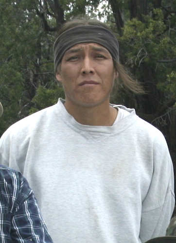


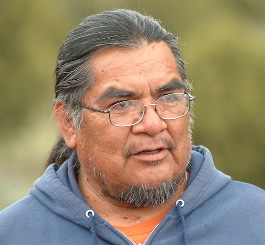
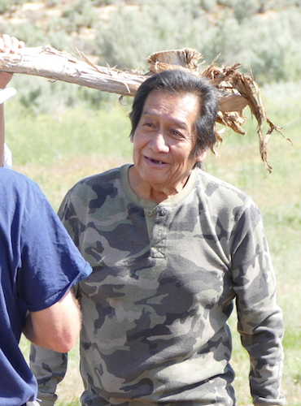

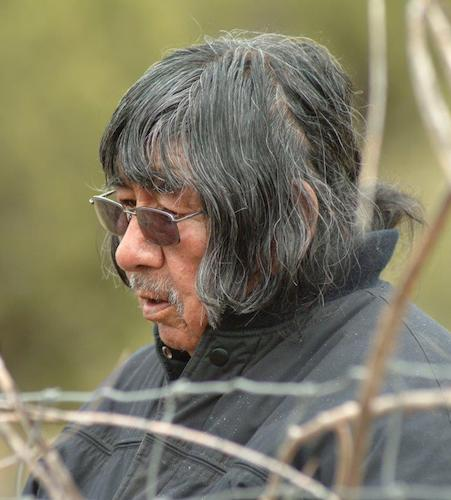


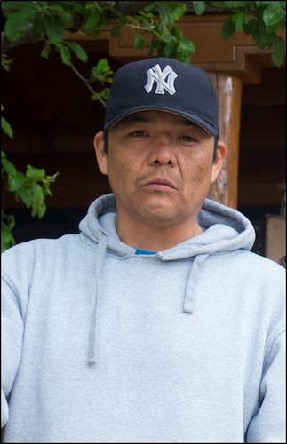


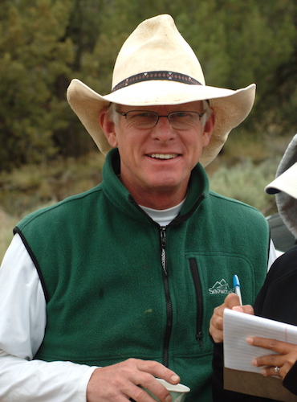


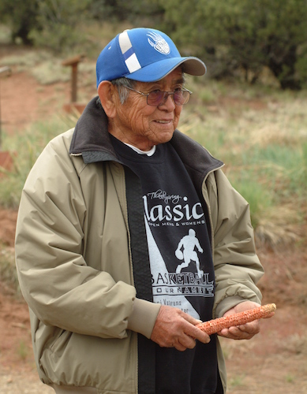


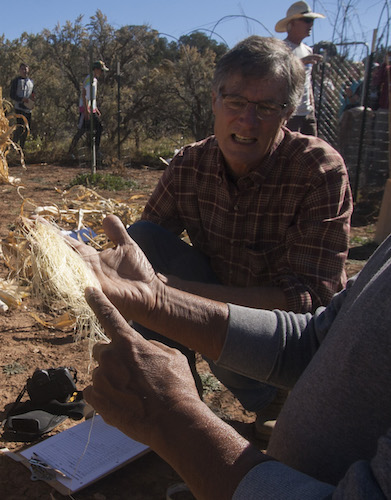


</div>

<div class="carcaption">
<p class="caption">&nbsp;</p>
</div>

## Where did the PFP take place?
<div style="text-align: center;">

</div>

Five Pueblo Farming Project gardens are scattered around Crow Canyon Archaeological Center's rural campus in Cortez, Colorado. In 2015, we planted a new garden in the contemporary dry-farmed region north of Crow Canyon's campus. Use the map below to explore the PFP garden locations, and click on the gardens to get more information about when they were planted as part of Pueblo Farming Project research. You can zoom using the controls on the left, the scrollwheel on your mouse, or by pinching on a mobile device. The menu in the upper right allows for different map backgrounds. The mapped boundaries of each garden are at the garden fences; gardens may not have been completely planted in each year.

```{r, echo=FALSE, message=FALSE}

knitr::opts_chunk$set(echo = FALSE,
                      message = FALSE,
                      warning = TRUE,
                      error = TRUE,
                      # results = 'hide',
                      cache = FALSE)

library(magrittr)

garden_locations <- sf::st_read("./data/gardens.geojson",
                                quiet = TRUE)
garden_locations$color <- RColorBrewer::brewer.pal(length(garden_locations),"Dark2")

garden_centroids <- garden_locations %>%
  sf::st_transform(26912) %>%
  sf::st_centroid() %>%
  sf::st_transform(4326)

l <- leaflet::leaflet(garden_locations, width = "100%") %>%
  leaflet::addProviderTiles("Esri.WorldImagery", group = "Satellite") %>%
  leaflet::addProviderTiles("Esri.WorldTopoMap", group = "Topography") %>%
  leaflet::addMarkers(data = garden_centroids,
                      popup = ~Popup
  ) %>%
  leaflet::addPolygons(data = garden_locations,
                       fillColor = ~color,
                       popup = ~Popup
  ) %>%
  leaflet::addLayersControl(
    baseGroups = c("Satellite", "Topography"),
    options = leaflet::layersControlOptions(collapsed = T)
  )

widgetframe::frameWidget(l, width='100%')

```

## Who funded the PFP?

The Pueblo Farming Project started as part of the Village Ecodynamics Project and was initially funded under National Science Foundation grants DGE-1347973 and DEB-0816400. Subsequent years of the Pueblo Farming Project received funding from the History Colorado State Historical Fund (grant 2015-02-025), the National Geographic Society Genographic Project, and the Christensen Fund.

<div style="text-align: center;">


</div>


<!--chapter:end:01-introduction.Rmd-->

# The story of maize
<div style="text-align: center;">

</div>

The relationship between humans and corn (or maize, *Zea mays* ssp. mays) is a long and interesting story. The path to domestication began about 9,000 years ago in southwestern Mexico. The domestication process led to a unique codependency: as it exists today, corn is not able to reproduce without human intervention. But humans have also become dependent upon this plant.  

Today, corn is the most widely produced grain crop in the United States, though only a tiny fraction of the corn grown directly feeds people. Most of what we consume is in the form of high-fructose corn sweeteners. Most corn production goes toward animal feed, ethanol and exports. Corn has become less of an important food resource and more of a refined industrial product. In contrast, corn holds an important place in the origin myths and lifeways of many native cultures. In Pueblo cultures, maize plays a vital position physically, spiritually, and symbolically.

<div style="text-align: center;">

</div>

## Origins
<div style="text-align: center;">

</div>

The domestication of maize was unique. Typically, domesticated plants look similar to their wild ancestors; However, an ear of corn's closest wild relative, teosinte, is noticeably different from an ear of modern corn. An ear of maize is wrapped in a husk and the kernels are held tightly and not able to scatter or free themselves from the cob, whereas the kernels of teosinte are able to scatter freely. Because the husks of corn must be removed in order for corn to reproduce, corn is as dependent on humans as humans are dependent on corn.
<!-- <div style="text-align: center;"> -->
<!--  -->
<!-- </div> -->

Teosinte, a wild grass native to Mexico and Central America, is so closely related to maize that it belongs to the same species, *Zea mays*, but is a different subspecies: parviglumis. Despite their shared ancestry, the plants differ in significant ways:

| **Maize** | **Teosinte** |
| --- | --- |
| grows as a single stalk with a few large ears | branched with many small ears |
| ears are encased in a husk with hundreds of kernels on the cob | ears have eight to 12 kernels, each surrounded by a hard fruit-case |
| ears typically have 8 to 16 rows of kernels | ears have two rows of kernels |
| kernels must be separated from the ear and planted by humans | ears shatter when dry and the seeds scatter, distributed by gravity, birds and other animals |

## The people of corn

<div style="text-align: center;">
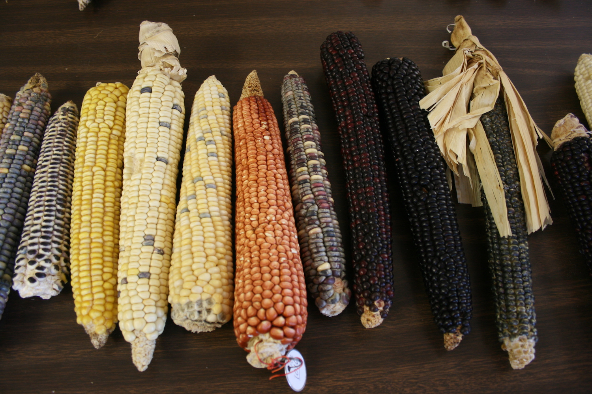
</div>

Maize entered the southwestern United States about 4,000 years ago. On its long journey from Mexico, maize has adapted from its tropical environment, which has 12 hours of daylight, to the semiarid, long summer days and cool night conditions of the Colorado Plateau. Farming techniques also had to adapt. Direct-precipitation agriculture is dependent on moisture stored in the soil from precipitation and runoff water. Pueblo people have practiced direct-precipitation farming in the arid Southwest for millennia. They have accumulated detailed knowledge of their environment and have adopted specialized planting techniques. Direct-precipitation farming is an act of faith that binds the people to their land and their beliefs, requiring hard work, song and prayer.

Traditional direct-precipitation farming techniques include:

- **Knowing wild plants that indicate adequate soil moisture.** Several plant species are regarded as key indicators when it comes to agricultural field selection. Rabbitbrush (*Chrysothamnus*), snakeweed (*Gutierrezia*), grease wood (*Sarcobatus*), fourwing saltbush (*Atriplex*), and ricegrass (*Oryzopsis*) typically indicate good soil moisture. Corn is likely to do well where these indicator species grow vigorously.
- **Planting seeds deeply.** Seeds are planted deep, about eight to 12 inches, so they will come in contact with moist soil. This ensures the seeds receive all the benefits of winter moisture and a deep root system. 
- **Planting seeds in clumps.** By planting 10 to 15 seeds together, the farmers ensure the young plants protect each other from the harsh sun and winds. When many seeds are planted together, the chances of total loss from insects, birds, or rodents are reduced.
- **Planting with wide spacing between clumps.** Clumps are spaced about 1.5 to 2 meters apart to ensure adequate surface area to absorb precipitation and reduce competition from other plants for moisture stored in the soil.
- **Planting on north-facing slopes and/or planting in alluvial floodplains.** Less exposure to direct sunlight reduces evaporation and conserves soil moisture. Alluvial floodplains provide deep sediment deposits that have increased moisture-storage capacity. These settings also get recharged with organic materials that move down the drainage and settle in the fields.

<div style="text-align: center;">

</div>

> When the people emerged into this world Masau'u provided the people with three gifts---a planting stick (*so'ya*) a bag of seeds and a gourd of water. He handed them a small ear of blue corn and told the people: "Here is my life and my spirit. This is what I have to give you."
>
> --- A portion of a Hopi origin story

To contemporary Pueblo people, corn is considered a mother because it sustains the people both physically and spiritually. Corn is also a child --- it needs constant protection and encouragement to grow to maturity. After harvest, the plants die and are laid to rest just as people are. Nourishment provided by corn in turn allows the people to care for the growing plants. The symbolic cycle of corn and people repeats over and over.

## A world of corn

Maize was unknown outside the New World before the sixteenth century. Because of its ability to grow in diverse climates, maize spread rapidly to the rest of the world and became the staple it is today.

<div style="text-align: center;">

</div>

The success of maize worldwide can be attributed to the following:

**Adaptation** — Contemporary varieties of maize grow in many different environmental conditions: from sea level to 11,000 feet and from 5 to 170 inches of precipitation annually.

**Variability in appearance** — Ears and kernels display a diverse range of sizes, colors, and endosperm textures. There are thousands of varieties of corn to choose from in seed catalogs: open-pollenated, heirloom, hybrid, and even genetically modified. Variability in kernel shape, size, and color, as well as differences in ear size, demonstrates the incredible diversity in maize.

<div style="text-align: center;">

</div>

**Versatility** — Products range from cereal and sweeteners to fuel. Maize may be stored as dried grain, liquid sweeteners, or alcohol. Maize can be eaten boiled, roasted, popped, or ground.

Genetic diversity is important in adapting to a wide variety of environments and conditions. Hopi farmers have at least 17 locally adapted varieties of corn. This diversity allows plants to adjust to the arid environment of the region and reduce the risk of crop failure.

<!--chapter:end:02-story_of_maize.Rmd-->

# The life cycles of maize
<div style="text-align: center;">

</div>


All farmers combine intimate knowledge about the crops they grow with in-field observations of how their crops are doing during the growing season. They use this information throughout the growing season when making decisions about how to care for their crops. Farmers from different cultures often have different "ways of knowing" about how their crops are doing.

Here, we present two ways of knowing that describe the life cycle of maize. [The Hopi life cycle of maize] emphasizes the relationship between Hopi farmers and their corn that has sustained the Hopi people for generations. [The phenology of maize] are the growth stages that scientists record to understand the life cycle of maize.

## The Hopi life cycle of maize

All farmers use descriptions of the life cycle of their crops. The descriptions used by traditional farmers such as the Hopi reflect their traditional ecological knowledge about how their particular varieties of maize grow. The words provided in the images below are the Hopi words for the growth-stages of maize.

<div class="carousel">
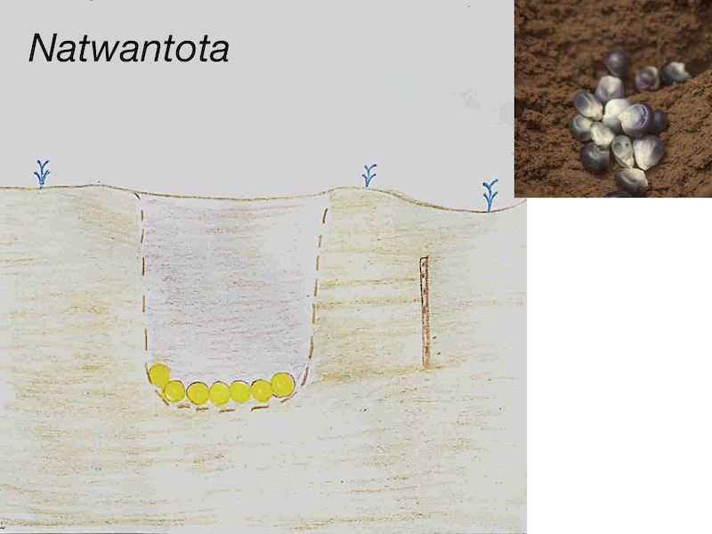


</div>

<div class="carcaption">
<p class="caption">&nbsp;</p>
</div>

## The phenology of maize

Like the Hopi, Pueblo Farming Project researchers also have desccriptions for the life cycle of maize. Pueblo Farming Project scientists use stages of maize growth from maize *phenology*, or the scientific study of how plant growth and reproduction relates to the environment. The photographs below illustrate the growth stages that were recorded by Pueblo Farming Project researchers during the growing season.

<div class="carousel">


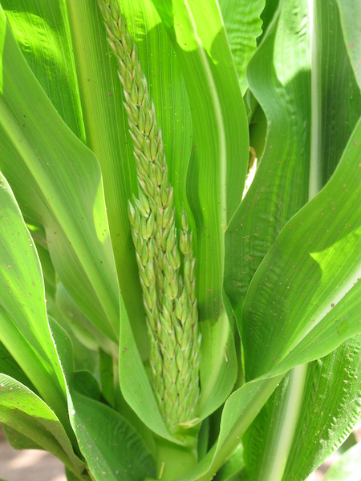
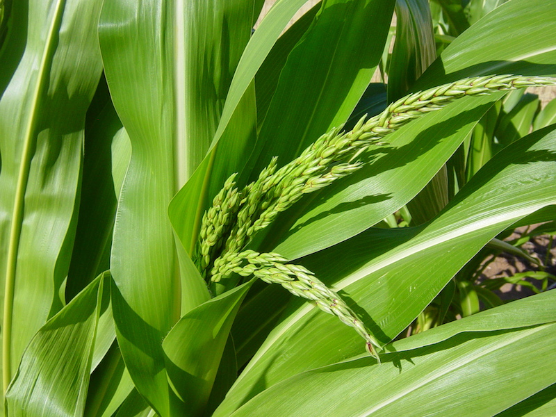

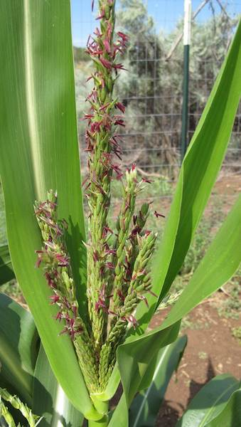

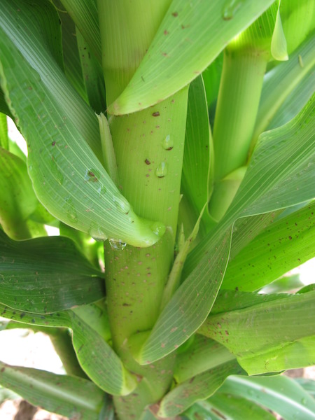


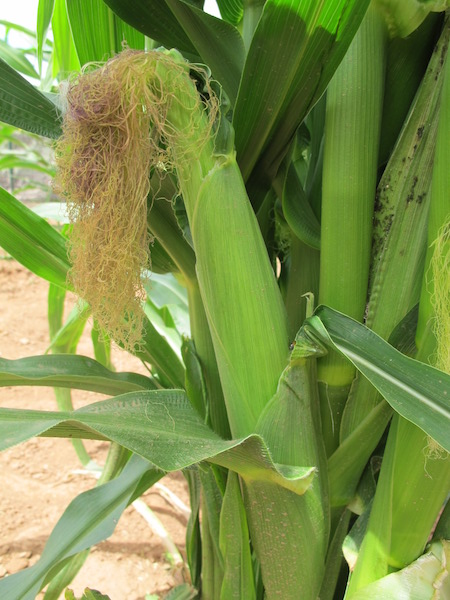


</div>

<div class="carcaption">
<p class="caption">&nbsp;</p>
</div>


<!--chapter:end:03-maize_lifecycle.Rmd-->

---
output: html_document
editor_options: 
  chunk_output_type: console
---
# What maize needs to flourish
<div style="text-align: center;">

</div>

Maize plants, like all crops, require nutrients from the soil, water, and heat and sunlight in order to flourish. In this chapter, we explore how Pueblo maize uses each of these resources and how those resources affected the Pueblo Farming Project gardens.

<div style="text-align: center;">

</div>


## Soils and water

### What are soils? {-}

Soil is made of a combination of minerals, organic matter, and sediment. These three ingredients are combined in different amounts and travel long distances around the globe through gravity and the movements of glaciers, water, and wind. **Soils store water and nutrients that plants use to flourish.**

#### How does soil gain water? {-}
Water is delivered to the soil in two ways:

*   **The Earth's water cycle**: precipitation in the form of rain, snow and ice. In the Southwest, the most important weather events that deliver water to the soil are winter snowstorms and summer monsoon rains. 
*   **Water management**: Humans capture and store water from the water cycle and spread it on the soil using irrigation systems. 

This video from [The Monsoon Project](https://themonsoonproject.org/) describes the importance of the North American Monsoon to the Southwest.

<div class="embed-responsive embed-responsive-16by9">
<iframe src="https://www.youtube.com/embed/wCRkLcLT1cE?modestbranding=1&rel=0&start=1" frameborder="0" gesture="media" showinfo="0" allow="encrypted-media" allowfullscreen></iframe>
</div>

#### How does soil lose water? {-}

Soils lose water through a process called **evapotranspiration**. This means that the sun and the wind cause soil to lose moisture through direct evaporation and through plant tissues.

Breaking this term into two parts clarifies this definition:

*   **Transpiration** — plants sweat out and lose water they have received from the soil
*   **Evaporation** — the soil loses water due to the wind and the sun

To slow this process, farmers often use a technique called **mulching**. Mulch is:

*   A material that is spread over a planting area to protect the soil from the effects of the wind and the sun.
*   A layer of insulation that traps moisture and shades the soil, which slows evaporation.
*   Carbon-based materials such as straw or dry grass clippings.

Pueblo farmers, such as the Hopi, use dust and sand as a mulch; they cover the moist soil that holds their seeds with a thick layer of sand and dust. 

#### Why do some farmers apply irrigation water to their soil? {-}

Some farmers irrigate because:

*   They are replacing the water that their plants and soils have lost due to evapotranspiration.
*   Some plants require more water than the environment has to offer; the farmers apply irrigation water to make up for water that does not arrive in the form of rain and snow.

Some modern farmers do not apply irrigation water to their soil: 

*   Hopi farmers who have vast direct-precipitation corn fields.
*   Farmers in the Western states who have large direct-precipitation crop farms.

Many Hopi farmers and other farmers in the Southwest do not use irrigation systems; the keys to their success are understanding weather patterns, caring for their soil, planting drought-resilient seeds, and having faith in natural cycles.

> **_"Dry-farming in the high desert ... relying only on precipitation and runoff water, requires an almost miraculous level of faith and is sustained by hard work, prayer, and an attitude of deep humility."_**
> 
> --- <cite>Wall and Masayesva 2004:436</cite>

#### How do direct-precipitation farmers decide where to place their gardens and fields? Why is this decision so important? {-}

Choosing the location of a garden is called *site selection*. It is important to direct-precipitation farmers because the chosen site must be able to capture and hold water delivered by the water cycle, making it drought resilient. 

**These are features that Hopi farmers of today look for---and that ancestral Pueblo farmers probably also looked for---when searching for a drought-resilient site.**:

*  **Geography**: Rainfall and snowmelt that drains off of a mesa or cliff will collect and flow into drainages, washes, arroyos, and canyons. Where these features become less narrow and widen into sandy slopes, Pueblo farmers expect water and good soil to collect because it is washed down with the floodwaters. This mouth or opening is also a place where they traditionally built **check dams**---rows of low rock walls to slow down the movement of runoff water.
*   **Garden slope**: North-facing slopes have less direct exposure to sunlight and lower soil temperature, and therefore less water is lost to evaporation.
*   **Indicator plants**: The appearance of certain plants in early spring give information, or *indicate*, to Hopi and other direct-precipitation farmers about the best locations for a garden/field, how deep to plant and how much space to leave between plants. Farmers combine these indications with practice, experience, and knowledge of the land. Some examples of plants that indicate these conditions are:

<table>
<tr>
<td>
<strong>CONDITION</strong>
</td>
<td><strong>INDICATOR PLANT</strong>
</td>
</tr>
<tr>
<td>Good soil moisture
</td>
<td>Rabbitbrush<br>
Four-wing saltbrush<br>
Mormon tea<br>
Rice grass<br>
Snakeweed
</td>
</tr>
<tr>
<td>Deep, well-drained soil
</td>
<td>Rabbitbrush<br>
Oak trees
</td>
</tr>
</table>

*   **Soil moisture depth**: deep, soft soils allow natural reservoirs of water to collect and be held deep in the soil.
*   **Soil color**: darker colors often mean higher amounts of decomposed organic matter and nutrients in the soil. In the Southwest, this means dark red-brown.
*   **Large, open planting area**: the area must be large enough that clumps of seeds can be planted with wide spaces between them (2--3 adult paces/steps or 4--6 feet between clumps.) This spacing allows little soil-moisture reservoirs to be created between clumps, providing long-term moisture. 

**Soil moisture is especially important to maize growth at planting (for germination), at tasseling/silking (for best chances at pollination), and during grain fill (to get ears completely covered with kernels).**

### Drought {-}
**When a normal amount of snow and rain does not arrive, this is called a *drought*.**

#### How do Pueblo farmers respond to drought? {-}

The Hopi use the agricultural knowledge gained through their ancestral direct-precipitation farming practices. They want to ensure their crops will continue to be drought-resilient into the future. To survive drought, direct-precipitation farmers must know a lot about their soil and their seeds. Ancestral Pueblo farmers might have responded to drought by:

*   anticipating the possibility that it could arrive any year and preparing for it by saving seeds from plants that can survive drought. 
*   using the site-selection factors listed above to decide whether or not a site would be drought-resilient. 
*   meeting these site requirements by planting in multiple locations.
*   using clumps of plants, twigs, or brush at the edge of the planting area or placing small upright stone slabs around seedlings as a windbreak to decrease evapotranspiration.
*   covering holes that contain seeds with loose topsoil to act as a *dust mulch*.

#### Do other direct-precipitation farmers use any of these same practices? {-}

Yes, though some farmers emphasize knowing the soil through soil testing:

*   First, farmers learn what is in their soil to determine what kind of soil they have. 
*   Second, farmers find out how much water their soil can hold. If the soil receives more water than it can hold, much of the extra water will drain away. Water that is wasted in this way is called **runoff**; it leads to **erosion**, when soil is carried away by the runoff. 

### Soils in the PFP gardens {-}
Pueblo Farming Project researchers used data from the USDA and local soil analysis to characterize the soils in the gardens on Crow Canyon's campus in southwestern Colorado. The map below displays the soils on Crow Canyon's campus. Click a soil to learn more information about it!

```{r, echo = FALSE, echo=FALSE, warning=FALSE, message=FALSE}
library(magrittr)
library(sf)

garden_locations <- sf::st_read("./data/gardens.geojson",
                                quiet = TRUE)

garden_locations$color <- RColorBrewer::brewer.pal(length(garden_locations),"Dark2")

garden_centroids <- garden_locations %>%
  sf::st_transform(26912) %>%
  sf::st_centroid() %>%
  sf::st_transform(4326)

pfp_soils <- sf::st_read("./data/soils.geojson",
                                quiet = TRUE)

## Create color palettes for each soil layer
colorpal <- leaflet::colorNumeric(
  palette = "YlGn",
  c(300,1400))

l <- pfp_soils %>%
  leaflet::leaflet(width = "100%") %>%
  leaflet::addProviderTiles("Esri.WorldImagery", group = "Satellite") %>%
  leaflet::addProviderTiles("Esri.WorldTopoMap", group = "Topography") %>%
  leaflet::addPolygons(
    data = pfp_soils,
    fillColor = ~colorpal(pfp_soils$Net.Primary.Productivity..kg.ha.),
    fillOpacity = 0.7,
    color = "white",
    weight = 3,
    opacity = 1,
    smoothFactor = 0.5,
    popup = ~popup
  ) %>%
  leaflet::addMarkers(data = garden_centroids %>%
                        dplyr::filter(Abbreviation != "MCG"),
                      popup = ~Popup) %>%
  leaflet::addPolygons(data = garden_locations %>%
                         dplyr::filter(Abbreviation != "MCG"),
                       fillColor = ~color,
                       popup = ~Popup) %>%
  leaflet::addLayersControl(
    baseGroups = c("Satellite", "Topography"),
    options = leaflet::layersControlOptions(collapsed = T)
  )

widgetframe::frameWidget(l, width='100%')

```


## Heat and sunlight
<div style="text-align: center;">

</div>

All plants require thermal energy---in the form of heat and sunlight---to perform **photosynthesis** and flourish. Photosynthesis is a process used by plants to make a sugary food that fuels their growth. Plants absorb the energy of the sun through their leaves, combine it with water and carbon dioxide, and make a sugar called glucose. **Fun Fact: The waste product that this process creates is oxygen!** Farmers in ancient times adapted their corn to the amount of heat and sunlight available in the regions in which they lived, and farmers today do the same.

But how much heat does a plant need, and how do we know how much it gets? Plant researchers use a measure of accumulated heat called a **growing degree day (GDD)** to estimate the amount of heat that plants may use for photosynthesis.

The equation for daily GDD for maize is:
$$ GDD=\frac{T_{MAX} + T_{MIN}}{2}-T_{BASE} $$
where $T_{MAX}$ is the maximum daily temperature, $T_{MIN}$ is the minimum daily temperature and $T_{BASE}$ is the temperature below which plant growth ceases, which we take to be 10°C (~50ºF) for maize.

Here we use a series of corrections to the equation typically applied for calculating maize GDD, which down-corrects $T_{MAX}$ and $T_{MIN}$ to an upper threshold ($T_{UT}$, here 30°C or 86ºF) above which corn growth does not appreciably increase, and up-corrects $T_{MAX}$ and $T_{MIN}$ if they fall below $T_{BASE}$ (here 10°C or 50ºF). To summarize:
$$
\text{if} \quad T_{MAX}>T_{UT}, \quad T_{MAX}=T_{UT}\\
\text{if} \quad T_{MIN}>T_{UT}, \quad T_{MIN}=T_{UT}\\
\text{if} \quad T_{MAX}<T_{BASE}, \quad T_{MAX}=T_{BASE}\\
\text{if} \quad T_{MIN}<T_{BASE}, \quad T_{MIN}=T_{BASE}
$$

Growing degree day amounts calculated in Celsius are different from those calculated in Fahrenheit. Growing degree days can be converted from Celsius heat units to Fahrenheit heat units by multiplying by a factor of 1.8. For example, 1000 Celsius GDDs are equal to 1800 Fahrenheit GDDs.


### Weather in Cortez {-}
<div style="text-align: center;">

</div>

Plants combine water and nutrients from the soil with heat and energy from the Sun to flourish. Pueblo Farming Project researchers estimated the amount of water and accumulated heat available to the maize in the Pueblo Farming Project gardens using weather data gathered by the US National Oceanic and Atmospheric Administration (NOAA) as part of the US Historical Climatology Network (USHCN). Temperature and precipitation data from a weather station in Cortez were used to measure the response of the Pueblo Farming Project gardens to local weather; we also installed a weather station on Crow Canyon's campus as well as temperature monitors in each garden. The graphs below show 2009 to 2018 data for the Pueblo Farming Project gardens. The top graph shows minimum and maximum daily temperatures and daily growing degree days, and the lower graph shows daily precipitation events. **These graphs are interactive!** Highlight a region of the graph in order to explore the weather. Hover over a graph to see the recorded weather at the Cortez weather station.

```{r, echo=FALSE, out.width = "100%", fig.height=3, echo=FALSE, warning=FALSE, message=FALSE}
library(dygraphs)
library(magrittr)

dyBarChart <- function(dygraph) {
  dyPlotter(
    dygraph = dygraph,
    name = "BarChart",
    path = system.file("examples/plotters/barchart.js",package = "dygraphs")
  )
}

cortez_weather <- readr::read_csv("./data/cortez_weather.csv",
                                  col_types = readr::cols(
                                    DATE = readr::col_date(format = ""),
                                    TMIN_F = readr::col_double(),
                                    TMAX_F = readr::col_double(),
                                    PRCP_IN = readr::col_double(),
                                    FGDD = readr::col_double()
                                  ))

cortez_weather_dy <- cortez_weather %>%
  dplyr::select(DATE, TMAX_F, TMIN_F, FGDD, PRCP_IN) %>%
  as.data.frame()
row.names(cortez_weather_dy) <- cortez_weather_dy$DATE

dygraphs::dygraph(cortez_weather_dy %>% 
                    dplyr::select(TMAX_F, TMIN_F, FGDD),
                  group = "cortez") %>%
  dygraphs::dyAxis('y',
                   label = "Temperature (ºF)",
                   drawGrid = F,
                   independentTicks = T) %>%
  dygraphs::dyAxis('y2',
                   label = "Daily GDD (F)",
                   valueRange = c(0, 30),
                   drawGrid = F,
                   independentTicks = T) %>%
  dygraphs::dyAxis('x',
                   drawGrid = F) %>%
  dygraphs::dySeries("TMAX_F", 
                     label = "Maximum temperature (ºF)", 
                     axis = 'y', 
                     color = "#ef8a62", 
                     strokeWidth = 1.5) %>%
  dygraphs::dySeries("TMIN_F", 
                     label = "Minimum temperature (ºF)", 
                     axis = 'y', 
                     color = "#67a9cf", 
                     strokeWidth = 1.5) %>% 
  dygraphs::dySeries("FGDD", 
                     label = "GDD (F)", 
                     axis = "y2", 
                     color = "black") %>%
  dygraphs::dyLegend(labelsSeparateLines = T, 
                     show = "onmouseover") %>%
  dygraphs::dyRangeSelector(dateWindow = c("2020-01-01", 
                                           "2020-12-31"))


cortez_weather_dy$PRCP_CM <- cortez_weather_dy$PRCP_IN * 2.54

dygraphs::dygraph(cortez_weather_dy %>% 
                    dplyr::select(PRCP_IN, PRCP_CM),
                  group = "cortez") %>%
  dygraphs::dyAxis('y',
                   label = "Precipitation (in)",
                   valueRange = c(0, NULL),
                   drawGrid = F,
                   independentTicks = T) %>%
  dygraphs::dyAxis('y2',
                   label = "Precipitation (cm)",
                   valueRange = c(0, NULL),
                   drawGrid = F,
                   independentTicks = F) %>%
  dygraphs::dyAxis('x',
                   drawGrid = F) %>%
  dygraphs::dySeries("PRCP_IN", 
                     label = "Precipitation (in)", 
                     axis = 'y', 
                     # stepPlot = TRUE,
                     # stemPlot = TRUE,
                     drawPoints = NULL,
                     strokeWidth = 1,
                     pointSize = 0,
                     color = "black") %>%
  dygraphs::dyLegend(show = "onmouseover",
                     labelsSeparateLines = TRUE) %>%
  dygraphs::dySeries("PRCP_CM",
                     label = "Precipitation (cm)",
                     axis = 'y2',
                     # stemPlot = T,
                     drawPoints = NULL,
                     strokeWidth = 0,
                     pointSize = 0,
                     color = "black") %>%
  dygraphs::dyRangeSelector(dateWindow = c("2020-01-01", 
                                           "2020-12-31"))

```

<!--chapter:end:04-maize_flourishing.Rmd-->

---
output: html_document
editor_options: 
  chunk_output_type: console
---
# The PFP field experiments
<div style="text-align: center;">

</div>


## Procedure
### Planting {-}
<div style="text-align: center;">

</div>

The primary tool for planting is a planting stick or, in the Hopi language, a *so'ya*. Traditionally a *so'ya* is made from greasewood (*Sarcobatus vermicalatus*), but some planting sticks today are made from a length of metal pipe with a narrow blade welded to one end.

Planting begins by using your foot to scrape away the upper layer of loose, dry dirt. This exposes the top of the underlying hard-packed soil. About a square foot area is cleared. The planter gets down on one knee and grabs the *so'ya* with one hand low and one hand higher up on the tool. A narrow hole is dug using a pulling motion toward the planter. Typically, the hole is dug to a depth of about 8 to 10 inches or to the depth where good soil moisture is encountered. The hole is dug deeper if the soil is drier and shallower if the soil is moist. This soil moisture is critical for plant germination and for the plant to be able to grow until there is more precipitation, which might not occur until many weeks after planting.

Hopi farmers plant corn in clumps. 10--20 seeds are deposited into the hole. The excavated earth is put back gently into the hole in the order it was removed with the moist soil covering the seeds on the bottom and the drier soil on top. The loose dry dirt is on the top, but a small basin is created on the surface to collect any precipitation that falls and to create a dust mulch that reduces evaporation. 

The farmer stands and takes two or three steps to measure where the next clump of corn will be planted. Because the soils in the PFP gardens hold a bit more moisture than those soils near the Hopi mesas, the PFP clumps are typically spaced about 1.5--1.75 meters apart rather than the three-meter spacing typically used at Hopi. The wide spacing of the planted clumps reduces competition for valuable sub-surface moisture.

Flick through these slides to see how planting is done the Hopi way! The descriptions are based on *Notes On Hopi Economic Life* by Earnest Beaglehole, 1937.

<div class="carousel">


</div>

<div class="carcaption">
<p class="caption">&nbsp;</p>
</div>

### Monitoring {-}
<div style="text-align: center;">

</div>

The procedures for monitoring Pueblo Farming Project gardens were based on those developed by Benjamin Bellorado in an experimental gardening study that he developed for the Animas-LaPlata archaeological project and for his MA thesis at Northern Arizona University. For the majority of the Pueblo Farming Project these procedures were implemented by Paul Ermigiotti and staff and volunteers who assisted him.

Monitoring was conducted each week. The primary objectives were to record growth stages, to document damage by pests, and to make other observations about the condition of the gardens. The data were recorded on paper forms in the field and later put into a database.

The data collected each week on growth stages includes the following:

* **Height** --- The height of the tallest plant in each clump was recorded to the nearest 5 cm.
* **Early Tassel Development** --- Early tassel development was recorded when it occurred on any plant in a clump. Early tassel development is defined as the time when the tassel bud starts to emerge from the central enclosing leaves at the top of the stalk to the time the tassel spike begins to branch.
* **Tassel Development** --- Tassel development was recorded when it occurred on any plant in a clump. Tassel development begins when the tassel emerges from the central cluster of leaves and begins to branch. This stage ends when the anthers (male flowers) emerge from the glumes of the tassel and the pollen begins to shed.
* **Tasseling** --- The period of tasseling was recorded when it occurred on any plant in a clump. The tasseling period is when the apex inflorescences (a group of flowers) begin to open. The anthers (male flowers) emerge and begin to shed pollen. At this stage the stalk has produced all its leaves, and the plant has reached full height.
* **Silk Development** --- Silk development was recorded when it occurred on any plant in a clump. Silk development is when ear shoots become visible in the nodes (between the leaf and stalk) until the silks have fully emerged and are ready to receive pollen.
* **Silking** --- Silk development was recorded when it occurred on any plant in a clump. Silking is when the silk has emerged from the husk surrounding the developing cob and is capable of receiving pollen. A single silk will deliver pollen and develop into individual kernel. Once the silks have begun to dry and shrivel, this growth stage has ended.
* **Ear Development** --- Ear development was recorded when it occurred on  any plant in  a clump.  Ear development begins once the silks have dried out, shriveled, and are no longer accepting pollen and continues until the kernels mature and the ear is ready to harvest.  A hard frost (below 28ºF.) will prematurely end ear development.


### Harvesting {-}
<div style="text-align: center;">
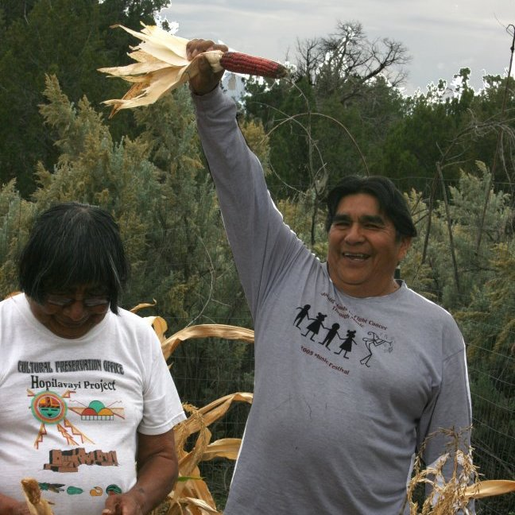
</div>

The harvest and yield data entry for the Pueblo Farming Project is a three-step process that includes collecting the corn from the field, weighing  the ears just after harvest, and, when they have dried completely, weighing the ears again to record the dry-kernel weight for each ear.

On harvest day, typically in mid-October after the ears have sufficiently ripened on the stalk, the farmers approach the garden with anticipation. All of the ears from each stalk in a clump are shucked, the silk is removed, and the ears are recorded and tagged according to the clump, stalk, and ear. After the ears are collected from a clump the stalks are bent over at the base and laid to rest on the ground. This laying to rest of the stalks is part of the life process that cycles through birth, maturation, and death. The stalks left in the garden also help with the spacing in the next year's planting. Planting between the stalks ensures that seeds are not planted in the same place two years in a row.

<div style="text-align: center;">
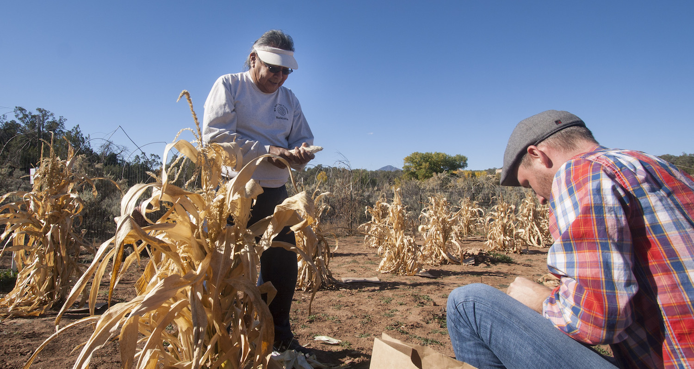
</div>

After harvest the ears are weighed to obtain a wet weight, because there is still considerable moisture remaining in the ears. The ears are then placed on trays and allowed to dry for two months.

When the ears have thoroughly dried, each ear is weighed with the kernels intact and after the kernels have been removed.  Ear, cob, and kernel weights are entered into the data base. Additional information on the ear is also recorded such as the number of rows of kernels, kernel color, and the completeness of kernel filling on the ear. The categories describing the condition of the ear include: 

* **Full**: more than two-thirds of the kernels are present
* **Partial**: one-third to two-thirds of the kernels are present
* **Sparse**: up to one-third of the kernels are present
* **Immature**: there are no kernels present on the cob

## Results
<div style="text-align: center;">

</div>

```{r pfp-results, echo=FALSE, warning=FALSE, message=FALSE}
library(plotly)
library(magrittr)

gardens <- readr::read_csv("./data/gardens.csv")
growth <- readr::read_csv("./data/growth.csv")
growth_summaries <- readr::read_csv("./data/growth_summaries.csv")
ears <- readr::read_csv("./data/ears.csv")
yields <- readr::read_csv("./data/yields.csv")

dir.create("./docs/plots",
           showWarnings = FALSE,
           recursive = TRUE)

dir.create("./docs/tables",
           showWarnings = FALSE,
           recursive = TRUE)

tabler <- function(x, file_out){
  x %>%
    dplyr::mutate_if(is.double, ~round(., digits = 3)) %>%
    DT::datatable(extensions = c('FixedColumns','Buttons'),
                  options = list(
                    dom = 'Bfrtip',
                    scrollX = TRUE,
                    fixedColumns = list(leftColumns = 1),
                    pageLength = 5,
                    buttons = list(list(extend = 'csv',
                                        filename = paste0(file_out,".csv")),
                                   list(extend = 'print',
                                        autoPrint = FALSE))),
                  rownames = FALSE,
                  width = "100%",
                  height = "100%") %>%
    widgetframe::frameWidget(width='100%')
}

```

PFP researchers were interested in how much Hopi maize could be grown in the Mesa Verde region, and whether the **phenotype**---or physical characteristics---of Hopi maize grown in the Mesa Verde region would be different from that grown on the Hopi Mesas. Here, we present analyses of [maize growth][Maize growth] (the **phenology** of maize), [maize yield][Maize yield], and [ear diversity][Ear diversity] (phenotype).

### Maize growth {-}
**The timing of maize growth stages was variable across the Pueblo Farming Project gardens.** The data and graph below report the growth data for each of the gardens for every year of the Pueblo Farming Project. Because the different clumps of maize (and even maize plants within a clump) mature at different rates, Pueblo Farming Project researchers reported the proportion of clumps that reached a given growth stage. So for example, in the table below, a "tasseling" proportion of `r growth_summaries %>% dplyr::filter(Garden == "CDG", Date == "2009-08-06") %$% Tasseling %>% round(digits = 3)` in the Check Dam Garden (CDG) on August 6, 2009, means that `r growth_summaries %>% dplyr::filter(Garden == "CDG", Date == "2009-08-06") %$% Tasseling %>% round(digits = 3) %>% magrittr::multiply_by(100)`% of clumps in the CDG showed signs of tasseling by that date. The data presented below are a summary of the raw growth data, which are available <a href="./docs/tables/growth_table.csv" download="PFP_growth_table.csv">here</a>.

```{r growth-summary-data, echo=FALSE, warning=FALSE, message=FALSE}
growth_summaries %>%
  tabler("growth_summary_table")

growth %>%
  readr::write_csv("./docs/tables/growth_table.csv")
```

<!-- <iframe src="./tables/growth_summary_table.html" width="100%" height="500px" frameborder="0" scrolling="no"></iframe> -->

An important thing to consider is the timing of tasseling relative to silking. The tassels of maize plants are their flowers---tassels produce pollen that must fall upon silks in order to produce maize kernels. If tasseling and silking don't happen at nearly the same time, pollenation doesn't occur, and the ears won't develop. If tasseling happens long before silking, the pollen will fall to the ground. The graph below allows you to select a year and visualize the relative timing of tasseling and silking (and the other growth stages). You'll notice that the highest yielding gardens such as the Check Dam Garden (CDG) have silk development and silking occurring within about a week after tasseling. In other gardens, such as Karen's Upper Garden (KUG), silking follows many weeks after tasseling; this prevents a majority of pollenation and leads to lower yields in that garden.

**Explore the plot below.** You can hover over the plot to view the individual values. Use the slider at the bottom of the graph to move through the growth stages. You can isolate a particular garden by double clicking its name in the legend at the right of the graph; a single click will turn a garden on or off. Finally, you can download an image of the graph by hovering over it and clicking the small camera icon in the upper right.

```{r growth-plot, echo=FALSE, warning=FALSE, message=FALSE}
2009:2021 %>%
  magrittr::set_names(2009:2021) %>%
  purrr::walk(function(season){
    test_data <- growth_summaries %>%
      tidyr::gather(`Growth stage`, 
                    `Proportion of clumps at growth stage`, 
                    `Early Tassel Development`:`Ear Development`) %>%
      dplyr::mutate(`Growth stage` = ordered(`Growth stage`, 
                                             levels = c("Early Tassel Development",
                                                        "Tassel Development",
                                                        "Tasseling",
                                                        "Silk Development",
                                                        "Silking",
                                                        "Ear Development"
                                             ))) %>%
      dplyr::filter(Season == season)
    
    out <-  test_data %>%
      plot_ly(
        x = ~Date, 
        y = ~`Proportion of clumps at growth stage`, 
        frame = ~`Growth stage`,
        color = ~Garden#,
        # width = 800,
        # height = 400
      ) %>% 
      add_lines() %>%
      animation_opts(
        transition = 0,
        redraw = FALSE
      ) %>% 
      animation_slider(
        currentvalue = list(prefix = "", 
                            font = list(size = 12,
                                        color = "black")),
        font = list(size = 8,
                    color = "black")
      ) %>%
      animation_button(visible = FALSE,
                       x = 1, xanchor = "right", y = 0, yanchor = "bottom"
      ) %>%
      layout(xaxis = list(title = "",
                          range = range(test_data$Date) %>%
                            as.POSIXct(format="%Y-%m-%d") %>%
                            as.numeric() %>%
                            magrittr::multiply_by(1000),
                          type = "date"),
             yaxis = list(title = "Proportion of clumps\nat growth stage")
      ) %>%
      config(displaylogo = F,
             scrollZoom = F,
             modeBarButtonsToRemove = list("toggleSpikelines",
                                           "hoverClosestCartesian",
                                           "hoverCompareCartesian",
                                           "resetScale2d")) %T>%
      htmlwidgets::saveWidget(file = stringr::str_c("./growth_",season,".html"),
                              selfcontained = FALSE,
                              libdir = "./libs")
    
    out %>%
      htmlwidgets:::toHTML() %>%
      htmltools::save_html(file = stringr::str_c("./growth_",season,".html"), 
                           libdir = "./libs")
    
    file.copy(stringr::str_c("./growth_",season,".html"),
              stringr::str_c("./docs/plots/growth_",season,".html"),
              overwrite = TRUE)
    
    unlink(stringr::str_c("./growth_",season,".html"))
    
  })

system("cp -R libs/. docs/plots/libs/")

```


<form name="change">
<select name="options" onchange="document.getElementById('youriframe').src = this.options[this.selectedIndex].value">
<option value="./plots/growth_2021.html">Select a year to view the growth data:</option>
<option value="./plots/growth_2021.html">2021</option>
<option value="./plots/growth_2020.html">2020</option>
<option value="./plots/growth_2019.html">2019</option>
<option value="./plots/growth_2018.html">2018</option>
<option value="./plots/growth_2017.html">2017</option>
<option value="./plots/growth_2016.html">2016</option>
<option value="./plots/growth_2015.html">2015</option>
<option value="./plots/growth_2014.html">2014</option>
<option value="./plots/growth_2013.html">2013</option>
<option value="./plots/growth_2012.html">2012</option>
<option value="./plots/growth_2011.html">2011</option>
<option value="./plots/growth_2010.html">2010</option>
<option value="./plots/growth_2009.html">2009</option>
</select>

<iframe name="iframe" id="youriframe" src="./plots/growth_2021.html" height="400" width="100%" frameborder="0" scrolling="no"></iframe>

### Maize yield {-}

```{r yield-summary-data, echo=FALSE, warning=FALSE, message=FALSE}
yields_summary <- yields %>%
  dplyr::group_by(Season,Garden,Variety) %>%
  dplyr::summarise(`PFP experimental yield (kg/ha)` = mean(`PFP experimental yield (kg/ha)`)) %>%
  dplyr::mutate(`PFP experimental yield (kg/ha)` = round(`PFP experimental yield (kg/ha)`))

drop_current_season <- 
  yields_summary %>%
  dplyr::filter(Season == max(yields_summary$Season)) %$%
  `PFP experimental yield (kg/ha)` %>%
  magrittr::equals(0) %>%
  all()

yields_summary %<>% 
  {
    if(drop_current_season)
      dplyr::filter(., Season != max(.$Season)) 
    else .
  }

# yields_summary %>%
#   tabler("yield_summary_table")

max_yield <- yields_summary %>% 
  dplyr::ungroup() %>%
  dplyr::filter(`PFP experimental yield (kg/ha)` == max(`PFP experimental yield (kg/ha)`, na.rm = TRUE))

yields %>%
  readr::write_csv("./docs/tables/yield_table.csv")
```

**Hopi maize grown during the PFP flourished in the Mesa Verde region.** Although some gardens failed to produce yields in some years, many of the gardens produced substantial yields. The highest yielding garden was the Mike Coffey Garden (MCG) in `r max_yield$Season`, which produced an average yield of `r max_yield[["PFP experimental yield (kg/ha)"]]` kg/ha of maize. To put that into perspective, such a yield rate would have easily supported `r (max_yield[["PFP experimental yield (kg/ha)"]]/160) %>% floor()` people for one year from a one hectare field! The average yield for all of the gardens from `r min(yields_summary$Season)` to `r max(yields_summary$Season)` was `r (yields_summary[["PFP experimental yield (kg/ha)"]]) %>% mean() %>% round()` kg/ha, enough to support about two people for one year from a one hectare field. The data presented above are a summary of the raw yield data, which are available <a href="./docs/tables/yield_table.csv" download="PFP_yield_table.csv">here</a>.

```{r yield-summary-table, echo=FALSE, warning=FALSE, message=FALSE}

yields_summary %>%
  tabler("yield_summary_table")

```

<!-- <iframe src="./tables/yield_summary_table.html" width="100%" height="500px" frameborder="0" scrolling="no"></iframe> -->

Even though there were really good years with high yields in some gardens, many gardens produced very low yields (although see [What we learned] for a discussion of low yields). The graph below displays estimated yields from each garden in each year. The yields are displayed as box plots; they show the **distribution** of possible yields as calculated from the clump data [see @Bocinsky2017 for a discussion of our methods]. The box represents the middle 50% of values; the line in the box is the median, or middle value; the lines extending from the boxes represent the middle 95% of values. Values outside the middle 95% appear as dots above and below the lines. As above, you can isolate a garden by double-clicking its name in the legend at the right of the graph. These data show the importance of traditional ecological knowledge in selecting garden locations---subsistence farmers quickly learn the best places to plant fields, and then they avoid planting in less-optimal places.

```{r yield-plot, echo=FALSE, warning=FALSE, message=FALSE}
yields %>% 
  {
    if(drop_current_season)
      dplyr::filter(., Season != max(.$Season)) 
    else .
  } %>%
  plot_ly(x = ~Season, 
          y = ~`PFP experimental yield (kg/ha)`, 
          color = ~Garden, 
          type = "box") %>%
  layout(boxmode = "group") %>%
  layout(xaxis = list(title = "",
                      autotick = FALSE),
         yaxis = list(title = "PFP experimental yield (kg/ha)")
  ) %>%
  config(displaylogo = F,
         scrollZoom = F,
         
         modeBarButtonsToRemove = list("toggleSpikelines",
                                       "hoverClosestCartesian",
                                       "hoverCompareCartesian",
                                       "resetScale2d")) %>%
  widgetframe::frameWidget(width='100%')

```

### Ear diversity {-}
**The phenotypes presented by Hopi maize are strongly related to growing conditions.** Hopi maize is conventionally thought of as having 12--14 rows; however, under certain conditions, the PFP maize demostrates that Hopi maize can produce ears with up to `r ears$Rows %>% max(na.rm = T)` rows, as occurred in `r ears %>% dplyr::filter(Rows == 24) %$% Season` in the `r ears %>% dplyr::filter(Rows == 24) %$% Garden` garden. Still, the median number of rows in full ears in all the gardens during all years was `r ears %>% dplyr::filter(Condition == "Full") %$% Rows %>% median(na.rm = T)`, much closer to the conventional number. The average kernel weights for full ears was `r (ears %>% dplyr::filter(Condition == "Full"))[["Kernel weight"]] %>% mean(na.rm = T) %>% round(digits = 1)` grams. The data presented below are a summary of the raw ear measurement data, which are available <a href="./docs/tables/ears_table.csv" download="PFP_ears_table.csv">here</a>.

```{r ear-summary-data, echo=FALSE, warning=FALSE, message=FALSE}
ears %>%
  dplyr::group_by(Season,Garden, Variety) %>%
  dplyr::summarise(`Median Rows` = median(Rows, na.rm = TRUE),
                   `Avg. Ear weight (g)` = mean(`Ear weight`, na.rm = TRUE),
                   `Avg. Cob weight (g)` = mean(`Cob weight`, na.rm = TRUE),
                   `Avg. Kernel weight (g)` = mean(`Kernel weight`, na.rm = TRUE)) %>%
  tabler("ear_summary_table")

ears %>%
  readr::write_csv("./docs/tables/ears_table.csv")
```

<!-- <iframe src="./tables/ear_summary_table.html" width="100%" height="500px" frameborder="0" scrolling="no"></iframe> -->

The relationship between ear metrics and yield is clear: years with higher yields produced larger ears with more rows and higher kernel weights. Compare the graph below to the yield graph above.

**These results suggest that Hopi farmers have developed and maintained the ability of Hopi maize to adapt to a variety of growing conditions. Hopi maize flourishes in the Mesa Verde region, an ancestral Hopi homeland.**

```{r ears-plot, echo=FALSE, warning=FALSE, message=FALSE}
c("rows" = "Rows",
  "ear_weight" = "Ear weight",
  "cob_weight" = "Cob weight",
  "kernel_weight" = "Kernel weight") %>%
  purrr::map(function(var){
    out <- plot_ly(x = ears$Season, 
                   y = ears[[var]], 
                   color = ears$Garden, 
                   type = "box") %>%
      layout(boxmode = "group") %>%
      layout(xaxis = list(title = "",
                          autotick = FALSE),
             yaxis = list(title = var)
      ) %>%
      config(displaylogo = F,
             scrollZoom = F,
             
             modeBarButtonsToRemove = list("toggleSpikelines",
                                           "hoverClosestCartesian",
                                           "hoverCompareCartesian",
                                           "resetScale2d"))
  }) %>%
  purrr::iwalk(function(x,name){
    out <- x %T>%
      htmlwidgets::saveWidget(file = stringr::str_c("./ears_",name,"_plot.html"),
                              selfcontained = FALSE,
                              libdir = "./libs")
    
    out %>%
      htmlwidgets:::toHTML() %>%
      htmltools::save_html(file = stringr::str_c("./ears_",name,"_plot.html"), 
                           libdir = "./libs")
    
    file.copy(stringr::str_c("./ears_",name,"_plot.html"),
              stringr::str_c("./docs/plots/ears_",name,"_plot.html"),
              overwrite = TRUE)
    
    unlink(stringr::str_c("./ears_",name,"_plot.html"))
  })

system("cp -R libs/. docs/plots/libs/")

```


<form name="change">
<select name="options" onchange="document.getElementById('ears').src = this.options[this.selectedIndex].value">
<option value="./plots/ears_rows_plot.html">Select a variable to view the ear data:</option>
<option value="./plots/ears_rows_plot.html">Rows</option>
<option value="./plots/ears_ear_weight_plot.html">Ear weight</option>
<option value="./plots/ears_cob_weight_plot.html">Cob weight</option>
<option value="./plots/ears_kernel_weight_plot.html">Kernel weight</option>
</select>

<iframe name="iframe" id="ears" src="./plots/ears_rows_plot.html" height="400" width="100%" frameborder="0" scrolling="no"></iframe>


### Maize genetics {-}
Compared to other Native American groups, Hopi communities have been cultivating maize for millennia with very little influence by Western methods or contemporary industrialized agriculture. As part of the Pueblo Farming Project, researchers performed a genetics study characterizing 95 individual plants from 12 named varieties grown by 6 farmers at the Hopi Mesas ("in situ Hopi" samples) to provide a genetic baseline for Hopi corn today. Kelly Swarts, currently a postdoctoral scholar at the Max Planck Institute for Developmental Biology in Tübingen, Germany, directed the analysis of these 95 plants and compared the results with previously published genotypes in order to contextualize Hopi genetic variation in a global context. The comparative data consist of the following: (1) ancestral Pueblo maize from the site of Turkey Pen ruin in southern Utah, which dates from AD 200; (2) a collection of wild-collected teosinte; and (3) landrace varieties adapted to local conditions---including Hopi accessions ("*ex situ* Hopi" samples) from across the Americas and held in collections at the [USDA Agricultural Research Service](https://www.ars.usda.gov/) and [Native Seeds/SEARCH](https://www.nativeseeds.org/) (a non-profit seed-saving organization in Arizona).

#### Results {-}

* *In situ* Hopi maize is genetically unique, though very closely related to other temperate maize from the Southwest. Hopi varieties differ from other maize with respect to environmental responses, growth, and physiology.
* Ancestral Pueblo samples from Turkey Pen Shelter are closely associated with the *in situ* Hopi samples (as to other samples from the temperate Southwest), but *in situ* Hopi maize has undergone continued selection for desirable traits over the last 2,000 years.
* Hopi material from the *ex situ* collections demonstrates tropical traits that are not found in the *in situ* Hopi samples from this study. The cause of this is inconclusive, but this absence demonstrates the necessity of not relying on banked corn from services like USDA-ARS and Native Seeds/SEARCH. That is, analysis on Hopi maize should be performed on new *in situ* collections.
* Named varieties of Hopi corn are genetically different from one another, although there is a fair amount of genetic overlap between them as well. This suggests that, although contemporary Hopi farming techniques seek to isolate named types, genetic mixing has occurred in the past. 
* There is little population structure within the Hopi germplasm (variation is widely distributed), despite the clear morphological and physiological characteristics of the different varieties. This pattern typically results from past intermating between varieties and also indicates seed sharing between farmers across the Hopi Mesas.
* Breeding population sizes, as indicated by estimated inbreeding within populations, are within the healthy range.

These data will all be available for future studies to monitor changes within *in situ* Hopi germplasm.

<!--chapter:end:05-pfp_experiments.Rmd-->

# What we learned
<div style="text-align: center;">

</div>

Through the Pueblo Farming Project, researchers, educators and volunteers have gained a deeper appreciation of traditional Pueblo Indian agricultural practices and the role of corn, or maize, in Pueblo society both past and present. The Pueblo farmers, especially our Hopi colleagues, shared their knowledge of corn farming with us, and they taught us how this plant---and the preservation their agricultural practices---are essential to their cultural continuity.

The Pueblo consultants on the Pueblo Farming Project agreed that the Hopi farmers should take the lead in the project, because they still practice direct-precipitation farming on the Hopi Mesas in northeastern Arizona. This type of farming relies strictly on direct precipitation and rainfall runoff. The length of the growing season is longer in the Hopi region, the soil makeup is different, and annual precipitation is less compared to the Mesa Verde region. Despite these differences, the Hopi consider the Mesa Verde region part of their ancestral homeland, and they wanted to know if their farming techniques would work in this area that was almost 200 miles distant.

<div style="text-align: center;">

</div>

Archaeological remains show that maize spread into the greater American Southwest about 4,000 years ago. For archaeologists, the adoption of corn farming signals the beginning of Pueblo Indian culture. The Hopi also see their origins as tied to the adoption of maize. Hopi oral history tells how Masau'u, ancient caretaker of the earth, presented the Hopi with the gift of corn (*qa'ö*) upon their emergence from the underworld. The gift included a bag of seed, a planting stick, and a gourd filled with water. Farming corn became their identity, and this lifeway based on humility and perseverance in a harsh landscape, offered the Hopi a long and spiritually rich life.

<div style="text-align: center;">

</div>

Scientific studies have determined that by 2,400 years ago the diets of the earliest farmers in the Four Corners area were heavily dependent on maize. It appears that by that time, maize made up about 70% of Pueblo people's caloric intake. 

<div style="text-align: center;">

</div>

DNA testing of 12 named Hopi maize varieties, undertaken by the PFP, show that Hopi maize is genetically distinct, although it is closely related to other temperate maize from the US Southwest. The Hopi samples are closely associated with ancient corn samples that were tested in separate studies. The studies also show that the Hopi varieties have also undergone continued selection over the past 2,000 years.

<div style="text-align: center;">

</div>

Archaeological evidence of farming in the region includes items such as planting sticks, manos, metates, check dams, storage facilities, and abundant corn remains. These materials attest to the persistence of agricultural practices in the Southwest since maize was first introduced and reinforce the continuity of these traditional practices at Hopi.

In summarizing what we have learned about Pueblo farming in the Mesa Verde region, a good place to begin is with a discussion of how and why "Pueblo farming" is different from conventional "modern farming" practices. The Colorado Plateau poses many challenges to farming not present elsewhere. The elevation ranges from 4,500 to 13,000 feet above sea level, with the direct-precipitation farming belt extending from about 5,500 to 7,500 feet. Daily temperatures fluctuate widely here during the growing season with hot days and cool nights. Cold air drains and settles into lower elevations on the landscape, and Pueblo Farming Project temperature monitors have shown that in cold air drainages, the length of the frost-free growing season can often be well below the 120-day span typically thought necessary for corn production. For one of the Pueblo Farming Project gardens, Paul's Old Garden, the frost-free growing season was just over 100 days on several occasions. Two gardens, Paul's Old Garden and the Mike Coffey Garden, illustrate the differences in cold air drainage. The Mike Coffey Garden is located 30 miles north of the other gardens and is 1,100 ft. higher in elevation; however, because nearby canyons drain cold air away from the plot, the Mike Coffey Garden had a longer frost-free season. In contrast, the Paul's Old Garden is located at a lower elevation and should be warmer, but it is situated at the bottom of a canyon that collects cold air from the adjacent higher ground, resulting in a shorter growing season. 

Precipitation can vary greatly across the Southwest. This variation can be affected by elevation as well as annual jetstream patterns. Extended droughts are not uncommon. Annual precipitation ranges from 5 inches to 19.5 inches across of the Four Corners area. The annual precipitation for the PFP study area averaged 11.9 inches during the 10 years between 2008 and 2017, which is close to the long-term average for nearby Cortez, Colorado. The Mesa Verde region experiences a bimodal weather pattern that delivers the majority of its precipitation in the colder months of November through March, and during the summer monsoons which typically occur from July to September. Some of the hottest and driest weather occurs in May, June and early July. 

<div style="text-align: center;">

</div>

Many favored agricultural locations are on reddish, deep, wind-blown soils. These soils, and good winter precipitation, are the key to successful farming without irrigation in the Mesa Verde region. These soils retain valuable subsurface moisture that carries seedlings and young plants through the driest part of the year without supplemental water. Caliche (a rock-hard layer of calcium carbonate) and mineral salts can build up in some soils, restricting root growth and affecting plant development. 

Karen's Upper Garden was placed on a ridge not far from ancestral Pueblo archaeological sites. This seemed like an ideal location---deep soil and a long frost-free growing season. Relatively poor yields from this garden, however, indicate a deficiency in some unseen factor that affects yields, and soil profiles taken in that area revealed significant caliche formation not far below the surface. With such variability in precipitation, soil, temperature and cold air drainage, the nature of direct-precipitation farming in the Mesa Verde region could be considered a "roll of the dice" in any given year. Pueblo subsistence farmers must have possessed a detailed understanding of the landscape and the conditions that can result in crop success or failure.

The first step in establishing Pueblo Farming Project plots was selecting the garden locations. Prime locations for gardening on Crow Canyon's campus were somewhat limited because of Crow Canyon's facilities, so the placement of our gardens was not ideal. In the areas available, the Pueblo farmers used the growth of specific native plants to guide their selection of optimal field locations. Rabbitbrush (*Chrysothamnus nauseosus*), snakeweed (*Guitierrezia sarothrae*), and dense stands of big sagebrush (*Artemisia tridentata*) grow in soils thought to be indicative of good areas for raising corn. Five gardens on the Crow Canyon campus and one garden located almost 40 miles northwest of campus in a prime direct-precipitation bean farming area presented a variety of conditions that allowed us to measure and compare different settings in terms of their agricultural potential. 

Initially, several different varieties of Hopi maize were planted in the PFP gardens. Later, the selection was reduced to two varieties: white flour corn (*qotsaqa'ö*) and blue flour corn (*sakwapqa"ö*). 

<div style="text-align: center;">

</div>

Most Americans are familiar with the modern practice of planting corn closely spaced in long rows. Many have heard the story of how American Indians taught Pilgrims to plant corn in hills with fish as a fertilizer. Traditional Hopi farming is quite distinct from either of these farming techniques. Planting technology is limited to a single tool: the planting stick or *so'ya*. Traditionally made of greasewood (*Sarcobatus vermicalatus*), today many planting sticks are made from a length of metal pipe with a narrow blade welded to one end. 

Planting begins with the planter scraping the modern ground surface with a sideways motion of the foot to push aside the loose and dry upper dust layer. This exposes the top of the underlying hard-packed soil. About a square foot, or slightly larger, area is cleared. The planter gets down on one knee and grabs the planting stick with one hand low and the other hand higher up on the tool. Then, using a pulling motion, the planter digs a narrow hole to the desired depth. The hole is dug about 8 to 10 inches deep, or to the depth of good soil moisture. It is important that there is sufficient soil moisture where the seeds are deposited to ensure germination. The hole is dug deeper if the soil is drier and shallower if the soil is moist. 

<div style="text-align: center;">

</div>

The base of the hole is enlarged and about 10--20 seeds are deposited into the hole. The excavated earth is put back gently into the hole in the order it was removed, with the moist soil covering the seeds on the bottom and the drier soil on top. Using loose top soil, a small well or basin is created above the planted seeds. This collects any precipitation that may fall and creates a mulch of dust that reduces evaporation. 

The farmer then stands and paces off two or three steps to where the next clump of corn will be planted. Because the soils in the PFP gardens hold a bit more moisture than those soils near the Hopi mesas, the clumps are typically spaced about 1.5--1.75 meters apart rather than the 3-meter spacing typically used at Hopi. The wide spacing of the planted clumps reduces competition for valuable subsurface moisture. When the garden planting has been completed the farmers call out *kwakwhay*---thank you!

<div style="text-align: center;">

</div>

The seedlings emerge in about ten days after planting. The closely grouped seedlings in each clump provide some mutual protection from the sun and wind. By early July, when the plants are about 18 inches tall, the leaves begin to bend over as if to touch the ground. At this time the number of young corn plants is reduced to about six in each clump.

<div style="text-align: center;">

</div>

Weeding and monitoring for pests are ongoing tasks throughout the growing season. Newly emerged seedlings are vulnerable to cutworms that attack the stem just under the ground surface. Grasshoppers and ants can chew young plants to the ground. Rabbits destroyed whole PFP gardens during one dry summer. At Hopi today, and in our gardens, large cans with the tops removed are placed over the newly planted clumps to prevent cutworm damage, shade young plants, and protect plants from spring winds. The Hopi deter rodents by soaking dog dung in a bucket and then spraying plants with the resulting liquid by means of a rabbitbrush switch. Crows, ravens, and jays can pluck out young seedlings early in the season and, perhaps even more devastatingly, raid the garden at the end of a successful season. In unfenced fields such as those at Hopi, deer, elk and cattle are also known to destroy crops. 

Weeding to reduce any competition from other plants is especially important in direct-precipitation farming. By far the most damaging invasive weed species in the PFP gardens is field bindweed (*Convolvulus arvensus*). This rapidly spreading plant is native to Europe and was not a problem for ancestral Pueblo farmers, and so far it does not seem to be very common in the Hopi area. This plant is hard to eradicate and certainly is the biggest competitor for moisture and nutrients in our gardens. Some wild or semi-cultivated plants are tolerated and allowed to remain in the PFP gardens. The young leaves of Rocky Mountain beeplant (*Cleome serrulata*), called *tuma* or wild spinach, are cooked and eaten by Hopi people. They also boil down beeplant leaves to make paint for pottery designs. Wild tobacco (*Nicotonia attenuate*) is widely used by Pueblo people for ceremonial purposes. These plants and a small patch of wild potato (*Solanum jamesii*) have at times been allowed to grow in some of the PFP gardens. Hopi farmers have indicated the allowing tobacco to grow to close to the corn will impart a bad taste to the corn. 

The Hopi farmers have repeatedly stressed the importance of good thoughts and actions while tending to their fields. It is of utmost importance that the farmer's heart be filled with good intention in the garden to ensure a bountiful harvest. When approaching a field, the farmer announces his arrival. Songs are composed and sung to the plants to provide encouragement for growth. Prayers for moisture are said while work in the field is carried out. The Hopi liken the development of their corn to the stages of a human life. The relationship of the farmer to the plant is analogous to that of a parent to a child. The corn goes through life much as a person does; as a child born, so too do the seedlings emerge from the earth. The plant sends out its first long leaves that bend over to touch the ground much as an infant learns to crawl. Like toddlers, plants then begin to stand upright and then grow tall. The plants reach sexual maturity as they tassel and silk. Finally they produce offspring of their own as fully mature ears of corn. A perfect ear of white corn, full to the tip with kernels, is called a "mother ear" (*tsotsmingwa*). Such ears are presented to a child at birth and later used at important stages in an individual's life. When the ears are harvested the plants are pushed over to the ground so that they can rest---they have completed their lives.

<div style="text-align: center;">
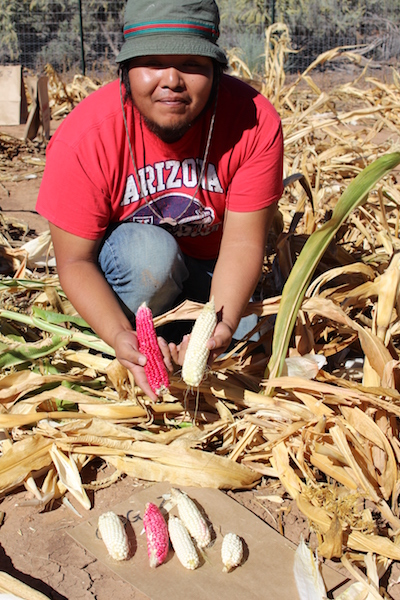
</div>

One of the research goals of the Pueblo Farming Project was to use the harvest yields from the gardens to evaluate the Village Ecodynamics Project (VEP) paleoproductivity model for ancestral Pueblo maize farming in the Mesa Verde region. The Village Ecodynamics Project modeled maize productivity estimates for all of the soil types in the region, including estimates for the locations of the Pueblo Farming Project gardens. The productivity estimates were created using soil type, a compilation of historical yields for those soils, reconstruction of annual precipitation based on tree rings, and calculations of the Palmer Drought Severity Index, which is a measure of stored soil moisture available for plant growth. 

Over the history of the Pueblo Farming Project, the harvest yields have varied greatly between gardens and even between clumps within the same garden, due in part to many of the factors stated previously. There is a high degree of correlation between yields from the gardens and the Village Ecodynamics Project model estimates, but in some of the better years (greater precipitation) the Pueblo Farming Project gardens produced much more than the model estimated, and in bad years (less precipitation) the garden harvests were lower than the Village Ecodynamics Project estimates. As a result, there is far less variability in the Village Ecodynamics Project estimated yields than in the Pueblo Farming Project garden yields.

The small size of our experimental gardens may exaggerate some results. For example, in some years our harvest yields for some gardens were near zero. It is possible that a larger plot would have produced better yields. 

The total precipitation and the timing of that precipitation seemed to be the greatest contributing factors in yields. Lower than average winter precipitation and a dry spring slows growth and causes plants to wilt early in the season. Heat stress brought on by delayed monsoon rains during the reproductive stages can also result in drastically lowered yields. In years when other vegetation suffered the effects of drought, PFP gardens increasingly became the target of grasshoppers and rabbits. These nuanced occurrences aren't acccounted for in the modeling programs, but they would have been noticed by ancestral Pueblo farmers.

```{r yield-estimates, echo=FALSE, warning=FALSE, message=FALSE}
library(magrittr)

yields <- readr::read_csv("./data/yields.csv") %>%
  dplyr::group_by(Season,Garden,Variety) %>%
  dplyr::summarise(`PFP experimental yield (kg/ha)` = mean(`PFP experimental yield (kg/ha)`)) %>%
  dplyr::mutate(`PFP experimental yield (kg/ha)` = round(`PFP experimental yield (kg/ha)`)) %>%
  dplyr::ungroup()

max_yield <- yields %>%
  dplyr::filter(`PFP experimental yield (kg/ha)` == max(`PFP experimental yield (kg/ha)`))

ccac_max_yield <- yields %>%
  dplyr::filter(Garden != "MCG") %>%
  dplyr::filter(`PFP experimental yield (kg/ha)` == max(`PFP experimental yield (kg/ha)`))

mean_yield <- yields %>%
  dplyr::summarise(`PFP experimental yield (kg/ha)` = mean(`PFP experimental yield (kg/ha)`))
```

The annual Pueblo Farming Project garden harvests were used to estimate maize yields as kilograms per hectare (10,000 m<sup>2</sup>, or 2.47 acres). These estimates can be translated into the number of people the yields from a specific garden could have fed in a given year. They can also be used to estimate the size of the area that needed to be cultivated to feed a family and grow a surplus for storage to buffer against years with poor yields. An average of 160 kilograms of corn per year per person has been estimated for a diet in which about 70% of calories come from corn. Our highest yields came from the `r max_yield$Garden`, which was planted with `r max_yield$Variety` maize in the year `r max_yield$Season`. This garden produced an estimated `r max_yield[["PFP experimental yield (kg/ha)"]] %>% formatC(format="d", big.mark=",")` kilograms per hectare, a yield rate that could have fed `r floor(max_yield[["PFP experimental yield (kg/ha)"]]/160)` people had the field covered a full hectare. Among gardens on Crow Canyon's campus, the `r ccac_max_yield$Garden` in `r ccac_max_yield$Season`, planted with `r ccac_max_yield$Variety` maize, produced the greatest yields, with an estimated `r ccac_max_yield[["PFP experimental yield (kg/ha)"]] %>% formatC(format="d", big.mark=",")` kg/ha, enough for a one-hectare field to feed `r floor(ccac_max_yield[["PFP experimental yield (kg/ha)"]]/160)` people. The average yields of all PFP gardens over the years (`r round(mean_yield[["PFP experimental yield (kg/ha)"]]) %>% formatC(format="d", big.mark=",")` kg/ha) would feed `r round(mean_yield[["PFP experimental yield (kg/ha)"]]/160, digits = 1)` persons per hectare. A family of six would need approximately `r round(1/(mean_yield[["PFP experimental yield (kg/ha)"]]/(160*6)), digits = 1)` hectares of farmland for one year, and much more to create a several-year stockpile against future years of crop failure.

The low average yields from the combined Pueblo Farming Project gardens may be misleading. The gardens on the Crow Canyon Archaeological Center campus were not located in the prime agricultural lands available in the Mesa Verde region. Also, the amount of labor invested in weeding and pest control in the Pueblo Farming Project gardens was probably minimal compared to the effort expended by a subsistence farmer. Again, the small size of the garden plots may have played a role in reduced yields. Increased vulnerability of crops to damage by pests and edge effects (where the roots from vegetation surrounding the garden compete for valuable moisture) could impact yields of smaller fields more than those of larger fields. The time devoted to crops and the knowledge of the land gained from generations of farming is inestimable. 

The Hopi farmers have shown us that their seed and farming practices do produce yields in their ancestral homeland. The Village Ecodynamics Project paleoproductivity modeling has provided a means to assess agricultural productivity in the Mesa Verde region in the past and possibly in the future. As we face the possibility of climate change and the challenge of feeding an ever-increasing population, the lessons learned from the success and failures of drought-prone farming in the American Southwest provide a unique opportunity to learn from and honor this traditional means of food production.

**As our Hopi teachers have taught us, "keep a good heart, and pray for rain."**

<div style="text-align: center;">
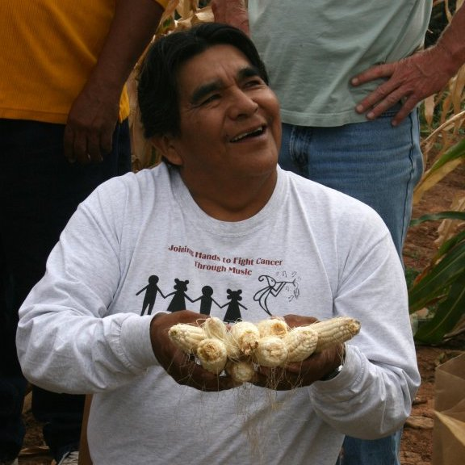
</div>

<!--chapter:end:06-what_we_learned.Rmd-->

# Lesson plans

<div style="text-align: center; font-weight: bold;">

<br>

Ancestral Methods and Materials and Adaptations<br>
+<br>
Future Methods and Materials and Innovations<br>
=<br>
Self-Sufficiency & Food Security

</div>

These lessons were developed as a collaboration between the [Montezuma School to Farm Project](https://www.montezumaschooltofarm.org/) and the [Crow Canyon Archaeological Center](https://www.crowcanyon.org/) to reflect the educational sphere where archaeology, experiential education and agriculture intersect. 

The Montezuma School to Farm Project and Crow Canyon work with children and adults alike to bring the heritage of southwestern Colorado to life: providing hands-on experiences with the land and with the human legacy of farming in an arid and ancient landscape. 

The mission of the Montezuma School to Farm Project is to unite our local agricultural heritage with our growing future by engaging students at the crossroads of sustainable agriculture, resource conservation, health and economics through educational experiences in outdoor garden classes. The mission of Crow Canyon Archaeological Center is to empower present and future generations by making the human past accessible and relevant through archaeological research, experiential education, and American Indian knowledge. Together, we have created these lesson plans in order to link Crow Canyon's *Pueblo Farming Project* research gardens to the academic lives of middle school students in the Four Corners region.

<div style="text-align: center;">
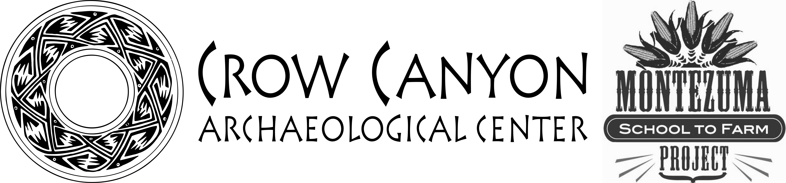
</div>

#### Lesson Formats {-}
The lessons are presented in two formats to reflect the varying contexts in which the lessons may be used: long sessions of approximately 90 minutes, and short short sessions of approximately 45 minutes. 

The long sessions can be used during  multi-day field trips students experience when they attend Crow Canyon's school group archaeology programs. The short sessions can be used during the school day in a class that is held during a middle school science, social studies, or health class period. You will find both long and short sessions in the tabs at the top of the online version of each lesson.

Both the long-form and short-form lessons are structured using three phases: ***Opening Circle***, ***Working Groups or Procedure***, and ***Closing Circle***:

Opening Circle
: When students arrive, they gather on outdoor classroom benches. We begin class with the opening circle and use this time to: 
    
    - Welcome and create a communicative atmosphere with students                              
    - Introduce the activity or lesson, showing their connection to academic concepts in the Colorado Academic Standards

Working Groups
: Students break into groups of approximately 6--8. During this time, we:

    - Teach students to use real tools for authentic garden jobs, assisting if necessary
    - Encourage decision making that utilizes the five senses

Closing Circle
: Class concludes with the closing circle. Students reflect on their time in the garden with review of opening circle concepts or a brief activity.  

The eBook version of each lesson plan includes embedded videos and other interactive teaching materials. You may also download PDF versions of the lesson plans---links are at the top of each lesson.

#### Unique Considerations: Living Props and Teaching to Climate Change {-}

##### Standards in Garden Lessons: How do these lesson plans integrate state educational standards? {-}

This manual aims to draw clear connections between food production (both ancestral and modern) and academic concepts central to middle school learning. Colorado's science, comprehensive health, physical education, reading, social studies, and math standards met are listed at the conclusion of each lesson. 

For further information in regards to the Colorado Academic Standards: [https://www.cde.state.co.us/apps/standards/](https://www.cde.state.co.us/apps/standards/)

##### What are the benefits of using live teaching props? {-}

Some lessons require extra preparation, such as preparing soil or assembling materials, often multiple days in advance. In exchange for this preparation, educators gain a unique and high quality teaching prop. The use of living props ensures that the lesson will have a direct connection to the world outside of the classroom. They provide memorable examples and experiences that impact the senses, leading the concepts to be more thoroughly understood and strongly committed to memory. When we use living props, scientific concepts are brought to life.

##### Why do we teach children about the Puebloan Farmers? {-}

Through learning the ancestral roots of our modern approaches to agriculture, children learn human history but also the history of the land they live on. This is a cornerstone of teaching student to be environmentally literate. It fosters an understanding of environmental issues by providing experiences that allow children to feel connected and related to all living creatures, helping them to fall in love with the world outside their back door. 

Beginning when they are very young, children easily and joyfully engage with the Earth's cycles. Such experiences will lay a foundation of love and loyalty to their local ecosystems. On this foundation, the world's most critical environmental challenges can be explored with optimism, challenging young minds to think deeply and critically about solutions. Confident of their place in the web of life, our younger generations can lead us back to the heartfelt awe nature so easily inspired during childhood.

#### Optimal Garden Setup for Creating a Garden Classroom {-}

No two educational gardens are ever quite the same. Available space, materials, and resources influence a garden's growth and allow it to become a living piece of the community.  Sourcing talents and expertise locally adds further character to a garden and simultaneously builds relationships that sustain it.  A garden's educational opportunities are only amplified by its unique components. There are few constraints as far as what must exist in the space to maximize its educational potential. To complete the lessons in this manual, we suggest the following conditions:

##### Bare Minimum Conditions {-}

- Two 10' x 4' x 1' raised beds or the equivalent in-ground row space.
- Access to a water spigot.
- A compost area or a space designated for a future compost site. The space should accommodate rotation through a three pile system:
    - Active, building pile
    - Aging pile
    - Ready-for-use pile
- A large volume of dry, carbon-based materials to use as mulch and in the compost system. See below for advice on securing safe, herbicide-free sources. 
- A source of nitrogen-based materials to use in the compost system. See page 7 for advice on securing safe, herbicide-free sources.

##### Recommended Conditions {-}

- Drip irrigation system with a timer - or plans for installation of a drip system
- Circle of benches and whiteboard to create an outdoor classroom space
- Tool shed
- Work table

##### Securing Safe Sources:<br>Carbon & Nitrogen-Based Materials for Building Compost and Amending Soil {-}

Very often, carbon and nitrogen-based materials will have persistent herbicides in them (herbicides are substances that are toxic to plants and are used to destroy unwanted vegetation). Once sprayed, these chemicals will be absorbed by and persist in the plants' bodies, even after they have passed through an animal's digestive system; they will continue to persist in grass clippings or manure and end up in your compost pile. The resulting finished compost can deform or dramatically reduce yield, may kill your plants, and can contaminate your soil for years to come.

When importing externally sourced materials, considering a donation, or purchasing of materials, it is very important to: 

- Maintain the school garden use of herbicide-free methods. This includes interviewing the maintenance department staff about their methods of lawn and landscape care. This will help inform decisions about using grass clippings from the campus and can also lead to an agreement or understanding about herbicide use on the campus near the garden site. 
- Carefully interview potential merchants or donors of any compost materials to attain the following information:
  - Have herbicides of any kind been used on the straw, hay, grass clippings, weeds, leaf, or yard debris?
  - Have the animals that produced the manure been fed hay, straw, other feed that was sprayed with herbicide?

This can sometimes be an awkward conversation, as the person you are interviewing may become defensive. Many people are unaware of the term "persistent herbicides," or lack a full understanding of how persistent herbicides affect vegetable production. Be prepared to be friendly but firm in your need to gather this information about your sources. These conversations can also be informative and eye-opening for all involved.

Please use this link to the US Composting Council's frequently asked questions about persistent herbicides: 
[https://www.compostingcouncil.org/page/persistent-herbicides-faq#3](https://www.compostingcouncil.org/page/persistent-herbicides-faq#3)

#### Seed Donations {-}

Often, it is possible to attain seeds on a donation basis from individuals, families, or grocery/nursery/garden stores.  It is important to assess the viability of these older seeds as some, but not all, will germinate beyond the "packed for/sell by" date listed on their packaging. It is deeply disappointing and disrupting when carefully planted and watered seeds do not germinate. The following are some examples of estimated time frames that seed varieties can be expected to last, past the "packed for/sell by" date. Please research the viability of additional seed varieties as needed. 

- Up to 5 Years:  annual flowers, collard greens, melon, radish
- Up to 4 Years:  eggplant, squash, tomato
- Up to 3 Years:  beans, peas, cabbage and carrot family varieties
- Up to 2 Years:  leek, mesclun, sweet corn
- Up to 1 Year:   lettuce, onion


```{r echo=FALSE, background=TRUE, message=FALSE, child = 'lessons/PFP_Lesson-1_The-People-of-Corn.Rmd'}
```

```{r echo=FALSE, background=TRUE, message=FALSE, child = 'lessons/PFP_Lesson-2_Farming-Through-Drought.Rmd'}
```

```{r echo=FALSE, background=TRUE, message=FALSE, child = 'lessons/PFP_Lesson-3_Know-Your-Soil.Rmd'}
```

```{r echo=FALSE, background=TRUE, message=FALSE, child = 'lessons/PFP_Lesson-4_Ancient-Technologies.Rmd'}
```

```{r echo=FALSE, background=TRUE, message=FALSE, child = 'lessons/PFP_Lesson-5_The-Short-Blue-Ear.Rmd'}
```

<!--chapter:end:07-lesson_plans.Rmd-->

